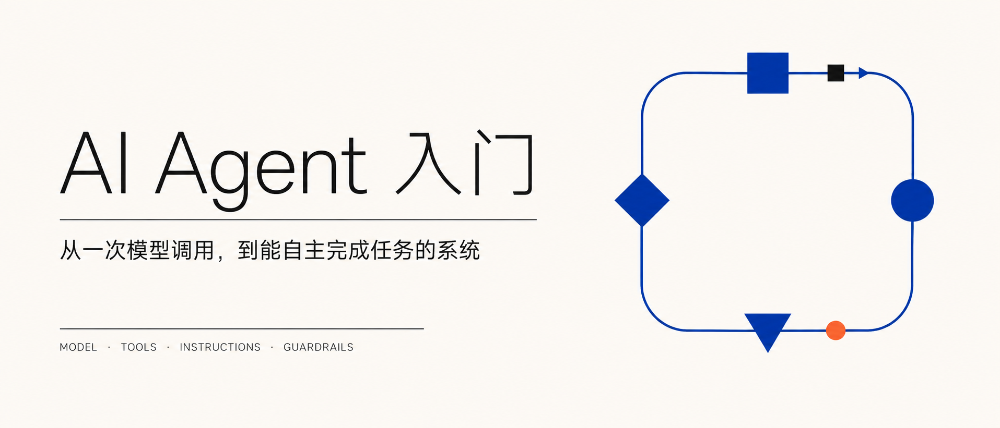
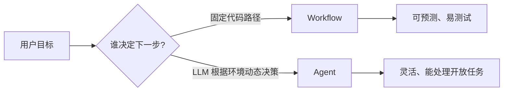
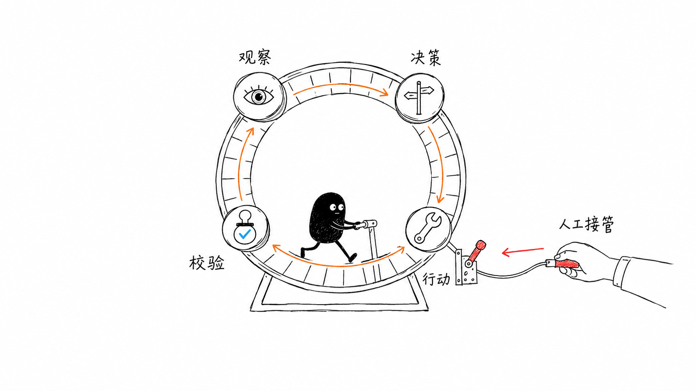
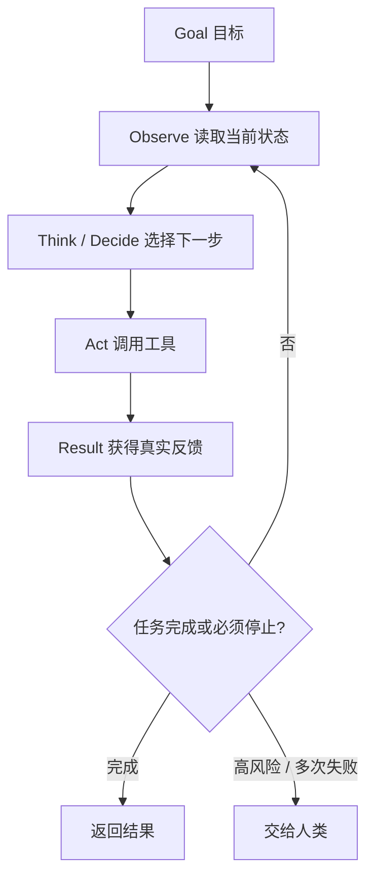
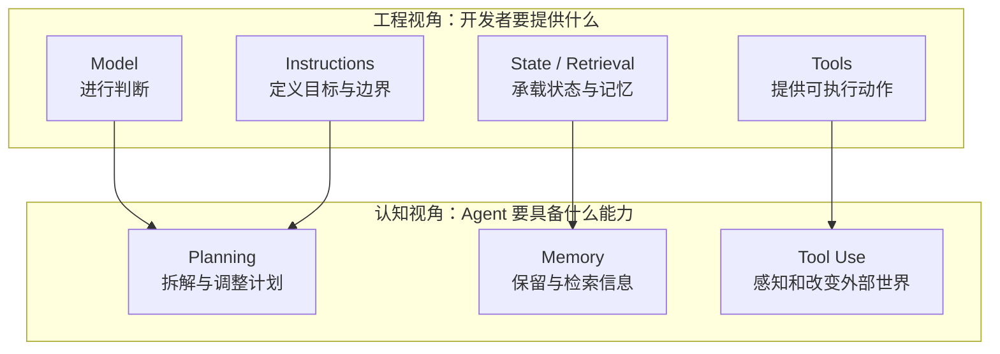
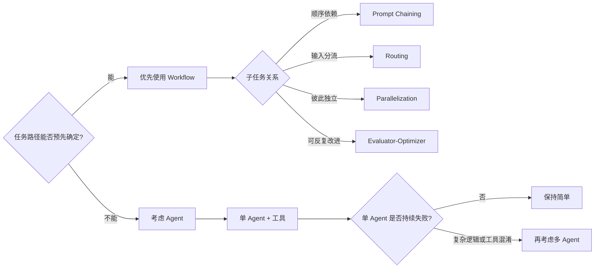
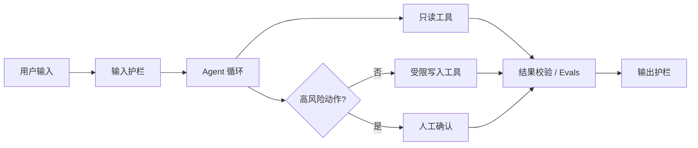

## 前言：会聊天，不等于会办事

刚开始学习 Agent 时，我最容易混淆的是这些问题：接了搜索功能的聊天机器人算不算 Agent？工作流（Workflow）和 Agent 有什么区别？规划、记忆、工具调用是不是缺一不可？多 Agent 又是不是一定比单 Agent 更强？

读完 Anthropic 的 [Building effective agents](https://www.anthropic.com/engineering/building-effective-agents)、OpenAI 的 [A practical guide to building agents](https://openai.com/business/guides-and-resources/a-practical-guide-to-building-ai-agents/) 和 Lilian Weng 的 [LLM Powered Autonomous Agents](https://lilianweng.github.io/posts/2023-06-23-agent/) 后，我认为最值得记住的不是某个框架，而是下面这句话：

> **Agent 不是一个更长的 Prompt，而是一个让模型在约束内反复“观察—决策—行动—校验”，直到完成目标或交还控制权的系统。**



三篇文章恰好从三个角度补全了这幅图：

| 文章 | 主要回答的问题 | 最适合建立的认知 |
| --- | --- | --- |
| Lilian Weng | 一个 Agent 内部有哪些能力？ | Planning、Memory、Tool Use |
| Anthropic | Agentic System 有哪些常见形态？ | Workflow 与 Agent、五种工作流模式 |
| OpenAI | 怎样把 Agent 做成可上线的产品？ | Model、Tools、Instructions、Orchestration、Guardrails |

下面不按文章顺序复述，而是从“什么是 Agent”开始，把这些概念装进同一张地图。

## 1. 先划清边界：LLM、Workflow 和 Agent

### 1.1 普通 LLM 应用：输入一次，输出一次

最简单的 LLM 应用像一个函数：输入 Prompt，模型生成结果，流程结束。

```text
response = llm(prompt)
```

即使调用前加入了 RAG 检索，只要检索步骤由程序固定执行、模型不能决定下一步做什么，它仍更接近“被增强的模型调用”，而不是完整 Agent。

### 1.2 Workflow：路由由代码预先画好

Anthropic 把 **Workflow** 定义为：LLM 和工具按照预先规定的代码路径运行。模型可以负责某个节点的内容生成或分类，但整个流程往哪里走，主要由开发者决定。

例如“生成文章大纲 → 检查格式 → 撰写正文”，步骤和顺序在运行前已经确定。它的优点是稳定、容易测试，也容易知道失败发生在哪一环。

### 1.3 Agent：模型在运行中决定下一步

Agent 的关键变化不是多调用几次模型，而是把**工作流执行权**部分交给模型。模型根据目标和环境反馈，动态选择工具、调整步骤，并判断任务是否结束。OpenAI 也强调：如果 LLM 没有控制工作流的执行，普通聊天、单轮生成或情感分类器都不属于 Agent。



这不是非黑即白的分类，而是一条**自主程度逐渐增加的光谱**：

```text
单次调用 → 带检索的调用 → 固定 Workflow → 动态路由 Workflow → 自主 Agent
```

越往右，系统越灵活，但延迟、成本、调试难度和错误传播风险也通常越高。因此，Anthropic 与 OpenAI 给出的建议非常一致：**先用能解决问题的最简单方案，只有当固定流程确实不够用时，再增加自主性。**

## 2. Agent 的最小闭环：它其实是一个 while 循环

把框架、论文名和产品包装拿掉后，Agent 的核心结构并不神秘：

```python
state = initialize(user_goal)

while not should_stop(state):
    observation = read_environment(state)
    decision = model.decide(
        goal=user_goal,
        instructions=instructions,
        context=observation,
        available_tools=tools,
    )

    if decision.needs_human:
        return handoff_to_human(state)
    if decision.is_final:
        return decision.answer

    result = execute_tool(decision.tool_call)
    state = update(state, decision, result)
```

OpenAI 把这种持续运行直到满足退出条件的过程称为一个 **run**。退出条件可以是模型给出最终答案、调用特定的完成工具、触发错误、请求人工介入，或者达到最大轮数。



这张图可以当作全文的记忆锚点：**循环提供自主性，环境反馈提供事实，红色刹车提供控制权。** 三者缺少任何一个，系统都更容易变成“反复调用模型”，而不是可靠地完成任务。



这里最重要的一条线是 `Act → Result → Observe`。Agent 不能只凭模型“觉得自己完成了”，而要从环境获得 **ground truth**：搜索是否找到了来源、API 是否真的写入数据、代码是否通过测试。没有真实反馈，循环就可能退化成模型不断对自己的猜测进行加工。

## 3. 两套组件模型，其实在描述同一个系统

初学者可能会发现，两篇文章给出的“Agent 组成”不一样：

- Lilian Weng：**规划（Planning）+ 记忆（Memory）+ 工具（Tool Use）**；
- OpenAI：**模型（Model）+ 工具（Tools）+ 指令（Instructions）**。

它们并不矛盾。前者更像认知架构，解释 Agent 需要完成哪些内部功能；后者更像工程装配清单，解释开发者要配置哪些东西。



### 3.1 Model：不是所有步骤都需要最强模型

模型负责理解目标、选择动作和处理例外。更强的模型通常能处理更模糊、更复杂的决策，但成本和延迟也更高。OpenAI 建议先用能力较强的模型建立效果基线，再在评测支持下，把简单的分类、检索等步骤替换成更小、更快的模型。

关键不是追求“全程最强”，而是知道**哪一步的错误最昂贵**。

### 3.2 Instructions：把隐含经验写成可执行规则

Instructions 不只是“你是一名客服”这样的角色描述。高质量指令应该说明：

- 目标和完成标准是什么；
- 遇到缺失信息时怎样处理；
- 哪些动作允许自动执行；
- 哪些情况必须停止或询问人类；
- 输出需要满足什么格式。

现有的 SOP、客服脚本和业务政策，往往是编写 Instructions 的最佳原料。含糊的制度搬进 Prompt 后仍然含糊，模型不会自动替开发者消除业务歧义。

### 3.3 Tools：把“会说”变成“能做”

工具让模型能够获取训练数据之外的信息，并对外部系统采取行动。OpenAI 将工具分为三类：

| 类型 | 能力 | 例子 |
| --- | --- | --- |
| 数据工具 | 读取上下文 | 搜索网页、查询数据库、读取 PDF |
| 动作工具 | 改变外部状态 | 发邮件、退款、写入 CRM、提交代码 |
| 编排工具 | 委托其他 Agent | 调用研究 Agent、翻译 Agent |

工具名称、参数和返回值，就是 Agent 的“操作界面”。Anthropic 把它称为 **ACI（Agent-Computer Interface）**，对应人类世界里的 HCI。一个含糊的 `process(data)`，远不如 `refund_order(order_id, amount, reason)` 容易被模型正确使用。

好的工具应做到：职责单一、参数语义明确、错误可读、结果可验证，并尽量让误操作在接口层就难以发生。尤其要区分只读和写入工具，因为它们的风险完全不同。

### 3.4 Memory：不是把所有历史都塞进上下文

Lilian Weng 用人类记忆作类比：当前上下文可以看作短期记忆，外部数据库或向量库可以承担长期记忆。但“存下来”不等于“记得住”，真正困难的是在正确时机取回正确内容。

一个实用的记忆系统至少要回答三件事：

1. **写什么**：用户偏好、任务状态、关键工具结果，还是所有原始对话？
2. **怎么找**：按相关性、时间、新旧程度或重要性检索？
3. **何时忘**：哪些数据过期、冲突或不应长期保存？

向量检索能扩展可访问的信息量，却不等于无限上下文；检索遗漏、过时记忆和错误摘要都会改变 Agent 的判断。

### 3.5 Planning：计划不是一次写完的清单

规划包含任务拆解，也包含根据结果修改计划。真正有用的 Agent 计划应该是可执行、可观察、可修正的：先找资料，检查来源是否充分，不足时继续搜索，再进入写作，而不是一开始生成十步计划后机械执行到底。

对于步骤固定的任务，与其让模型自由规划，不如直接写成 Workflow。规划能力真正有价值的地方，是子任务数量和路径在运行前无法确定的场景。

## 4. 五种 Workflow 模式：先学会编排，再追求自治

Anthropic 总结了五种常见工作流。它们是可组合的积木，不是互斥的框架选型。

| 模式 | 结构 | 适用场景 | 主要代价 |
| --- | --- | --- | --- |
| Prompt Chaining | A → B → C | 任务能稳定拆成固定步骤 | 延迟随步骤增加 |
| Routing | 分类 → 专用流程 | 输入类别清晰、处理方式不同 | 路由错误会选错流程 |
| Parallelization | 多路并行 → 汇总 | 子任务独立，或需要多视角投票 | 成本增加、结果需融合 |
| Orchestrator-Workers | 动态拆解 → 多个 Worker → 汇总 | 子任务无法预先确定 | 编排和评测更复杂 |
| Evaluator-Optimizer | 生成 → 评价 → 修改 | 有清晰质量标准且迭代有效 | 可能陷入无效循环 |



这里有两个特别容易混淆的概念：

- **Parallelization** 的子任务由开发者预先规定；**Orchestrator-Workers** 的子任务由模型根据当前任务动态拆解。
- **Evaluator-Optimizer** 只有在评价标准明确时才有意义。编译、测试、格式约束都能提供强反馈；“再写得更好一点”则很容易变成昂贵的原地打转。

## 5. 单 Agent 与多 Agent：不要把组织架构当性能升级

OpenAI 总结了两类常见多 Agent 结构：

- **Manager 模式**：中心 Agent 把专业 Agent 当作工具调用，最后由中心统一回答；
- **Handoff 模式**：一个 Agent 把会话和控制权移交给另一个 Agent，由后者接管。

多 Agent 的价值是隔离上下文、指令和工具，让每个 Agent 面对更清晰的局部问题。它并不会自动提高正确率，反而会引入交接信息丢失、调用成本、延迟和新的调试边界。

应先增强单 Agent，只有出现下面的具体信号时再拆分：

- 指令中堆积大量条件分支，已经难以维护；
- 工具名称或功能相似，模型反复选错；
- 不同任务需要明显不同的上下文、权限或评价标准；
- 子任务可以并行，并且收益足以覆盖额外成本。

判断标准不是“工具超过 10 个就拆”。OpenAI 特别指出，工具之间的相似度和重叠程度往往比绝对数量更重要。

## 6. 可靠性来自系统边界，不来自模型自信

Agent 可以执行动作，所以一次错误可能不再只是生成一段错误文字，而是写错数据库、发错邮件甚至产生资金损失。可靠性要靠多层机制共同保证。

### 6.1 为循环设置刹车

至少设置最大轮数、超时、预算和重复动作检测。连续失败时不要让 Agent 无限“再试一次”，而应保留现场并交还用户。

### 6.2 给工具分级

可以按四个问题评估工具风险：是否只读、是否可逆、需要什么权限、影响是否涉及金钱或敏感数据。读取公开网页和发送付款不应使用同一套授权策略。

### 6.3 护栏要分层

OpenAI 建议把护栏理解为纵深防御：相关性分类、安全分类、PII 检测、规则过滤、工具风险检查和输出校验可以各守一层。同时，护栏不能代替传统的身份认证、权限控制和软件安全措施。



### 6.4 Evals 决定你是否真的变好了

“看起来不错”不是评测。应该建立一组贴近真实任务的测试集，记录完成率、工具选择准确率、事实错误、平均轮数、成本、延迟和人工介入比例。先建立基线，再修改 Prompt、模型或架构，否则复杂度增加后也无法确认收益来自哪里。

Lilian Weng 在 2023 年总结的三个限制今天仍值得警惕：上下文有限、长程规划不稳定、自然语言接口不够可靠。模型能力在进步，但这些问题不会因为换了一个 Agent 框架就自动消失。

## 7. 第一个 Agent 应该怎么做？

假设要实现一个“帮我搜索主题并生成带来源的学习摘要”的 Agent，可以按下面的顺序迭代。

### 第 0 版：确认是否真的需要 Agent

先做一次模型调用，并把人工找到的资料放进上下文。如果效果已经够好，就停在这里。

### 第 1 版：固定 Workflow

把任务拆成“搜索 → 摘要 → 引用检查”三个节点。程序决定顺序，每一步保存输入输出。此时最容易发现真正的失败点。

### 第 2 版：单 Agent 加少量工具

允许模型自己决定搜索关键词和是否继续搜索，只提供边界清晰的工具：

```text
search_web(query, domains?, recency?)
open_page(url)
save_note(title, summary, source_url)
finish(answer, citations)
```

设置最大搜索次数，要求关键结论必须带来源，并在 `finish` 前运行引用校验。

### 第 3 版：用评测决定是否继续复杂化

准备 20～50 个有代表性的主题，比较引用正确率、覆盖率、耗时和成本。只有当单 Agent 经常因为上下文混杂或工具选择而失败时，才把“搜索”和“写作”拆成两个 Agent。

### 第 4 版：逐步开放写操作

最初只把结果保存为草稿。等评测和日志证明系统稳定后，再允许自动发布；发布仍应保留人工确认或可快速回滚的机制。

这条路线的核心是：**每增加一层自主性，都用可观测的收益来支付它带来的复杂度。**

## 8. 一张速查表

| 概念 | 一句话解释 | 常见误区 |
| --- | --- | --- |
| Augmented LLM | 接入检索、工具或记忆的模型 | 接了工具就一定是 Agent |
| Workflow | 代码预先规定执行路径 | Workflow 比 Agent“低级” |
| Agent | 模型动态控制任务执行 | Agent 必须有复杂框架 |
| Planning | 拆解任务并根据反馈调整 | 一次生成长计划就叫规划 |
| Memory | 对任务信息进行保存与检索 | 向量数据库等于无限记忆 |
| Tool | 读取或改变外部世界的接口 | 工具越多能力越强 |
| Orchestration | 组织模型、工具和 Agent 的运行 | 多 Agent 天然优于单 Agent |
| Guardrail | 在输入、动作和输出处限制风险 | 一层过滤就足够安全 |
| Eval | 用任务集衡量系统表现 | 凭几个 Demo 判断可上线 |

## 结语：Agent 开发的本质是设计一个可控的决策循环

回到开头的问题：Agent 并不神秘。模型负责判断，工具负责行动，状态与记忆提供上下文，Instructions 和 Guardrails 划定边界，环境反馈与 Evals 告诉系统有没有真的完成任务。

真正困难的也不是写出那个 `while` 循环，而是回答这些工程问题：模型看到了什么？它能做什么？动作结果如何验证？失败到什么程度必须停止？高风险决策由谁批准？

所以，对初学者最稳妥的学习顺序不是先研究庞大的多 Agent 框架，而是：

```text
单次调用 → 工具调用 → 固定 Workflow → 带反馈的单 Agent → 必要时再做多 Agent
```

能用简单系统稳定解决的问题，就不需要用自治来证明它是一款 Agent。**最好的 Agent 架构，不是看起来最像科幻电影的那一个，而是恰好拥有完成任务所需的最小自主性。**

## 参考资料

1. Anthropic, [Building effective agents](https://www.anthropic.com/engineering/building-effective-agents), 2024-12-19.
2. OpenAI, [A practical guide to building agents](https://openai.com/business/guides-and-resources/a-practical-guide-to-building-ai-agents/).
3. Lilian Weng, [LLM Powered Autonomous Agents](https://lilianweng.github.io/posts/2023-06-23-agent/), 2023-06-23.
