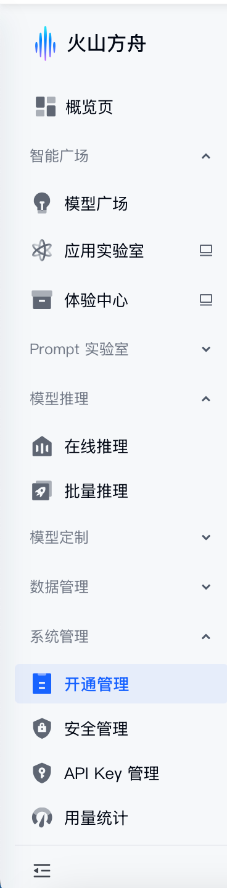

# Go-Agent学习笔记

## 1. 基本概念与Api调用

### 1.1 基模和垂直模型

- **基模 (Base Model)**：也就是通用大模型（如 GPT-4、DeepSeek-V3 等）。它们在大规模的无监督语料上进行预训练，具备广泛的通用知识和语言理解能力。
- **垂直模型 (Vertical Model)**：在基模的基础上，针对特定行业（如医疗、金融、编程等）使用专业数据进行微调（Fine-Tuning）的模型，专注解决特定领域的专业性问题。

### 1.2 模型与提示词 (Prompt)

- **模型 (Model)**：AI 的“大脑”，负责接收输入并生成预测结果。
- **提示词 (Prompt)**：我们与大模型沟通的“语言”。精心设计的 Prompt 能够显著提升模型输出的准确性和逻辑性。通常包含**角色设定 (Role)**、**任务背景 (Context)**、**操作指令 (Instruction)** 和**输出格式 (Format)**。

### 1.3 模版与思维链 (Chain-of-Thought, CoT)

- **提示词模版 (Prompt Template)**：将常用的 Prompt 结构化、参数化，通过注入不同的变量渲染出对应的提示词，从而提高系统的复用性和稳定性。
- **思维链 (CoT)**：通过在提示词中引导模型“一步一步地思考 (Let's think step by step)”，促使模型显式地输出中间推理过程，以便在复杂任务（如数学推理、逻辑判断等）中获得更高的准确率。

### 1.4 流式输出 (Streaming)

大模型在推理文本时，是逐个字（Token by Token）生成的。**流式输出**允许客户端在模型生成每个 Token 时立即接收并前端渲染，而不是等待整个长段落全部生成完毕再展示。这极大降低了用户的等待焦虑感，也是现代 AI 产品的标配。

### 1.5 TTFT (Time to First Token)

**首字返回时间**。它是衡量大模型 API 推理首批响应速度的核心考量指标。具体指的是从客户端发出请求开始，到接收到模型返回的**第一个 Token** 所耗费的时间。TTFT 越低，在使用流式输出时的体感响应就越快。

### 1.6 SSE (Server-Sent Events)

一种基于 HTTP 的单向服务器推送技术。鉴于大模型问答场景下往往只需**服务端单向、持续地向客户端推送数据流**，SSE 相比 WebSocket 更加纯粹和简单。目前大厂的流式接口普遍采用的就是基于 HTTP 协议的 SSE 技术。

---

### 1.7 实战初体验：Hello, LLM

下面我们将接入 **火山方舟 (Volcengine)** 作为基座模型，在代码中实现我们第一个 Go-Agent 测试用例。



#### 1. 调用前的服务准备：
- **模型开通**：登录火山方舟控制台，点击「开通管理」，选择合适的模型并开通（例如针对文字生成任务，`doubao-seed` 系列通常会赠送一定的试用 token 额度）。
- **获取鉴权**：在控制台进入「API Key 管理」页面，获取你的 API Key。

#### 2. 项目拓扑结构

创建一个专门用于 Agent 开发与测试的工程目录：

```text
go-agent/
├── config/
│   ├── config.go       # 配置文件读取逻辑
│   └── config.yaml     # 环境变量配置
├── test/
│   └── hello_test.go   # AI 模型调用联调测试
├── go.mod
└── go.sum
```

#### 3. 参数配置封装 (`config.yaml` & `config.go`)

在项目中借助 `viper` 初始化获取我们在方舟平台得到的 API Key：

**`config.yaml`**
```yaml
apikey: "xxxxxxxxxx"
model: "doubao-seed-1-6-lite-251015"
```

**`config.go`**
```go
package config

import (
	"fmt"
	"github.com/fsnotify/fsnotify"
	"github.com/spf13/viper"
)

type Config struct {
	// Ark 模型的 API Key，填你申请创建的 Key
	APIKey string `json:"apikey"`
	// Ark 模型的 Model ID (注意不是 Model Name)
	Model  string `json:"model"`
	// MaxTokens: 最大 Token 数，默认是 2048
	// Temperature: 温度值，范围 [0.1,1.0]
}

var Cfg *Config

func Init() (err error) {
	viper.SetConfigName("config")
	viper.SetConfigType("yaml")
	viper.AddConfigPath("./config")
	viper.AddConfigPath("../config")

	if err := viper.ReadInConfig(); err != nil {
		fmt.Printf("viper.ReadInConfig() failed, err: %v\n", err)
		return err
	}
	
	Cfg = &Config{}
	if err := viper.Unmarshal(Cfg); err != nil {
		fmt.Printf("viper.Unmarshal failed, err: %v\n", err)
		return err
	}

	viper.WatchConfig()
	viper.OnConfigChange(func(in fsnotify.Event) {
		fmt.Printf("配置文件被修改了...")
		if err := viper.Unmarshal(Cfg); err != nil {
			fmt.Printf("viper.Unmarshal failed, err:%v\n", err)
			return
		}
	})

	return nil
}
```

#### 4. 编写第一个 LLM 聊天测试 (`hello_test.go`)

引入云原生大模型组件，向模型发出交互 Prompt，询问与框架相关的知识点：

```go
package test

import (
	"context"
	"fmt"
	"go-agent/config"
	"testing"

	"github.com/cloudwego/eino-ext/components/model/ark"
	"github.com/cloudwego/eino/schema"
)

func TestArkChat(t *testing.T) {
	err := config.Init()
	if err != nil {
		t.Fatalf("配置初始化失败: %v", err)
	}
	
	chat, err := ark.NewChatModel(context.Background(), &ark.ChatModelConfig{
		APIKey: config.Cfg.APIKey,
		Model:  config.Cfg.Model,
	})
	if err != nil {
		t.Fatalf("创建 Ark 模型失败: %v", err)
	}
	
	prompt := []*schema.Message{
		{
			Role:    schema.System,
			Content: "你是一个go语言专家,为go学徒答疑解惑",
		},
		{
			Role:    schema.User,
			Content: "你了解eino吗",
		},
	}
	
	out, _ := chat.Generate(context.Background(), prompt)
	fmt.Print(out)
}
```

### 1.8 运行结果展示

<details>
<summary>💡 点击展开模型的思考过程 (Reasoning Content)</summary>

用户现在问了解eino吗，首先得明确Eino是什么——应该是指Go语言生态里的Eino框架吧？首先得确认Eino的定位：Eino是一个轻量级、高性能的Go Web框架，类似Gin、Echo，但有自己的特点。

首先要整理Eino的核心信息：
1. 定位：轻量、高性能Web框架，Go语言编写，遵循简洁设计。
2. 主要特点：
   - 高性能：底层用 `net/http`，优化了路由匹配
   - 简洁API：类似 Gin 的链式调用，学习成本低
   - 中间件支持：自定义中间件或使用现有中间件
   - 路由参数：支持 *:param*、*\*wildcard* 等
   - 响应处理：JSON、HTML、文件等常见响应
   - 错误处理：集中式错误处理机制
3. 基本使用示例：比如创建路由、中间件、响应JSON等，这样用户能快速上手。
4. 注意点：Eino相对Gin/Echo来说生态没那么丰富，第三方中间件可能少一些，但性能不错，适合轻量场景。

然后组织回答结构：先明确Eino是什么，核心特点，基本使用示例，适用场景，对比其他框架的差异。

</details>

<br/>

**🤖 Assistant 回复：**

Eino 是**Go语言生态中一款轻量级、高性能的Web框架**，定位介于原生 `net/http` 和更重型的框架（如 Gin、Echo）之间，以简洁设计和高效性能为核心特点。

#### 一、核心特点
1. **高性能**：底层基于 `net/http` 优化，路由匹配采用高效结构（如前缀树），性能接近主流框架但依赖更少。
2. **简洁API**：链式调用风格，学习成本低，核心功能（路由、中间件、响应）清晰直观。
3. **灵活中间件**：支持自定义中间件，也可兼容部分 `net/http` 中间件，方便扩展（如日志、认证）。
4. **路由支持**：静/动态参数/通配符提取。
5. **响应处理**：内置 `JSON`、`HTML` 等响应。

#### 二、快速上手示例

**1. 安装**
```bash
go get github.com/eaigner/eino
```

**2. Hello World 代码示例**
```go
package main

import "github.com/eaigner/eino"

func main() {
    e := eino.New()

    // 1. 中间件示例（日志）
    e.Use(func(c *eino.Context) {
        println("请求开始：", c.Request.URL.Path)
        c.Next()
        println("请求结束：", c.StatusCode)
    })

    // 2. 静态路由
    e.Get("/", func(c *eino.Context) {
        c.String(200, "Hello Eino!")
    })

    e.Run(":8080")
}
```

#### 三、适用场景
- 小型 API 服务、轻量 Web 应用（无需复杂功能）
- 追求启动速度和资源占用的场景
- 快速原型开发（API 设计验证）

#### 四、与主流框架对比

| 特点          | Eino               | Gin                | Echo               |
|---------------|--------------------|--------------------|--------------------|
| **依赖**      | 极少（仅核心）     | 较多（含绑定/验证）| 中等（含扩展）     |
| **生态**      | 弱（第三方中间件少）| 强（社区活跃）     | 较强（插件丰富）   |
| **学习曲线**  | 平缓               | 平缓               | 平缓               |
| **性能**      | 高（接近原生）     | 高                 | 高                 |

> ⏱ _运行耗时: 24.348s (耗费 Token: 1711)_
