# 🧩 16 个常用设计模式・Java / Go 双语言版：业务对象、协作过程与类图

理解一个模式，不能只看到 `send(msg)` 被转发了一次。真正要看的是：业务中谁保存状态，谁决定规则，谁调用谁；当新增渠道、修改算法或执行失败时，需要改动哪些地方。

本文围绕这些问题重写了 16 个模式的示例。每节都有具体需求、类的职责、完整调用过程、Java / Go 可运行代码、实际输出和扩展边界。例子保持在一个文件能够读完的规模，同时保留金额、商品明细、权限、分页游标、快照等真正影响行为的数据。

**运行约定：** Java 使用 **JDK 17+**，每节单独保存为 `Main.java`，执行 `javac -encoding UTF-8 Main.java` 后运行 `java -Dfile.encoding=UTF-8 Main`；Go 每节单独保存为 `main.go`，执行 `go run main.go`。不同节会重用类名，请放在不同目录。金额统一用整数“分”，重量用“克”，演示数量控制在整数运算范围内。Java 常用异常、Go 常用 `error` 表达业务失败，结果含义对应，语法不强求一致。

支付、物流、存储、发送队列均为本地替身，没有真实扣款、发货或发送通知。例子验证的是对象协作与局部行为；涉及幂等、并发与外部副作用的限制写在对应章节，不把它们当成模式自动提供的能力。

「第一梯队 / 第二梯队」沿用原笔记的学习分组，共 16 个模式，不代表严格的使用频率排名。先看总表，再按具体需求阅读。

## 📋 开篇总结表：16 个模式一眼看懂

| 模式 | 类型 | 核心一句话 | 典型业务场景 | 什么时候不用 | 一句话口诀 |
|---|---|---|---|---|---|
| 单例 Singleton | 创建型 | 约定范围内共享一个实例 | 数据库连接池、全局配置、日志、Redis/MQ 客户端 | 需要多份独立状态；单测难 mock | 同一范围，取到同一实例 |
| 简单工厂 Simple Factory | 创建型 | 集中选择、配置并创建实现对象 | 支付渠道、文件导出器、消息发送 | 创建逻辑无差异；复杂产品族需其他工厂结构 | 创建细节集中到一处 |
| 建造者 Builder | 创建型 | 分步构建字段多、可选参数多的复杂对象 | 复杂订单、多条件查询、HTTP 请求体、报表对象 | 字段只有 2-3 个 | 字段太多，链式 Builder 慢慢搭 |
| 适配器 Adapter | 结构型 | 转换接口，做翻译层 | 第三方支付 SDK、新旧接口字段映射、多数据源 | 接口本来就一致 | 别人的接口和我不一样 → 加一层适配器翻译 |
| 装饰器 Decorator | 结构型 | 动态叠加附加能力，不改原代码 | 日志/耗时/链路、缓存、权限、文件流包装 | 要完全替换主体逻辑 | 原来的功能我还要，只是额外加点东西 |
| 代理 Proxy | 结构型 | 替身控制对真实对象的访问 | RPC 远程调用、权限拦截、懒加载、限流熔断 | 只是加日志计时 | 访问真实对象之前，先管控一下能不能进 |
| 策略 Strategy | 行为型 | 同一目标的多种算法独立封装 | 折扣、运费、排序、导出格式 | 只有一个稳定且简单的算法 | 同一个任务，多种算法独立实现 |
| 观察者 Observer | 行为型 | 一对多事件通知，主流程解耦 | 订单到账后的积分/回执/通知、注册事件 | 附属步骤之间存在强交易依赖 | 一件事做完，触发一堆附属事情 |
| 外观 Facade | 结构型 | 简单入口，隐藏复杂子系统 | 下单聚合库存/支付/物流 | 子系统本来就简单 | 复杂一堆子系统 → 一个入口 |
| 责任链 Chain | 行为型 | 一条流水线依次处理，可中断 | 参数→权限→限流→业务、审批流 | 检查很少；节点职责交叉严重 | 校验/审批一条流水线，中途失败就截断 |
| 状态 State | 行为型 | 当前状态决定动作行为与允许的转换 | 订单状态流转、工单/审批 | 状态少且流转简单 | 动作委托当前状态，按规则流转 |
| 模板方法 Template | 行为型 | 固定流程骨架，子类重写部分步骤 | 报表导出（加载→格式化→保存） | 流程本身不固定 | 流程骨架固定不变，只有部分步骤自定义 |
| 备忘录 Memento | 行为型 | 在不暴露内部细节的前提下保存、恢复对象状态 | 编辑器撤销、表单草稿回退、游戏存档 | 状态太大且快照频繁；需要撤销外部副作用 | 先存一份状态，后悔时读档 |
| 迭代器 Iterator | 行为型 | 统一遍历入口，隐藏集合内部结构 | 订单集合、树形目录、分页结果遍历 | 普通集合直接循环就够用 | 只管取下一个，不管里面怎么存 |
| 命令 Command | 行为型 | 把请求封装成对象，分离发起者与执行者 | 按钮与快捷键、任务队列、操作撤销 | 一次直接调用就能表达清楚 | 把要做的事装成命令，交给别人执行 |
| 桥接 Bridge | 结构型 | 拆开两个独立变化的维度，用组合连接 | 通知级别 × 发送渠道、报表种类 × 输出格式、控件类型 × 绘制平台 | 只有一个变化维度；维度之间强耦合 | 两个维度各自扩展，组合搭桥 |

## 🗂️ 类图怎么看：接口、继承与对象关系

每个模式都附一张与正文代码对应的类图，**以 Java 示例的类结构和方法名为主，图下方说明业务数据、调用路径与 Go 的结构差异**。图中只列关键成员，部分参数类型和构造方法省略，完整签名以代码为准。图片可点击放大；每张图下都能下载 `.excalidraw` 文件，在 Excalidraw 中继续编辑。

| 图中记号 | 含义 | 读图方向 |
|---|---|---|
| `«interface»` | 接口契约 | 具体实现类通过实现关系指向它 |
| `«abstract class»` | 抽象类，可同时包含公共实现与抽象方法 | 子类通过继承关系指向它 |
| 虚线 + 空心三角 | 实现接口 | 具体类 → 接口 |
| 实线 + 空心三角 | 继承父类 | 子类 → 父类 |
| 实线 + 普通箭头 | 可导航关联，通常对应一个持有的字段 | 持有者 → 被持有对象的类型 |
| 虚线 + 普通箭头 | 依赖，例如调用、使用参数类型或返回类型 | 使用者 → 被使用类型；`«create»` 表示创建 |
| `1` / `0..1` / `0..*` / `1..*` | 一个 / 零或一个 / 零到多个 / 一个或多个对象 | 数量标注对应箭头目标一侧的类型 |
| `+` / `-` / `#` | `public` / `private` / `protected` | 未标记可见性的成员请以源码为准 |
| `{static}` / `{final}` | 静态成员 / 不可重新赋值或不可重写的成员 | 结合所在字段、方法或类理解 |

类图只突出模式参与者，简单的数据载体集中列在图下方，完整定义见代码。没有自定义接口的例子按实际结构绘制。Go 采用结构体、接口与组合；嵌入与 Java 继承的区别可参见 [Effective Go 的嵌入说明](https://go.dev/doc/effective_go#embedding)。


## 先对齐术语：模式角色、业务类名与 record

**模式角色说明对象如何协作，业务类名说明它在当前业务里做什么。** 例如观察者模式里的 Subject（被观察者）、Observer（观察者接口）、ConcreteObserver（具体观察者），在本文分别由 `PaidEvents`、`PaidListener`、`LoyaltyListener / ReceiptListener` 承担。业务名不要求与角色名相同，但学习时需要能一一对应，因此下面每节的职责表、代码注释和类图都明确标出标准角色。

类图标题栏同时保留角色名与业务类型名；`«interface»`、`«abstract class»` 仍然表示实际的接口、抽象类，旁边的 Subject、Strategy 等是模式角色。业务数据和辅助服务会单独注明，不给它们硬套模式角色；示例中省略或合并的参与者也会在相应章节说明。手机上可横向滑动表格，查看完整的类名、角色与职责。

### Java 的 record 是什么

`record` 用于声明数据载体类，Java 16 已正式支持，本文统一使用 JDK 17+。它适合订单事件、支付回执、报价明细这类主要承载一组数据的对象。[Java 16 官方发布说明](https://inside.java/2021/03/16/the-arrival-of-java16/)

```java
record OrderPaid(String orderId, String customerId, int paidCents) {}

class RecordExample {
    public static void main(String[] args) {
        OrderPaid event = new OrderPaid("O-300", "C-7", 12800);
        System.out.println(event.orderId());   // O-300
        System.out.println(event.paidCents()); // 12800
    }
}
```

这一行声明会自动提供以下成员，所以后文的数据类看起来很短：

- 三个 `private final` 字段和接收三个参数的构造方法。
- `orderId()`、`customerId()`、`paidCents()` 访问方法；名称直接使用组件名，不是 `getOrderId()`。
- 根据组件值比较的 `equals()`、与之对应的 `hashCode()`，以及显示组件名称和值的 `toString()`。

它仍然是一种类：可以写业务方法、实现接口，也可以在构造时校验参数；类本身隐式为 `final`，不能被继承。如果使用普通 `class` 表达同样的数据契约，就需要自己补上字段、构造方法和这些方法。[Java record 官方说明](https://docs.oracle.com/en/java/javase/17/language/records.html)

`final` 限制字段重新赋值，不会递归冻结字段指向的对象。例如 record 中保存 `List` 时，外部仍可能修改原列表；因此本文在需要隔离集合修改的地方使用 `List.copyOf()` 等防御性复制。`OrderPaid` 的组件只有 `String` 和 `int`，可以作为不可变的事件数据。`record` 是实现数据类的语言工具，Subject / Observer 才是当前模式的协作角色。

## 一、8 个常用模式：创建、连接与可替换行为

### 1. 单例 Singleton｜创建型

#### 业务场景：同一份配置支撑结算与补货

商城有东区、西区两套运费规则，结算服务要计算实付金额，补货服务要读取预警阈值。如果每个服务都自行加载配置，既会重复读取，也可能在启动过程中拿到不同版本。这里把启动配置作为一份只读快照，通过 `AppConfig.getInstance()` 取得，然后注入各个业务服务。

| 类 / 接口 | 模式角色 | 具体职责 |
|---|---|---|
| `AppConfig` | Singleton（单例） | 持有区域运费表和补货阈值，通过 getInstance() 控制实例访问 |
| `ShippingRule` | 业务数据 | 保存基础运费、包邮门槛，用 feeFor() 计算运费 |
| `CheckoutService / RestockService` | Client（客户端） | 分别计算实付金额、判断是否补货，使用同一份配置 |

#### 一次请求怎样走

1. `main` 取得唯一配置，分别交给结算服务和补货服务。
2. 同样是 9000 分商品，东区收 800 分运费，西区收 1500 分运费。
3. 库存 3 小于预警阈值 5，因此需要补货。重复取得配置仍然是同一个实例。

#### 类图：接口与关系

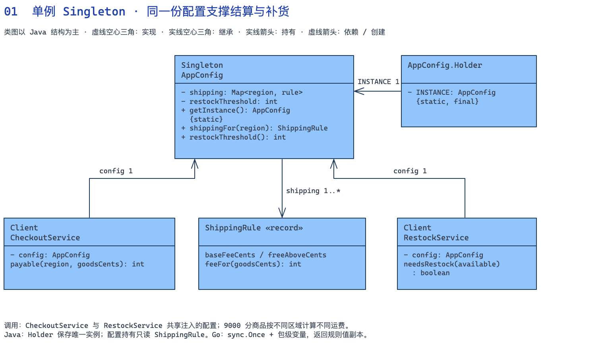

[下载可编辑的 Excalidraw 源文件](diagrams/01-singleton.zh.excalidraw)

#### 双语言完整示例



```java
import java.util.Map;

record ShippingRule(int baseFeeCents, int freeAboveCents) {
    int feeFor(int goodsCents) {
        return goodsCents >= freeAboveCents ? 0 : baseFeeCents;
    }
}
// Singleton（单例）。
final class AppConfig {
    private final Map<String, ShippingRule> shipping;
    private final int restockThreshold;
    private AppConfig() {
        // 用固定数据代替配置文件读取；构造完成后不再修改。
        shipping = Map.of("east", new ShippingRule(800, 10000),
                          "west", new ShippingRule(1500, 20000));
        restockThreshold = 5;
    }
    private static class Holder {
        private static final AppConfig INSTANCE = new AppConfig();
    }
    public static AppConfig getInstance() { return Holder.INSTANCE; }
    public ShippingRule shippingFor(String region) {
        ShippingRule rule = shipping.get(region);
        if (rule == null) throw new IllegalArgumentException("未知区域");
        return rule;
    }
    public int restockThreshold() { return restockThreshold; }
}
// Client（客户端）。
class CheckoutService {
    private final AppConfig config;
    CheckoutService(AppConfig config) { this.config = config; }
    int payable(String region, int goodsCents) {
        if (goodsCents < 0) throw new IllegalArgumentException("金额不能为负");
        return goodsCents + config.shippingFor(region).feeFor(goodsCents);
    }
}
// Client（客户端）。
class RestockService {
    private final AppConfig config;
    RestockService(AppConfig config) { this.config = config; }
    boolean needsRestock(int available) { return available < config.restockThreshold(); }
}
// Client（客户端）：组装参与者并发起调用。
public class Main {
    public static void main(String[] args) {
        AppConfig config = AppConfig.getInstance();
        CheckoutService checkout = new CheckoutService(config);
        RestockService restock = new RestockService(config);
        System.out.println("共享配置=" + (config == AppConfig.getInstance()));
        System.out.println("east 实付=" + checkout.payable("east", 9000));
        System.out.println("west 实付=" + checkout.payable("west", 9000));
        System.out.println("库存 3 需补货=" + restock.needsRestock(3));
    }
}
```



```go
package main

import (
	"fmt"
	"sync"
)

type ShippingRule struct{ BaseFeeCents, FreeAboveCents int }

func (r ShippingRule) FeeFor(goods int) int {
	if goods >= r.FreeAboveCents {
		return 0
	}
	return r.BaseFeeCents
}

// Singleton（单例）。
type AppConfig struct {
	shipping         map[string]ShippingRule
	restockThreshold int
}

var once sync.Once
var instance *AppConfig

func GetConfig() *AppConfig {
	once.Do(func() {
		instance = &AppConfig{map[string]ShippingRule{
			"east": {800, 10000}, "west": {1500, 20000},
		}, 5}
	})
	return instance
}
func (c *AppConfig) ShippingFor(region string) (ShippingRule, error) {
	r, ok := c.shipping[region]
	if !ok {
		return ShippingRule{}, fmt.Errorf("未知区域")
	}
	return r, nil
}
func (c *AppConfig) RestockThreshold() int { return c.restockThreshold }

// Client（客户端）。
type CheckoutService struct{ config *AppConfig }

func (s CheckoutService) Payable(region string, goods int) (int, error) {
	if goods < 0 {
		return 0, fmt.Errorf("金额不能为负")
	}
	r, err := s.config.ShippingFor(region)
	if err != nil {
		return 0, err
	}
	return goods + r.FeeFor(goods), nil
}

// Client（客户端）。
type RestockService struct{ config *AppConfig }

func (s RestockService) NeedsRestock(available int) bool {
	return available < s.config.RestockThreshold()
}
// Client（客户端）：组装参与者并发起调用。
func main() {
	config := GetConfig()
	checkout, restock := CheckoutService{config}, RestockService{config}
	fmt.Printf("共享配置=%t\n", config == GetConfig())
	for _, region := range []string{"east", "west"} {
		payable, err := checkout.Payable(region, 9000)
		if err != nil {
			panic(err)
		}
		fmt.Printf("%s 实付=%d\n", region, payable)
	}
	fmt.Printf("库存 3 需补货=%t\n", restock.NeedsRestock(3))
}
```



#### 运行结果与关键点

```text
共享配置=true
east 实付=9800
west 实付=10500
库存 3 需补货=true
```

增加区域时修改配置数据；修改补货算法时修改 `RestockService`。业务类通过构造参数接收配置，避免到处隐藏地调用全局入口。Java 使用静态内部类持有实例，Go 使用 `sync.Once`；两者的业务读取都不修改配置。

#### 什么时候不用，以及这个例子的边界

单例只约束约定范围内的实例数量，不等于跨进程唯一。Java 的范围还受到类加载器影响；Go 实际项目应把配置放到独立包中，用未导出字段限制外部修改。多个租户需要不同配置、测试需要替换配置时，应考虑普通对象或配置接口；需要热更新时也必须另行设计快照替换，`Once` 不负责更新。

### 2. 简单工厂 Simple Factory｜创建型

#### 业务场景：结算入口统一创建支付渠道

商城收到订单 O-100、应付 12800 分和用户选择的渠道。支付宝需要商户号，微信需要应用号；结算规则还要求渠道具备退款能力。如果控制器、定时任务和补单程序都自己拼这些创建参数，新增渠道时会同时改很多入口。`PaymentFactory` 收拢这件事，结算服务只依赖统一的支付契约。

| 类 / 接口 | 模式角色 | 具体职责 |
|---|---|---|
| `PaymentRequest / Receipt` | 业务数据 | 承载订单号、金额、渠道和交易流水 |
| `PaymentGateway` | Product（产品接口） | charge() 返回支付回执，supportsRefund() 声明渠道能力 |
| `AlipayGateway / WechatGateway` | ConcreteProduct（具体产品） | 保存各自接入配置，生成对应格式的模拟流水 |
| `PaymentFactory` | SimpleFactory（简单工厂） | 按渠道选择并配置支付对象 |
| `CheckoutService` | Client（客户端） | 检查业务约束，再通过产品接口发起支付 |

这里的 SimpleFactory 是集中创建对象的写法，不等同于 GoF 工厂方法模式中的 Creator / ConcreteCreator；不要仅凭名字把两者混为一谈。

#### 一次请求怎样走

1. `CheckoutService.pay()` 把渠道名交给工厂。
2. 工厂为支付宝注入商户号，为微信注入应用号，并返回 `PaymentGateway`。
3. 结算检查退款能力，收到包含流水号与实际金额的 `Receipt`。传入 cash 会明确失败，不返回空对象。

#### 类图：接口与关系

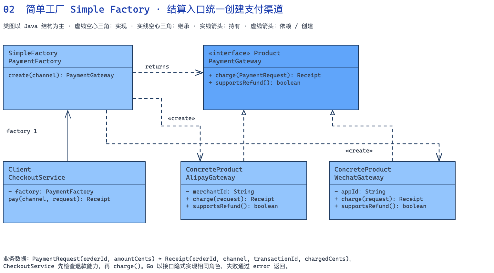

[下载可编辑的 Excalidraw 源文件](diagrams/02-simple-factory.zh.excalidraw)

#### 双语言完整示例



```java
record PaymentRequest(String orderId, int amountCents) {
    PaymentRequest {
        if (orderId.isBlank() || amountCents <= 0)
            throw new IllegalArgumentException("订单和金额无效");
    }
}
record Receipt(String orderId, String channel, String transactionId, int chargedCents) {}
// Product（产品接口）。
interface PaymentGateway {
    Receipt charge(PaymentRequest request);
    boolean supportsRefund();
}
// ConcreteProduct（具体产品）。
class AlipayGateway implements PaymentGateway {
    private final String merchantId;
    AlipayGateway(String merchantId) { this.merchantId = merchantId; }
    public Receipt charge(PaymentRequest r) {
        return new Receipt(r.orderId(), "alipay", merchantId + ":" + r.orderId(), r.amountCents());
    }
    public boolean supportsRefund() { return true; }
}
// ConcreteProduct（具体产品）。
class WechatGateway implements PaymentGateway {
    private final String appId;
    WechatGateway(String appId) { this.appId = appId; }
    public Receipt charge(PaymentRequest r) {
        return new Receipt(r.orderId(), "wechat", appId + ":" + r.orderId(), r.amountCents());
    }
    public boolean supportsRefund() { return true; }
}
// SimpleFactory（简单工厂）。
class PaymentFactory {
    PaymentGateway create(String channel) {
        return switch (channel) {
            case "alipay" -> new AlipayGateway("merchant-01");
            case "wechat" -> new WechatGateway("app-02");
            default -> throw new IllegalArgumentException("不支持的支付渠道: " + channel);
        };
    }
}
// Client（客户端）。
class CheckoutService {
    private final PaymentFactory factory;
    CheckoutService(PaymentFactory factory) { this.factory = factory; }
    Receipt pay(String channel, PaymentRequest request) {
        PaymentGateway gateway = factory.create(channel);
        if (!gateway.supportsRefund()) throw new IllegalStateException("商城要求渠道支持退款");
        return gateway.charge(request);
    }
}
// Client（客户端）：组装参与者并发起调用。
public class Main {
    public static void main(String[] args) {
        CheckoutService checkout = new CheckoutService(new PaymentFactory());
        for (String channel : new String[]{"alipay", "wechat"}) {
            Receipt r = checkout.pay(channel, new PaymentRequest("O-100", 12800));
            System.out.printf("%s %s %d%n", r.channel(), r.transactionId(), r.chargedCents());
        }
        try { checkout.pay("cash", new PaymentRequest("O-101", 100)); }
        catch (IllegalArgumentException e) { System.out.println(e.getMessage()); }
    }
}
```



```go
package main

import "fmt"

type PaymentRequest struct {
	OrderID     string
	AmountCents int
}
type Receipt struct {
	OrderID, Channel, TransactionID string
	ChargedCents                    int
}
// Product（产品接口）。
type PaymentGateway interface {
	Charge(PaymentRequest) (Receipt, error)
	SupportsRefund() bool
}

func validate(r PaymentRequest) error {
	if r.OrderID == "" || r.AmountCents <= 0 {
		return fmt.Errorf("订单和金额无效")
	}
	return nil
}

// ConcreteProduct（具体产品）。
type AlipayGateway struct{ merchantID string }

func (g AlipayGateway) Charge(r PaymentRequest) (Receipt, error) {
	if err := validate(r); err != nil {
		return Receipt{}, err
	}
	return Receipt{r.OrderID, "alipay", g.merchantID + ":" + r.OrderID, r.AmountCents}, nil
}
func (AlipayGateway) SupportsRefund() bool { return true }

// ConcreteProduct（具体产品）。
type WechatGateway struct{ appID string }

func (g WechatGateway) Charge(r PaymentRequest) (Receipt, error) {
	if err := validate(r); err != nil {
		return Receipt{}, err
	}
	return Receipt{r.OrderID, "wechat", g.appID + ":" + r.OrderID, r.AmountCents}, nil
}
func (WechatGateway) SupportsRefund() bool { return true }

// SimpleFactory（简单工厂）。
type PaymentFactory struct{}

func (PaymentFactory) Create(channel string) (PaymentGateway, error) {
	switch channel {
	case "alipay":
		return AlipayGateway{"merchant-01"}, nil
	case "wechat":
		return WechatGateway{"app-02"}, nil
	default:
		return nil, fmt.Errorf("不支持的支付渠道: %s", channel)
	}
}

// Client（客户端）。
type CheckoutService struct{ factory PaymentFactory }

func (s CheckoutService) Pay(channel string, r PaymentRequest) (Receipt, error) {
	g, err := s.factory.Create(channel)
	if err != nil {
		return Receipt{}, err
	}
	if !g.SupportsRefund() {
		return Receipt{}, fmt.Errorf("商城要求渠道支持退款")
	}
	return g.Charge(r)
}
// Client（客户端）：组装参与者并发起调用。
func main() {
	checkout := CheckoutService{PaymentFactory{}}
	for _, channel := range []string{"alipay", "wechat"} {
		r, err := checkout.Pay(channel, PaymentRequest{"O-100", 12800})
		if err != nil {
			panic(err)
		}
		fmt.Println(r.Channel, r.TransactionID, r.ChargedCents)
	}
	_, err := checkout.Pay("cash", PaymentRequest{"O-101", 100})
	fmt.Println(err)
}
```



#### 运行结果与关键点

```text
alipay merchant-01:O-100 12800
wechat app-02:O-100 12800
不支持的支付渠道: cash
```

增加银行卡支付时，实现 `PaymentGateway`，再为工厂新增创建分支。上层结算流程无需知道银行卡网关的构造参数。创建逻辑稳定时，简单 `switch` 就够了；创建规则庞大后可再考虑注册表或工厂方法。

#### 什么时候不用，以及这个例子的边界

两次调用是在比较本地模拟渠道，并不表示应对同一真实订单扣款两次。示例没有请求第三方，也没有实现支付幂等和到账核验。简单工厂关注创建职责；是否需要切换算法，是另一个问题，不能靠“用完就不换”来定义工厂。

### 3. 建造者 Builder｜创建型

#### 业务场景：构建一份有效且独立的报表任务

运营要导出一周订单，选择列、最大行数和收件人。时间范围是必填项，列不能空，行数限制在 1 到 10000 之间。有些任务下载到本地，有些发给运营邮箱。把这些参数都放进一个长构造方法，调用处很难看出每个值的含义，而且容易得到配置不完整的任务。

| 类 / 接口 | 模式角色 | 具体职责 |
|---|---|---|
| `DateRange` | 业务数据 | 校验起止日期，表示完整时间区间 |
| `ReportJob` | Product（产品） | 已构建的任务，保存列、收件人和行数限制 |
| `ReportJob.Builder / Go ReportBuilder` | Builder / ConcreteBuilder（建造者及其实现） | 逐步收集参数，在 build() / Build() 时检查约束并复制集合；Go 同时记录链式配置错误 |
| `main` | Client（客户端） | 选择构建步骤并取得 ReportJob |

本例把 Builder 契约与 ConcreteBuilder 实现合在一个类中，没有另外声明 Builder 接口或 Director（指挥者）。构建步骤由客户端直接选择，读图时不需要寻找代码中不存在的 Director。

#### 一次请求怎样走

1. 构建器接收 9 月 1 日至 7 日的时间范围，再选择订单号、金额两列。
2. `build()` 生成第一份任务，最多导出 500 行并发送到指定邮箱。
3. 同一个构建器追加区域列，生成第二份任务；第一份仍然只有两列，证明构建结果已与构建器隔离。

#### 类图：接口与关系

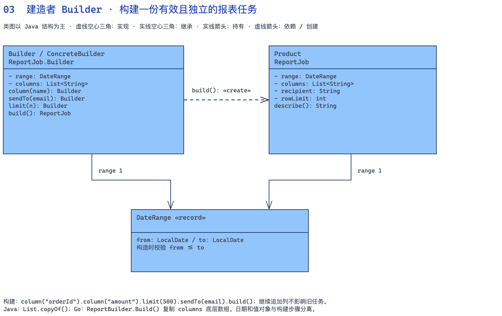

[下载可编辑的 Excalidraw 源文件](diagrams/03-builder.zh.excalidraw)

#### 双语言完整示例



```java
import java.time.LocalDate;
import java.util.*;

record DateRange(LocalDate from, LocalDate to) {
    DateRange {
        if (from.isAfter(to)) throw new IllegalArgumentException("开始日期晚于结束日期");
    }
}
// Product（产品）。
final class ReportJob {
    private final DateRange range;
    private final List<String> columns;
    private final String recipient;
    private final int rowLimit;
    private ReportJob(Builder b) {
        range = b.range;
        columns = List.copyOf(b.columns); // 构建后与 Builder 的可变列表隔离
        recipient = b.recipient;
        rowLimit = b.rowLimit;
    }
    String describe() {
        return range.from() + "~" + range.to() + " columns=" + columns.size()
            + " limit=" + rowLimit + " to=" + recipient;
    }
    // Builder / ConcreteBuilder（建造者及其实现）。
    static class Builder {
        private final DateRange range;
        private final List<String> columns = new ArrayList<>();
        private String recipient = "download";
        private int rowLimit = 1000;
        Builder(DateRange range) { this.range = Objects.requireNonNull(range); }
        Builder column(String name) {
            if (!Set.of("orderId", "amount", "region").contains(name))
                throw new IllegalArgumentException("不支持的列");
            if (!columns.contains(name)) columns.add(name);
            return this;
        }
        Builder sendTo(String email) { recipient = email; return this; }
        Builder limit(int n) { rowLimit = n; return this; }
        ReportJob build() {
            if (columns.isEmpty() || rowLimit < 1 || rowLimit > 10000 || recipient.isBlank())
                throw new IllegalArgumentException("列、行数或收件人无效");
            return new ReportJob(this);
        }
    }
}
// Client（客户端）：组装参与者并发起调用。
public class Main {
    public static void main(String[] args) {
        DateRange range = new DateRange(LocalDate.parse("2026-09-01"), LocalDate.parse("2026-09-07"));
        ReportJob.Builder builder = new ReportJob.Builder(range)
            .column("orderId").column("amount").limit(500).sendTo("ops@example.com");
        ReportJob first = builder.build();
        ReportJob second = builder.column("region").build();
        System.out.println(first.describe());
        System.out.println(second.describe());
        try { new ReportJob.Builder(range).build(); }
        catch (IllegalArgumentException e) { System.out.println(e.getMessage()); }
    }
}
```



```go
package main

import (
	"fmt"
	"time"
)

type DateRange struct{ from, to time.Time }

func NewDateRange(from, to string) (DateRange, error) {
	a, err := time.Parse("2006-01-02", from)
	if err != nil {
		return DateRange{}, err
	}
	b, err := time.Parse("2006-01-02", to)
	if err != nil {
		return DateRange{}, err
	}
	if a.After(b) {
		return DateRange{}, fmt.Errorf("开始日期晚于结束日期")
	}
	return DateRange{a, b}, nil
}

// Product（产品）。
type ReportJob struct {
	dateRange DateRange
	columns   []string
	recipient string
	rowLimit  int
}

func (j ReportJob) Describe() string {
	return fmt.Sprintf("%s~%s columns=%d limit=%d to=%s", j.dateRange.from.Format("2006-01-02"),
		j.dateRange.to.Format("2006-01-02"), len(j.columns), j.rowLimit, j.recipient)
}

// Builder / ConcreteBuilder（建造者及其实现）。
type ReportBuilder struct {
	job ReportJob
	err error
}

func NewReportBuilder(r DateRange) *ReportBuilder {
	return &ReportBuilder{job: ReportJob{dateRange: r, recipient: "download", rowLimit: 1000}}
}
func (b *ReportBuilder) Column(name string) *ReportBuilder {
	if name != "orderId" && name != "amount" && name != "region" {
		b.err = fmt.Errorf("不支持的列")
		return b
	}
	for _, c := range b.job.columns {
		if c == name {
			return b
		}
	}
	b.job.columns = append(b.job.columns, name)
	return b
}
func (b *ReportBuilder) SendTo(email string) *ReportBuilder { b.job.recipient = email; return b }
func (b *ReportBuilder) Limit(n int) *ReportBuilder         { b.job.rowLimit = n; return b }
func (b *ReportBuilder) Build() (ReportJob, error) {
	if b.err != nil {
		return ReportJob{}, b.err
	}
	j := b.job
	if len(j.columns) == 0 || j.rowLimit < 1 || j.rowLimit > 10000 || j.recipient == "" {
		return ReportJob{}, fmt.Errorf("列、行数或收件人无效")
	}
	j.columns = append([]string(nil), j.columns...) // 隔离底层数组
	return j, nil
}
// Client（客户端）：组装参与者并发起调用。
func main() {
	r, err := NewDateRange("2026-09-01", "2026-09-07")
	if err != nil {
		panic(err)
	}
	b := NewReportBuilder(r).Column("orderId").Column("amount").Limit(500).SendTo("ops@example.com")
	first, err := b.Build()
	if err != nil {
		panic(err)
	}
	second, err := b.Column("region").Build()
	if err != nil {
		panic(err)
	}
	fmt.Println(first.Describe())
	fmt.Println(second.Describe())
	_, err = NewReportBuilder(r).Build()
	fmt.Println(err)
}
```



#### 运行结果与关键点

```text
2026-09-01~2026-09-07 columns=2 limit=500 to=ops@example.com
2026-09-01~2026-09-07 columns=3 limit=500 to=ops@example.com
列、行数或收件人无效
```

新增“压缩文件”选项时，可以加有默认值的构建步骤，无需修改已有调用。`build()` 是一致性边界，不能只做 `new`；Java 的 `List.copyOf()` 和 Go 的切片复制使后续配置不会改掉已经创建的任务。

#### 什么时候不用，以及这个例子的边界

这里是常见的链式 Builder 变体，没有强行增加 Director 或 Builder 接口。只有两三个简单字段时，普通构造函数更清晰。Go 的未导出字段提供包级封装；需要向调用者返回切片时仍应复制，不能直接暴露内部数组。

### 4. 适配器 Adapter｜结构型

#### 业务场景：把以克计重的发货单接到旧快递 SDK

商城发货单包含订单号、收件地址和多条包裹明细，每条明细有重量与数量。旧快递 SDK 却要求整数公斤，还用数值状态码表示创建失败。让业务层到处换算重量、解析状态码，会把第三方细节扩散到发货、退货和运费预估功能。

| 类 / 接口 | 模式角色 | 具体职责 |
|---|---|---|
| `Shipment / Parcel` | 业务数据 | 表示一票货物及其商品明细，totalGrams() 合计重量 |
| `ShippingProvider` | Target（目标接口） | 业务需要的 quote() 与 book() 契约 |
| `LegacyCourierSdk（Go：LegacyCourierSDK）` | Adaptee（被适配者） | 旧接口 tariff()、create()，使用公斤和 LegacyTicket 状态码 |
| `CourierAdapter` | Adapter（适配器） | 实现目标接口，组合旧 SDK，完成单位、参数和结果转换 |

#### 一次请求怎样走

1. 两本 600 克的书加一个 500 克杯子，总重量是 1700 克。
2. 适配器向上取整为 2 公斤，再调用旧 SDK，运费是 600 + 2 × 200 = 1000 分。
3. SDK 返回成功票据后，适配器生成包含订单号的 `Tracking`；空地址的 400 状态码被转换为业务可处理的错误。

#### 类图：接口与关系

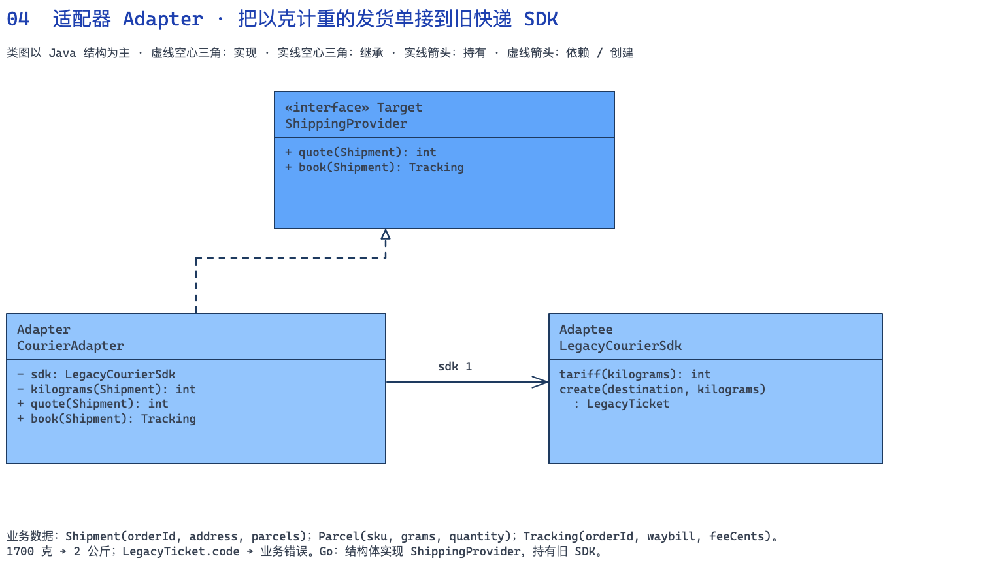

[下载可编辑的 Excalidraw 源文件](diagrams/04-adapter.zh.excalidraw)

#### 双语言完整示例



```java
import java.util.List;
record Parcel(String sku, int grams, int quantity) {}
record Shipment(String orderId, String address, List<Parcel> parcels) {
    Shipment { parcels = List.copyOf(parcels); }
    int totalGrams() { return parcels.stream().mapToInt(p -> p.grams() * p.quantity()).sum(); }
}
record Tracking(String orderId, String waybill, int feeCents) {}
// Target（目标接口）。
interface ShippingProvider {
    int quote(Shipment shipment);
    Tracking book(Shipment shipment);
}
record LegacyTicket(int code, String number) {}
// Adaptee（被适配者）。
class LegacyCourierSdk {
    int tariff(int kilograms) { return 600 + kilograms * 200; }
    LegacyTicket create(String destination, int kilograms) {
        if (destination.isBlank()) return new LegacyTicket(400, "");
        return new LegacyTicket(0, "WB-" + kilograms); // SDK 的本地替身
    }
}
// Adapter（适配器）。
class CourierAdapter implements ShippingProvider {
    private final LegacyCourierSdk sdk;
    CourierAdapter(LegacyCourierSdk sdk) { this.sdk = sdk; }
    private int kilograms(Shipment s) {
        if (s.parcels().isEmpty() || s.parcels().stream().anyMatch(p -> p.grams() <= 0 || p.quantity() <= 0))
            throw new IllegalArgumentException("包裹重量或数量无效");
        return (s.totalGrams() + 999) / 1000; // 克 → 向上取整的公斤
    }
    public int quote(Shipment s) { return sdk.tariff(kilograms(s)); }
    public Tracking book(Shipment s) {
        LegacyTicket ticket = sdk.create(s.address(), kilograms(s));
        if (ticket.code() != 0) throw new IllegalStateException("承运商拒绝地址");
        return new Tracking(s.orderId(), ticket.number(), quote(s));
    }
}
// Client（客户端）：组装参与者并发起调用。
public class Main {
    public static void main(String[] args) {
        ShippingProvider courier = new CourierAdapter(new LegacyCourierSdk());
        List<Parcel> parcels = List.of(new Parcel("BOOK", 600, 2), new Parcel("CUP", 500, 1));
        Tracking t = courier.book(new Shipment("O-200", "上海仓库路 1 号", parcels));
        System.out.printf("%s %s fee=%d%n", t.orderId(), t.waybill(), t.feeCents());
        try { courier.book(new Shipment("O-201", "", parcels)); }
        catch (IllegalStateException e) { System.out.println(e.getMessage()); }
    }
}
```



```go
package main

import "fmt"

type Parcel struct {
	SKU             string
	Grams, Quantity int
}
type Shipment struct {
	OrderID, Address string
	Parcels          []Parcel
}

func (s Shipment) TotalGrams() int {
	total := 0
	for _, p := range s.Parcels {
		total += p.Grams * p.Quantity
	}
	return total
}

type Tracking struct {
	OrderID, Waybill string
	FeeCents         int
}
// Target（目标接口）。
type ShippingProvider interface {
	Quote(Shipment) (int, error)
	Book(Shipment) (Tracking, error)
}
type LegacyTicket struct {
	Code   int
	Number string
}
// Adaptee（被适配者）。
type LegacyCourierSDK struct{}

func (LegacyCourierSDK) Tariff(kg int) int { return 600 + kg*200 }
func (LegacyCourierSDK) Create(destination string, kg int) LegacyTicket {
	if destination == "" {
		return LegacyTicket{400, ""}
	}
	return LegacyTicket{0, fmt.Sprintf("WB-%d", kg)}
}

// Adapter（适配器）。
type CourierAdapter struct{ sdk LegacyCourierSDK }

func kilograms(s Shipment) (int, error) {
	if len(s.Parcels) == 0 {
		return 0, fmt.Errorf("包裹重量或数量无效")
	}
	for _, p := range s.Parcels {
		if p.Grams <= 0 || p.Quantity <= 0 {
			return 0, fmt.Errorf("包裹重量或数量无效")
		}
	}
	return (s.TotalGrams() + 999) / 1000, nil
}
func (a CourierAdapter) Quote(s Shipment) (int, error) {
	kg, err := kilograms(s)
	if err != nil {
		return 0, err
	}
	return a.sdk.Tariff(kg), nil
}
func (a CourierAdapter) Book(s Shipment) (Tracking, error) {
	kg, err := kilograms(s)
	if err != nil {
		return Tracking{}, err
	}
	ticket := a.sdk.Create(s.Address, kg)
	if ticket.Code != 0 {
		return Tracking{}, fmt.Errorf("承运商拒绝地址")
	}
	return Tracking{s.OrderID, ticket.Number, a.sdk.Tariff(kg)}, nil
}
// Client（客户端）：组装参与者并发起调用。
func main() {
	var courier ShippingProvider = CourierAdapter{LegacyCourierSDK{}}
	parcels := []Parcel{{"BOOK", 600, 2}, {"CUP", 500, 1}}
	t, err := courier.Book(Shipment{"O-200", "上海仓库路 1 号", parcels})
	if err != nil {
		panic(err)
	}
	fmt.Printf("%s %s fee=%d\n", t.OrderID, t.Waybill, t.FeeCents)
	_, err = courier.Book(Shipment{"O-201", "", parcels})
	fmt.Println(err)
}
```



#### 运行结果与关键点

```text
O-200 WB-2 fee=1000
承运商拒绝地址
```

接入另一家快递时，为它实现一个 `ShippingProvider` 适配器。业务发货流程继续调用 `quote()`、`book()`，无需知道不同公司的重量单位、状态码和字段名称。

#### 什么时候不用，以及这个例子的边界

适配器的重点是把已有的不兼容接口接进来。这里只实现内存 SDK 替身；真实接入还要处理超时、鉴权、重复下单和服务端错误。示例运单号只是演示返回结构，不能作为唯一标识生成方案。

### 5. 装饰器 Decorator｜结构型

#### 业务场景：会员折扣与运费按顺序叠加

购物车里有三本单价 4000 分的书，会员享九折，折后商品金额满 11000 分包邮。原价计算、会员权益和配送费用由不同规则负责，组合也可能随活动变化。如果为每种组合都建一个计价类，类数量会快速增加。

| 类 / 接口 | 模式角色 | 具体职责 |
|---|---|---|
| `Cart / CartLine / Quote` | 业务数据 | 保存会员身份和商品明细；报价结果区分商品金额、运费和合计 |
| `Pricing` | Component（组件接口） | 定义所有报价对象共同遵守的报价入口 |
| `CatalogPricing` | ConcreteComponent（具体组件） | 计算未优惠的商品金额 |
| `MemberPricing / ShippingPricing` | ConcreteDecorator（具体装饰器） | 都实现 Pricing 并持有另一个 Pricing，分别叠加折扣和运费 |

传统结构还会画出 Decorator（装饰器基类）。这里两个具体装饰器直接实现 Component，并各自持有内部 Component，因此没有额外的 Decorator 父类；包装与转发的角色仍然存在。

#### 一次请求怎样走

1. 外层 `ShippingPricing` 调用会员层，会员层再调用基础计价，先得到 12000 分。
2. 会员层返回九折后的 10800 分；运费层发现没到 11000 分，添加 800 分运费。
3. 交换包装顺序后，运费层会用原价判断包邮，合计变成 10800 分，违反本例的折后包邮规则。

#### 类图：接口与关系

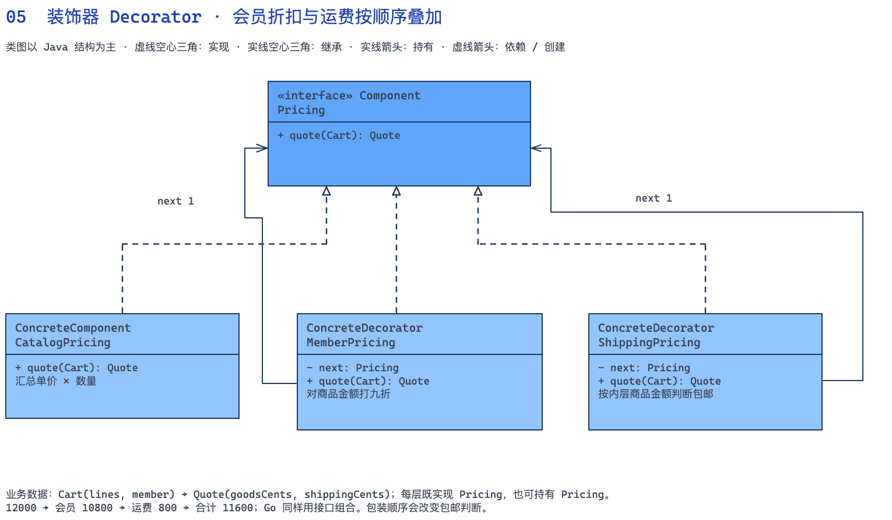

[下载可编辑的 Excalidraw 源文件](diagrams/05-decorator.zh.excalidraw)

#### 双语言完整示例



```java
import java.util.List;
record CartLine(String sku, int unitPriceCents, int quantity) {}
record Cart(List<CartLine> lines, boolean member) {
    Cart { lines = List.copyOf(lines); }
}
record Quote(int goodsCents, int shippingCents) {
    int total() { return goodsCents + shippingCents; }
}
// Component（组件接口）。
interface Pricing { Quote quote(Cart cart); }
// ConcreteComponent（具体组件）。
class CatalogPricing implements Pricing {
    public Quote quote(Cart c) {
        int goods = 0;
        for (CartLine line : c.lines()) {
            if (line.quantity() <= 0 || line.unitPriceCents() < 0)
                throw new IllegalArgumentException("商品价格或数量无效");
            goods += line.unitPriceCents() * line.quantity();
        }
        return new Quote(goods, 0);
    }
}
// ConcreteDecorator（具体装饰器）。
class MemberPricing implements Pricing {
    private final Pricing next;
    MemberPricing(Pricing next) { this.next = next; }
    public Quote quote(Cart c) {
        Quote q = next.quote(c);
        int goods = c.member() ? q.goodsCents() * 90 / 100 : q.goodsCents();
        return new Quote(goods, q.shippingCents());
    }
}
// ConcreteDecorator（具体装饰器）。
class ShippingPricing implements Pricing {
    private final Pricing next;
    ShippingPricing(Pricing next) { this.next = next; }
    public Quote quote(Cart c) {
        Quote q = next.quote(c);
        // 业务规定：按折后商品金额判断是否达到 110 元包邮。
        return new Quote(q.goodsCents(), q.goodsCents() >= 11000 ? 0 : 800);
    }
}
// Client（客户端）：组装参与者并发起调用。
public class Main {
    public static void main(String[] args) {
        Cart cart = new Cart(List.of(new CartLine("BOOK", 4000, 3)), true);
        Pricing pricing = new ShippingPricing(new MemberPricing(new CatalogPricing()));
        Quote q = pricing.quote(cart);
        System.out.printf("折后商品=%d 运费=%d 合计=%d%n", q.goodsCents(), q.shippingCents(), q.total());
        Pricing reversed = new MemberPricing(new ShippingPricing(new CatalogPricing()));
        System.out.println("反向包装的合计=" + reversed.quote(cart).total());
    }
}
```



```go
package main

import "fmt"

type CartLine struct {
	SKU                      string
	UnitPriceCents, Quantity int
}
type Cart struct {
	Lines  []CartLine
	Member bool
}
type Quote struct{ GoodsCents, ShippingCents int }

func (q Quote) Total() int { return q.GoodsCents + q.ShippingCents }

// Component（组件接口）。
type Pricing interface{ Quote(Cart) (Quote, error) }
// ConcreteComponent（具体组件）。
type CatalogPricing struct{}

func (CatalogPricing) Quote(c Cart) (Quote, error) {
	goods := 0
	for _, l := range c.Lines {
		if l.Quantity <= 0 || l.UnitPriceCents < 0 {
			return Quote{}, fmt.Errorf("商品价格或数量无效")
		}
		goods += l.UnitPriceCents * l.Quantity
	}
	return Quote{goods, 0}, nil
}

// ConcreteDecorator（具体装饰器）。
type MemberPricing struct{ next Pricing }

func (p MemberPricing) Quote(c Cart) (Quote, error) {
	q, err := p.next.Quote(c)
	if err != nil {
		return Quote{}, err
	}
	if c.Member {
		q.GoodsCents = q.GoodsCents * 90 / 100
	}
	return q, nil
}

// ConcreteDecorator（具体装饰器）。
type ShippingPricing struct{ next Pricing }

func (p ShippingPricing) Quote(c Cart) (Quote, error) {
	q, err := p.next.Quote(c)
	if err != nil {
		return Quote{}, err
	}
	q.ShippingCents = 800
	if q.GoodsCents >= 11000 {
		q.ShippingCents = 0
	}
	return q, nil
}
// Client（客户端）：组装参与者并发起调用。
func main() {
	c := Cart{[]CartLine{{"BOOK", 4000, 3}}, true}
	var pricing Pricing = ShippingPricing{MemberPricing{CatalogPricing{}}}
	q, err := pricing.Quote(c)
	if err != nil {
		panic(err)
	}
	fmt.Printf("折后商品=%d 运费=%d 合计=%d\n", q.GoodsCents, q.ShippingCents, q.Total())
	reversed := MemberPricing{ShippingPricing{CatalogPricing{}}}
	other, err := reversed.Quote(c)
	if err != nil {
		panic(err)
	}
	fmt.Printf("反向包装的合计=%d\n", other.Total())
}
```



#### 运行结果与关键点

```text
折后商品=10800 运费=800 合计=11600
反向包装的合计=10800
```

新增包装费可以再实现一层 `Pricing`，基础价格与会员规则都无需改动。装饰器使能力可以组合，但**包装顺序是业务规则的一部分**，应由装配入口明确固定。Go 这里也使用接口和结构体组合，便于与 Java 对照；轻量场景仍可用函数包装。

#### 什么时候不用，以及这个例子的边界

如果两项优惠互斥、需要比较最优组合，单纯套装饰器未必合适。装饰器也不保证每次都调用内层，例如缓存装饰器可能直接命中；应通过增强职责与设计意图区分它和代理。

### 6. 代理 Proxy｜结构型

#### 业务场景：跨租户的文档读取必须先经过权限检查

企业文档服务提供合同读取功能。用户不仅需要 document:read 权限，还必须属于文档所在租户。控制器如果先取正文再判断权限，会产生无谓读取，也容易在遗漏校验的入口泄露数据。所有业务入口应拿到同一个受保护的 `DocumentService`。

| 类 / 接口 | 模式角色 | 具体职责 |
|---|---|---|
| `User / Document` | 业务数据 | 用户带租户和权限集合，文档带标题、页数和标识 |
| `DocumentService` | Subject（共同接口） | 定义代理与真实对象共同实现的读取契约 |
| `DocumentStore` | RealSubject（真实主题） | 执行真实读取，调用计数便于观察代理是否放行 |
| `AccessPolicy` | 辅助服务 | 独立判断操作权限和租户归属 |
| `DocumentProxy` | Proxy（代理） | 先执行权限校验，通过后才委托真实服务 |

这里的 Subject 表示代理和真实对象共有的访问接口；观察者模式也使用 Subject 一词，但表示被订阅的通知主体。角色名要结合所在模式理解。

#### 一次请求怎样走

1. tenant-A 的 Alice 有读取权限，代理放行，真实存储返回 12 页的采购合同。
2. tenant-B 的 Bob 也有读取权限，但不属于该文档租户，因此在代理处被拒绝。
3. 真实读取次数仍为 1，说明被拒绝的请求没有进入存储层。

#### 类图：接口与关系

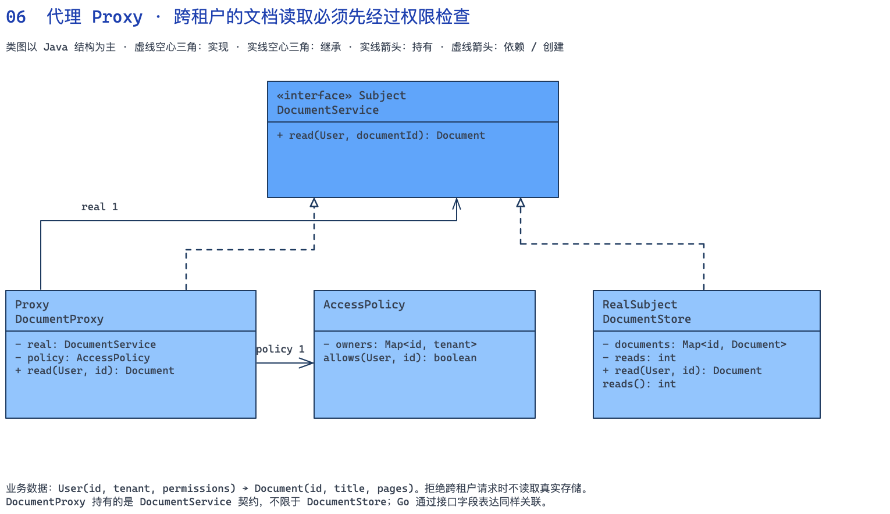

[下载可编辑的 Excalidraw 源文件](diagrams/06-proxy.zh.excalidraw)

#### 双语言完整示例



```java
import java.util.*;
record User(String id, String tenant, Set<String> permissions) {
    User { permissions = Set.copyOf(permissions); }
}
record Document(String id, String title, int pages) {}
// Subject（代理与真实对象的共同接口）。
interface DocumentService { Document read(User user, String documentId); }
// RealSubject（真实主题）。
class DocumentStore implements DocumentService {
    private final Map<String, Document> documents = Map.of("D-1", new Document("D-1", "采购合同", 12));
    private int reads;
    public Document read(User user, String id) {
        reads++;
        Document document = documents.get(id);
        if (document == null) throw new IllegalArgumentException("文档不存在");
        return document;
    }
    int reads() { return reads; }
}
class AccessPolicy {
    private final Map<String, String> owners = Map.of("D-1", "tenant-A");
    boolean allows(User user, String documentId) {
        return user.permissions().contains("document:read")
            && user.tenant().equals(owners.get(documentId));
    }
}
// Proxy（代理）。
class DocumentProxy implements DocumentService {
    private final DocumentService real;
    private final AccessPolicy policy;
    DocumentProxy(DocumentService real, AccessPolicy policy) { this.real = real; this.policy = policy; }
    public Document read(User user, String id) {
        if (!policy.allows(user, id)) throw new SecurityException("无权读取文档");
        return real.read(user, id);
    }
}
// Client（客户端）：组装参与者并发起调用。
public class Main {
    public static void main(String[] args) {
        DocumentStore store = new DocumentStore();
        DocumentService service = new DocumentProxy(store, new AccessPolicy());
        User alice = new User("alice", "tenant-A", Set.of("document:read"));
        Document d = service.read(alice, "D-1");
        System.out.printf("%s pages=%d%n", d.title(), d.pages());
        try { service.read(new User("bob", "tenant-B", Set.of("document:read")), "D-1"); }
        catch (SecurityException e) { System.out.println(e.getMessage()); }
        System.out.println("真实存储读取次数=" + store.reads());
    }
}
```



```go
package main

import "fmt"

type User struct {
	ID, Tenant  string
	Permissions map[string]bool
}
type Document struct {
	ID, Title string
	Pages     int
}
// Subject（代理与真实对象的共同接口）。
type DocumentService interface {
	Read(User, string) (Document, error)
}
// RealSubject（真实主题）。
type DocumentStore struct {
	documents map[string]Document
	reads     int
}

func (s *DocumentStore) Read(_ User, id string) (Document, error) {
	s.reads++
	d, ok := s.documents[id]
	if !ok {
		return Document{}, fmt.Errorf("文档不存在")
	}
	return d, nil
}

type AccessPolicy struct{ owners map[string]string }

func (p AccessPolicy) Allows(u User, id string) bool {
	owner, ok := p.owners[id]
	return ok && u.Permissions["document:read"] && owner == u.Tenant
}

// Proxy（代理）。
type DocumentProxy struct {
	real   DocumentService
	policy AccessPolicy
}

func (p DocumentProxy) Read(u User, id string) (Document, error) {
	if !p.policy.Allows(u, id) {
		return Document{}, fmt.Errorf("无权读取文档")
	}
	return p.real.Read(u, id)
}
// Client（客户端）：组装参与者并发起调用。
func main() {
	store := &DocumentStore{documents: map[string]Document{"D-1": {"D-1", "采购合同", 12}}}
	var service DocumentService = DocumentProxy{store, AccessPolicy{map[string]string{"D-1": "tenant-A"}}}
	alice := User{"alice", "tenant-A", map[string]bool{"document:read": true}}
	d, err := service.Read(alice, "D-1")
	if err != nil {
		panic(err)
	}
	fmt.Printf("%s pages=%d\n", d.Title, d.Pages)
	_, err = service.Read(User{"bob", "tenant-B", map[string]bool{"document:read": true}}, "D-1")
	fmt.Println(err)
	fmt.Printf("真实存储读取次数=%d\n", store.reads)
}
```



#### 运行结果与关键点

```text
采购合同 pages=12
无权读取文档
真实存储读取次数=1
```

新增管理员授权、分享链接校验时，扩展 `AccessPolicy`；替换为远程文档存储时，实现同一个 `DocumentService`。调用者不需要在每次读取时重新拼装权限步骤。

#### 什么时候不用，以及这个例子的边界

示例中的 `User` 代表认证系统已经确认的身份，不能相信客户端自己提交的 tenant 或权限字段。真实项目还要限制调用者绕过代理直接拿到存储对象。本例是访问控制代理，不依靠懒加载来体现模式。

### 7. 策略 Strategy｜行为型

#### 业务场景：同一包裹比较普通和加急配送

用户在结算页给一个 1700 克、发往偏远地区的包裹切换配送方式。普通和加急各有基础价、每公斤价格与偏远地区附加费，商品金额不变。把这些公式塞进结算类，每增加配送产品都会修改整个结算流程。

| 类 / 接口 | 模式角色 | 具体职责 |
|---|---|---|
| `Parcel / ShippingQuote` | 业务数据 | 输入重量、偏远地区标记和商品金额；输出商品金额、运费与总价 |
| `ShippingPolicy` | Strategy（策略接口） | fee() 专门表达运费算法 |
| `StandardShipping / ExpressShipping` | ConcreteStrategy（具体策略） | 分别实现普通和加急收费公式 |
| `Checkout` | Context（上下文） | 持有并调用所选策略，组合结果，不参与公式细节 |

#### 一次请求怎样走

1. 1700 克按 2 公斤计费；普通配送是 500 + 2 × 200 + 1000 = 1900 分。
2. 对同一个包裹改用加急策略，得到 1200 + 2 × 400 + 2000 = 4000 分。
3. 结算页展示两份应付金额 14700 和 16800 分，整个过程没有创建或修改真实订单。

#### 类图：接口与关系

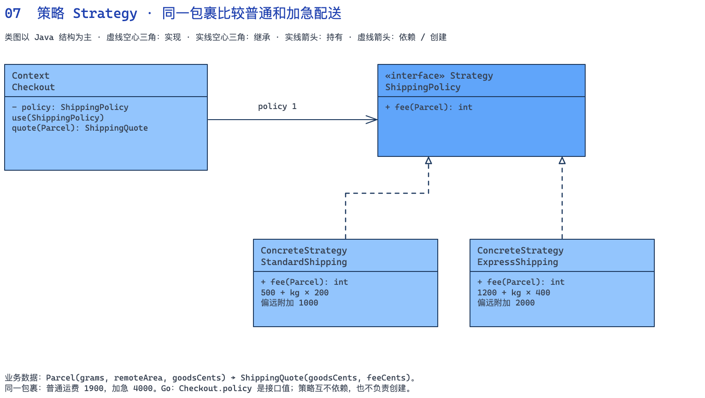

[下载可编辑的 Excalidraw 源文件](diagrams/07-strategy.zh.excalidraw)

#### 双语言完整示例



```java
record Parcel(int grams, boolean remoteArea, int goodsCents) {
    Parcel {
        if (grams <= 0 || goodsCents < 0) throw new IllegalArgumentException("包裹无效");
    }
    int kilograms() { return (grams + 999) / 1000; }
}
record ShippingQuote(int goodsCents, int feeCents) {
    int payable() { return goodsCents + feeCents; }
}
// Strategy（策略接口）。
interface ShippingPolicy { int fee(Parcel parcel); }
// ConcreteStrategy（具体策略）。
class StandardShipping implements ShippingPolicy {
    public int fee(Parcel p) {
        return 500 + p.kilograms() * 200 + (p.remoteArea() ? 1000 : 0);
    }
}
// ConcreteStrategy（具体策略）。
class ExpressShipping implements ShippingPolicy {
    public int fee(Parcel p) {
        return 1200 + p.kilograms() * 400 + (p.remoteArea() ? 2000 : 0);
    }
}
// Context（上下文）。
class Checkout {
    private ShippingPolicy policy;
    Checkout(ShippingPolicy policy) { use(policy); }
    void use(ShippingPolicy policy) { this.policy = java.util.Objects.requireNonNull(policy); }
    ShippingQuote quote(Parcel parcel) { return new ShippingQuote(parcel.goodsCents(), policy.fee(parcel)); }
}
// Client（客户端）：组装参与者并发起调用。
public class Main {
    public static void main(String[] args) {
        Parcel parcel = new Parcel(1700, true, 12800);
        Checkout checkout = new Checkout(new StandardShipping());
        ShippingQuote standard = checkout.quote(parcel);
        checkout.use(new ExpressShipping());
        ShippingQuote express = checkout.quote(parcel);
        System.out.printf("普通配送 fee=%d payable=%d%n", standard.feeCents(), standard.payable());
        System.out.printf("加急配送 fee=%d payable=%d%n", express.feeCents(), express.payable());
    }
}
```



```go
package main

import "fmt"

type Parcel struct {
	Grams      int
	RemoteArea bool
	GoodsCents int
}

func (p Parcel) Kilograms() int { return (p.Grams + 999) / 1000 }

type ShippingQuote struct{ GoodsCents, FeeCents int }

func (q ShippingQuote) Payable() int { return q.GoodsCents + q.FeeCents }

// Strategy（策略接口）。
type ShippingPolicy interface{ Fee(Parcel) int }
// ConcreteStrategy（具体策略）。
type StandardShipping struct{}

func (StandardShipping) Fee(p Parcel) int {
	fee := 500 + p.Kilograms()*200
	if p.RemoteArea {
		fee += 1000
	}
	return fee
}

// ConcreteStrategy（具体策略）。
type ExpressShipping struct{}

func (ExpressShipping) Fee(p Parcel) int {
	fee := 1200 + p.Kilograms()*400
	if p.RemoteArea {
		fee += 2000
	}
	return fee
}

// Context（上下文）。
type Checkout struct{ policy ShippingPolicy }

func (c *Checkout) Use(p ShippingPolicy) { c.policy = p }
func (c Checkout) Quote(p Parcel) (ShippingQuote, error) {
	if p.Grams <= 0 || p.GoodsCents < 0 {
		return ShippingQuote{}, fmt.Errorf("包裹无效")
	}
	if c.policy == nil {
		return ShippingQuote{}, fmt.Errorf("未选择配送方式")
	}
	return ShippingQuote{p.GoodsCents, c.policy.Fee(p)}, nil
}
// Client（客户端）：组装参与者并发起调用。
func main() {
	parcel := Parcel{1700, true, 12800}
	checkout := Checkout{StandardShipping{}}
	standard, err := checkout.Quote(parcel)
	if err != nil {
		panic(err)
	}
	checkout.Use(ExpressShipping{})
	express, err := checkout.Quote(parcel)
	if err != nil {
		panic(err)
	}
	fmt.Printf("普通配送 fee=%d payable=%d\n", standard.FeeCents, standard.Payable())
	fmt.Printf("加急配送 fee=%d payable=%d\n", express.FeeCents, express.Payable())
}
```



#### 运行结果与关键点

```text
普通配送 fee=1900 payable=14700
加急配送 fee=4000 payable=16800
```

新增冷链配送时实现 `ShippingPolicy`，让装配入口选择它。`Checkout.quote()` 不必新增分支，也不需要理解保温箱、温控时长等具体计价规则；如果新算法需要额外输入，应同步审视 `Parcel` 的契约是否仍然合理。

#### 什么时候不用，以及这个例子的边界

运行时切换只是演示方法。即使策略在构造时注入后一直不变，只要它用于封装可替换算法，仍然可以是策略模式。只有一个简单公式且不会变化时，普通方法即可。

### 8. 观察者 Observer｜行为型

#### 业务场景：订单到账后，积分和回执各自订阅事实

订单确认到账后，需要给顾客加积分、写回执、通知邮件系统。这些是不同的附属功能。把它们全写在付款确认方法里，每次增加功能都要改主流程；邮件出错还可能阻止回执生成。本例明确规定：付款事实先成立，订阅者独立处理，通知失败要汇总返回。

| 类 / 接口 | 模式角色 | 具体职责 |
|---|---|---|
| `OrderPaid` | 事件数据 | 包含订单号、顾客号和到账金额的不可变付款事实 |
| `OrderService` | Client（发布事件的业务调用方） | 检查到账金额与重复确认，再调用 Subject 发布付款事实 |
| `PaidEvents` | Subject（被观察者；同时承担 ConcreteSubject） | 持有观察者列表，接受订阅，逐个通知并收集失败 |
| `PaidListener` | Observer（观察者接口） | 用 onPaid() 约定观察者收到付款事件后的处理入口 |
| `LoyaltyListener / ReceiptListener` | ConcreteObserver（具体观察者） | 分别更新积分账本和本地回执列表 |

**对照教材中的名称：** `PaidEvents` 是 Subject，`PaidListener` 是 Observer（标准拼写是 Observer）。`subscribe()` 对应常见的 `attach()`，`publish()` 对应 `notify()`，`onPaid()` 对应观察者的 `update()`。本例没有实现 `detach()` / 取消订阅，也没有把 Subject 接口与 ConcreteSubject 分成两个类型；`PaidEvents` 同时保存订阅列表并实现通知。`OrderService` 提供付款事实，`OrderPaid` 承载该事实，二者都不能与 Observer 接口混为一谈。

#### 一次请求怎样走

1. O-300 到账 12800 分，`OrderService` 先将订单标记为已付款。
2. 积分订阅者记入 128 分；第二个演示订阅者返回邮件不可用。
3. 发布器记录失败后继续通知回执订阅者，最终得到已付款、128 积分、1 条回执和 1 个通知错误。

#### 类图：接口与关系

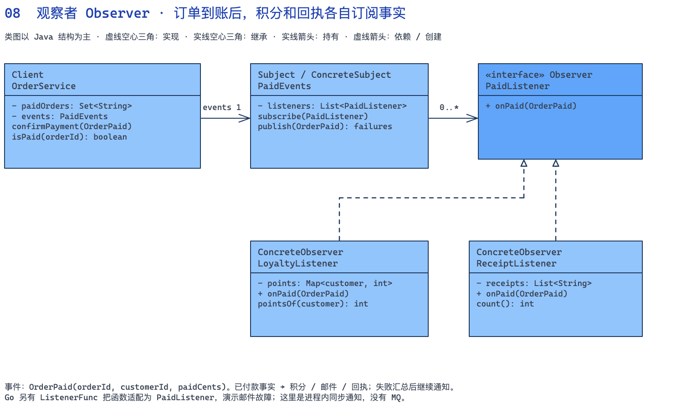

[下载可编辑的 Excalidraw 源文件](diagrams/08-observer.zh.excalidraw)

#### 双语言完整示例



```java
import java.util.*;
record OrderPaid(String orderId, String customerId, int paidCents) {}
// Observer（观察者接口）：onPaid 对应通常所说的 update 回调。
interface PaidListener { void onPaid(OrderPaid event); }
// Subject（被观察者）：同时承担 ConcreteSubject 的订阅管理与通知实现。
class PaidEvents {
    private final List<PaidListener> listeners = new ArrayList<>();
    void subscribe(PaidListener listener) { listeners.add(listener); }
    List<String> publish(OrderPaid event) {
        List<String> failures = new ArrayList<>();
        for (PaidListener listener : List.copyOf(listeners)) {
            try { listener.onPaid(event); }
            catch (RuntimeException e) { failures.add(e.getMessage()); }
        }
        return failures;
    }
}
// ConcreteObserver（具体观察者）：积分处理。
class LoyaltyListener implements PaidListener {
    private final Map<String, Integer> points = new HashMap<>();
    public void onPaid(OrderPaid e) { points.merge(e.customerId(), e.paidCents() / 100, Integer::sum); }
    int pointsOf(String customer) { return points.getOrDefault(customer, 0); }
}
// ConcreteObserver（具体观察者）：回执处理。
class ReceiptListener implements PaidListener {
    private final List<String> receipts = new ArrayList<>();
    public void onPaid(OrderPaid e) { receipts.add(e.orderId() + ":" + e.paidCents()); }
    int count() { return receipts.size(); }
}
// Client（业务调用方）：确认付款后调用 Subject。
class OrderService {
    private final Set<String> paidOrders = new HashSet<>();
    private final PaidEvents events;
    OrderService(PaidEvents events) { this.events = events; }
    List<String> confirmPayment(OrderPaid event) {
        if (event.paidCents() <= 0) throw new IllegalArgumentException("到账金额无效");
        if (!paidOrders.add(event.orderId())) throw new IllegalStateException("订单已确认付款");
        return events.publish(event); // 已付款事实先成立，再通知附属功能
    }
    boolean isPaid(String id) { return paidOrders.contains(id); }
}
// Client（客户端）：组装参与者并发起调用。
public class Main {
    public static void main(String[] args) {
        PaidEvents events = new PaidEvents();
        LoyaltyListener loyalty = new LoyaltyListener();
        ReceiptListener receipts = new ReceiptListener();
        events.subscribe(loyalty);
        events.subscribe(e -> { throw new IllegalStateException("邮件服务不可用"); });
        events.subscribe(receipts);
        OrderService orders = new OrderService(events);
        List<String> failures = orders.confirmPayment(new OrderPaid("O-300", "C-8", 12800));
        System.out.printf("已付款=%s 积分=%d 回执数=%d 失败数=%d%n",
            orders.isPaid("O-300"), loyalty.pointsOf("C-8"), receipts.count(), failures.size());
        System.out.println(failures.get(0));
    }
}
```



```go
package main

import "fmt"

type OrderPaid struct {
	OrderID, CustomerID string
	PaidCents           int
}
// Observer（观察者接口）：onPaid 对应通常所说的 update 回调。
type PaidListener interface{ OnPaid(OrderPaid) error }
type ListenerFunc func(OrderPaid) error

func (f ListenerFunc) OnPaid(e OrderPaid) error { return f(e) }

// Subject（被观察者）：同时承担 ConcreteSubject 的订阅管理与通知实现。
type PaidEvents struct{ listeners []PaidListener }

func (b *PaidEvents) Subscribe(l PaidListener) { b.listeners = append(b.listeners, l) }
func (b *PaidEvents) Publish(e OrderPaid) []error {
	var failures []error
	for _, l := range append([]PaidListener(nil), b.listeners...) {
		if err := l.OnPaid(e); err != nil {
			failures = append(failures, err)
		}
	}
	return failures
}

// ConcreteObserver（具体观察者）：积分处理。
type LoyaltyListener struct{ points map[string]int }

func (l *LoyaltyListener) OnPaid(e OrderPaid) error {
	l.points[e.CustomerID] += e.PaidCents / 100
	return nil
}
func (l *LoyaltyListener) PointsOf(id string) int { return l.points[id] }

// ConcreteObserver（具体观察者）：回执处理。
type ReceiptListener struct{ receipts []string }

func (l *ReceiptListener) OnPaid(e OrderPaid) error {
	l.receipts = append(l.receipts, fmt.Sprintf("%s:%d", e.OrderID, e.PaidCents))
	return nil
}
func (l *ReceiptListener) Count() int { return len(l.receipts) }

// Client（业务调用方）：确认付款后调用 Subject。
type OrderService struct {
	paidOrders map[string]bool
	events     *PaidEvents
}

func (s *OrderService) ConfirmPayment(e OrderPaid) ([]error, error) {
	if e.PaidCents <= 0 {
		return nil, fmt.Errorf("到账金额无效")
	}
	if s.paidOrders[e.OrderID] {
		return nil, fmt.Errorf("订单已确认付款")
	}
	s.paidOrders[e.OrderID] = true
	return s.events.Publish(e), nil
}
// Client（客户端）：组装参与者并发起调用。
func main() {
	events := &PaidEvents{}
	loyalty := &LoyaltyListener{map[string]int{}}
	receipts := &ReceiptListener{}
	events.Subscribe(loyalty)
	events.Subscribe(ListenerFunc(func(OrderPaid) error { return fmt.Errorf("邮件服务不可用") }))
	events.Subscribe(receipts)
	orders := OrderService{map[string]bool{}, events}
	failures, err := orders.ConfirmPayment(OrderPaid{"O-300", "C-8", 12800})
	if err != nil {
		panic(err)
	}
	fmt.Printf("已付款=%t 积分=%d 回执数=%d 失败数=%d\n", orders.paidOrders["O-300"], loyalty.PointsOf("C-8"), receipts.Count(), len(failures))
	fmt.Println(failures[0])
}
```



#### 运行结果与关键点

```text
已付款=true 积分=128 回执数=1 失败数=1
邮件服务不可用
```

要增加数据分析订阅者，只需实现 `PaidListener` 并注册。发布器不依赖积分或回执的具体类型。本例通知是同步顺序执行，错误隔离来自 `publish()` 的明确代码，并不是观察者模式自动附赠的能力。

#### 什么时候不用，以及这个例子的边界

示例的状态和事件都在内存里，进程崩溃会丢失；重复付款确认被拒绝，也没有自动重试失败订阅者。需要可靠投递时，要另行处理事件持久化、幂等和重试。库存预留、实际扣款等必须成功的主交易步骤不应随意塞进这种尽力通知流程。

## 二、易混模式：从变化的位置判断

| 容易混淆的模式 | 应该观察的职责 | 本文的对应例子 |
|---|---|---|
| 工厂 / 策略 | 工厂决定怎样创建对象；策略封装怎样完成某项计算 | 支付渠道的配置与创建 / 包裹的运费公式 |
| 装饰器 / 代理 | 装饰器组合附加能力；代理控制访问对象的方式 | 会员与运费叠加 / 文档租户权限检查 |
| 状态 / 策略 | 状态表达对象生命周期中动作是否合法、如何流转；策略表达可替换算法 | 付款前不能发货 / 普通与加急计费 |
| 桥接 / 适配器 | 桥接拆开两个独立演化维度；适配器转换已有的不兼容接口 | 告警级别 × 渠道 / 克与公斤、状态码与业务错误 |
| 命令 / 备忘录 | 命令记录要执行的动作；备忘录保存恢复所需的状态 | 加商品与用券 / 报价单完整检查点 |
| 迭代器 / 责任链 | 迭代器依次提供数据；责任链让同一请求依次接受处理 | 多页订单遍历 / 一次采购请求的逐项校验 |

**不要把“选完换不换”作为工厂与策略的分界，也不要把“内层是否被调用”作为装饰器与代理的唯一分界。** 这些可能是某个实现的行为，但设计意图才决定职责。例如一个注入后不再替换的计价算法仍然可以是策略；缓存装饰器命中时也可能不调用内层。

观察者和分布式发布订阅也不等同：本例的发布者持有订阅者引用并同步调用；消息中间件进一步引入跨进程传输、持久化和投递语义。支付成功后的附属通知可以借鉴事件解耦，但可靠性仍需独立设计。

### 工厂与策略怎样组合

复用第 7 节的 `Parcel`、`ShippingPolicy`、两个配送策略和 `Checkout`。当结算页传入配送方式时，由工厂负责创建策略，由结算对象负责使用策略。下面的工厂和试算入口**复用第 7 节的类型**，不是另一份独立程序。



```java
class ShippingFactory {
    ShippingPolicy create(String method) {
        return switch (method) {
            case "standard" -> new StandardShipping();
            case "express" -> new ExpressShipping();
            default -> throw new IllegalArgumentException("不支持的配送方式");
        };
    }
}
class ShippingPreview {
    private final ShippingFactory factory = new ShippingFactory();
    ShippingQuote quote(String method, Parcel parcel) {
        Checkout checkout = new Checkout(factory.create(method));
        return checkout.quote(parcel);
    }
}
// main 中调用 new ShippingPreview().quote("express", parcel)，应付金额为 16800。
```


```go
type ShippingFactory struct{}
func (ShippingFactory) Create(method string) (ShippingPolicy, error) {
    switch method {
    case "standard":
        return StandardShipping{}, nil
    case "express":
        return ExpressShipping{}, nil
    default:
        return nil, fmt.Errorf("不支持的配送方式")
    }
}
type ShippingPreview struct { factory ShippingFactory }
func (p ShippingPreview) Quote(method string, parcel Parcel) (ShippingQuote, error) {
    policy, err := p.factory.Create(method)
    if err != nil { return ShippingQuote{}, err }
    checkout := Checkout{policy: policy}
    return checkout.Quote(parcel)
}
// main 中调用 ShippingPreview{ShippingFactory{}}.Quote("express", parcel)，并检查 error。
```



新增冷链计费时，算法类与工厂选择入口发生变化，结算对象仍然只调用 `ShippingPolicy`。工厂并没有取代策略，策略也不负责知道怎样配置每一种实现。

## 三、另外 8 个常用模式：流程、状态与历史

### 9. 外观模式 Facade（结构型）

#### 业务场景：一个发货入口编排预留、打包与叫件

仓库操作员只想提交订单号、SKU、数量和地址。系统却需要先预留库存，再计算含包装的重量，最后向承运商叫件。每个入口若都复制这段编排，失败时是否释放库存很容易不一致。`FulfillmentFacade.dispatch()` 提供统一入口，并集中处理本例可以确定恢复的失败。

| 类 / 接口 | 模式角色 | 具体职责 |
|---|---|---|
| `FulfillmentRequest / PackageInfo / Dispatch` | 业务数据 | 封装发货请求、包装结果和最终运单 |
| `Inventory` | Subsystem（子系统） | reserve() 预留库存，release() 释放，available() 查询余额 |
| `PackagingService / CarrierService` | Subsystem（子系统） | 分别生成 PackageInfo 和创建运单 |
| `FulfillmentFacade` | Facade（外观） | 持有三个子系统，决定调用顺序并在叫件拒绝时释放预留 |

#### 一次请求怎样走

1. BOOK 初始库存 10，第一单预留 2 件后余量为 8。
2. 两本书各 600 克，加上 100 克包装，叫件重量为 1300 克，返回 WB-1。
3. 第二单预留 3 件后因空地址被承运商拒绝，门面释放这 3 件，库存恢复为 8。

#### 类图：接口与关系

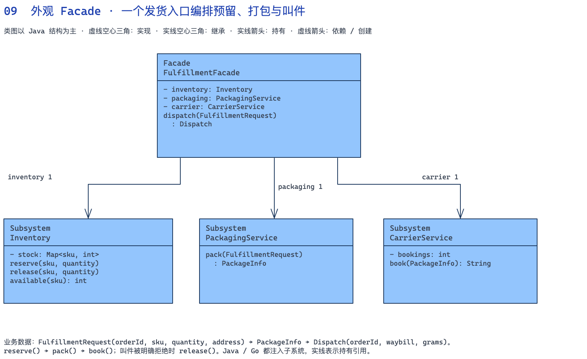

[下载可编辑的 Excalidraw 源文件](diagrams/09-facade.zh.excalidraw)

#### 双语言完整示例



```java
import java.util.*;
record FulfillmentRequest(String orderId, String sku, int quantity, String address) {}
record PackageInfo(String orderId, int grams, String address) {}
record Dispatch(String orderId, String waybill, int grams) {}
// Subsystem（库存子系统）。
class Inventory {
    private final Map<String, Integer> stock = new HashMap<>(Map.of("BOOK", 10));
    void reserve(String sku, int quantity) {
        if (quantity <= 0 || available(sku) < quantity) throw new IllegalStateException("库存不足或数量无效");
        stock.put(sku, available(sku) - quantity);
    }
    void release(String sku, int quantity) { stock.put(sku, available(sku) + quantity); }
    int available(String sku) { return stock.getOrDefault(sku, 0); }
}
// Subsystem（包装子系统）。
class PackagingService {
    PackageInfo pack(FulfillmentRequest r) {
        return new PackageInfo(r.orderId(), r.quantity() * 600 + 100, r.address());
    }
}
// Subsystem（物流子系统）。
class CarrierService {
    private int bookings;
    String book(PackageInfo p) {
        if (p.address().isBlank()) throw new IllegalArgumentException("收件地址为空");
        return "WB-" + (++bookings);
    }
}
// Facade（外观）。
class FulfillmentFacade {
    private final Inventory inventory;
    private final PackagingService packaging;
    private final CarrierService carrier;
    FulfillmentFacade(Inventory i, PackagingService p, CarrierService c) {
        inventory = i; packaging = p; carrier = c;
    }
    Dispatch dispatch(FulfillmentRequest request) {
        inventory.reserve(request.sku(), request.quantity());
        try {
            PackageInfo parcel = packaging.pack(request);
            String waybill = carrier.book(parcel);
            return new Dispatch(request.orderId(), waybill, parcel.grams());
        } catch (RuntimeException e) {
            inventory.release(request.sku(), request.quantity());
            throw e;
        }
    }
}
// Client（客户端）：组装参与者并发起调用。
public class Main {
    public static void main(String[] args) {
        Inventory inventory = new Inventory();
        FulfillmentFacade facade = new FulfillmentFacade(inventory, new PackagingService(), new CarrierService());
        Dispatch d = facade.dispatch(new FulfillmentRequest("O-400", "BOOK", 2, "上海仓库路 1 号"));
        System.out.printf("%s %s grams=%d 库存=%d%n", d.orderId(), d.waybill(), d.grams(), inventory.available("BOOK"));
        try { facade.dispatch(new FulfillmentRequest("O-401", "BOOK", 3, "")); }
        catch (IllegalArgumentException e) { System.out.println(e.getMessage()); }
        System.out.println("失败后库存=" + inventory.available("BOOK"));
    }
}
```



```go
package main

import "fmt"

type FulfillmentRequest struct {
	OrderID, SKU string
	Quantity     int
	Address      string
}
type PackageInfo struct {
	OrderID string
	Grams   int
	Address string
}
type Dispatch struct {
	OrderID, Waybill string
	Grams            int
}
// Subsystem（库存子系统）。
type Inventory struct{ stock map[string]int }

func (i *Inventory) Available(sku string) int { return i.stock[sku] }
func (i *Inventory) Reserve(sku string, q int) error {
	if q <= 0 || i.Available(sku) < q {
		return fmt.Errorf("库存不足或数量无效")
	}
	i.stock[sku] -= q
	return nil
}
func (i *Inventory) Release(sku string, q int) { i.stock[sku] += q }

// Subsystem（包装子系统）。
type PackagingService struct{}

func (PackagingService) Pack(r FulfillmentRequest) PackageInfo {
	return PackageInfo{r.OrderID, r.Quantity*600 + 100, r.Address}
}

// Subsystem（物流子系统）。
type CarrierService struct{ bookings int }

func (c *CarrierService) Book(p PackageInfo) (string, error) {
	if p.Address == "" {
		return "", fmt.Errorf("收件地址为空")
	}
	c.bookings++
	return fmt.Sprintf("WB-%d", c.bookings), nil
}

// Facade（外观）。
type FulfillmentFacade struct {
	inventory *Inventory
	packaging PackagingService
	carrier   *CarrierService
}

func (f FulfillmentFacade) Dispatch(r FulfillmentRequest) (Dispatch, error) {
	if err := f.inventory.Reserve(r.SKU, r.Quantity); err != nil {
		return Dispatch{}, err
	}
	p := f.packaging.Pack(r)
	waybill, err := f.carrier.Book(p)
	if err != nil {
		f.inventory.Release(r.SKU, r.Quantity)
		return Dispatch{}, err
	}
	return Dispatch{r.OrderID, waybill, p.Grams}, nil
}
// Client（客户端）：组装参与者并发起调用。
func main() {
	inventory := &Inventory{map[string]int{"BOOK": 10}}
	facade := FulfillmentFacade{inventory, PackagingService{}, &CarrierService{}}
	d, err := facade.Dispatch(FulfillmentRequest{"O-400", "BOOK", 2, "上海仓库路 1 号"})
	if err != nil {
		panic(err)
	}
	fmt.Printf("%s %s grams=%d 库存=%d\n", d.OrderID, d.Waybill, d.Grams, inventory.Available("BOOK"))
	_, err = facade.Dispatch(FulfillmentRequest{"O-401", "BOOK", 3, ""})
	fmt.Println(err)
	fmt.Printf("失败后库存=%d\n", inventory.Available("BOOK"))
}
```



#### 运行结果与关键点

```text
O-400 WB-1 grams=1300 库存=8
收件地址为空
失败后库存=8
```

对外调用方只依赖一个门面入口。子系统对象通过构造参数注入，因此类图画的是持有关联；它们不是由门面私有创建并独占的组合对象。进一步引入接口可替换真实仓储或物流服务，但这个局部例子无需给每个类机械地加接口。

#### 什么时候不用，以及这个例子的边界

门面简化接口，不自动提供分布式事务。这里承运商失败一定发生在创建运单之前；若真实请求超时但对方已经接单，不能直接假定释放库存就是完整回滚，必须查询结果并设计补偿。重复发货与并发库存控制也未在本例实现。

### 10. 责任链 Chain of Responsibility（行为型）

#### 业务场景：采购请求逐项校验并保留通过轨迹

采购入口要检查用户标识、商品数量、账号状态和可用库存。无效参数不该访问后续资源；冻结账号也不该继续查库存。每个检查负责一个原因，遇到拒绝立即停止，同时保留已经通过的步骤，方便页面解释失败位置。

| 类 / 接口 | 模式角色 | 具体职责 |
|---|---|---|
| `PurchaseRequest / CheckContext` | 业务数据 | 请求保存用户、SKU、数量；上下文保存通过轨迹 |
| `PurchaseCheck` | Handler（处理者） | Java 抽象基类保存 next，固定先检查再传递；Go 接口定义处理入口 |
| `ParameterCheck / AccountCheck / StockCheck` | ConcreteHandler（具体处理者） | 分别检查参数、账号和库存 |
| `Go NextCheck` | 转发辅助对象 | 负责传递到下一节点，本身没有完整实现 Handler 接口 |

#### 一次请求怎样走

1. 正常账号买 2 本书，依次通过参数、账号和库存三项检查。
2. 冻结账号在账号节点失败，轨迹只有参数通过，库存节点未执行。
3. 正常账号买 4 本书，但库存只有 3，轨迹停在账号通过，返回库存不足。

#### 类图：接口与关系

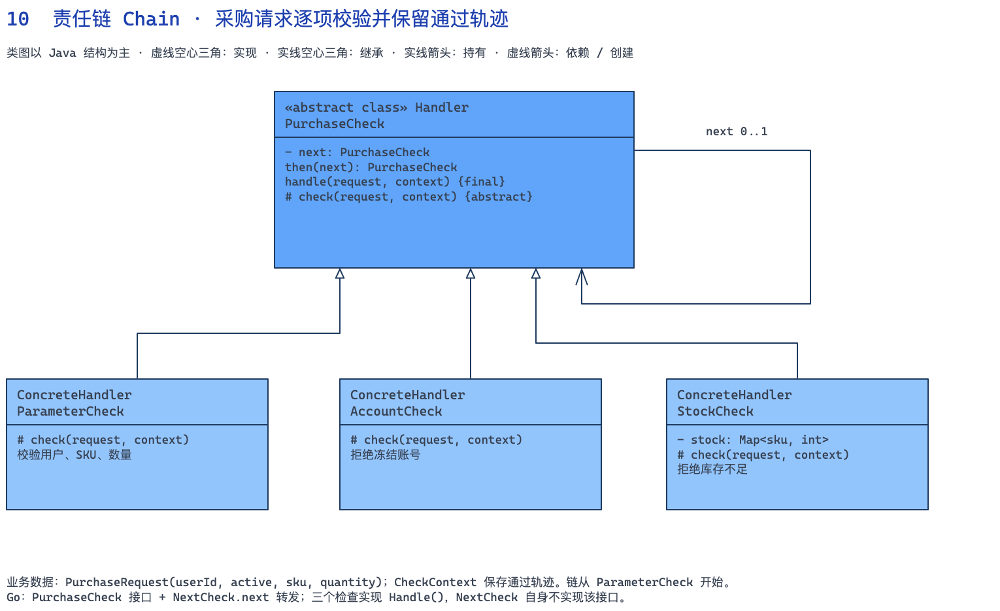

[下载可编辑的 Excalidraw 源文件](diagrams/10-chain.zh.excalidraw)

#### 双语言完整示例



```java
import java.util.*;
record PurchaseRequest(String userId, boolean active, String sku, int quantity) {}
class CheckContext {
    private final List<String> passed = new ArrayList<>();
    void record(String step) { passed.add(step); }
    String trace() { return String.join(" -> ", passed); }
}
// Handler（处理者）。
abstract class PurchaseCheck {
    private PurchaseCheck next;
    PurchaseCheck then(PurchaseCheck next) { this.next = next; return next; }
    final void handle(PurchaseRequest r, CheckContext context) {
        check(r, context);
        if (next != null) next.handle(r, context);
    }
    protected abstract void check(PurchaseRequest r, CheckContext context);
}
// ConcreteHandler（具体处理者）。
class ParameterCheck extends PurchaseCheck {
    protected void check(PurchaseRequest r, CheckContext c) {
        if (r.userId().isBlank() || r.sku().isBlank() || r.quantity() <= 0)
            throw new IllegalArgumentException("参数不合法");
        c.record("参数通过");
    }
}
// ConcreteHandler（具体处理者）。
class AccountCheck extends PurchaseCheck {
    protected void check(PurchaseRequest r, CheckContext c) {
        if (!r.active()) throw new IllegalStateException("账户已冻结");
        c.record("账户通过");
    }
}
// ConcreteHandler（具体处理者）。
class StockCheck extends PurchaseCheck {
    private final Map<String, Integer> stock;
    StockCheck(Map<String, Integer> stock) { this.stock = Map.copyOf(stock); }
    protected void check(PurchaseRequest r, CheckContext c) {
        if (stock.getOrDefault(r.sku(), 0) < r.quantity()) throw new IllegalStateException("库存不足");
        c.record("库存通过");
    }
}
// Client（客户端）：组装参与者并发起调用。
public class Main {
    public static void main(String[] args) {
        PurchaseCheck head = new ParameterCheck();
        head.then(new AccountCheck()).then(new StockCheck(Map.of("BOOK", 3)));
        for (PurchaseRequest r : List.of(
            new PurchaseRequest("U-1", true, "BOOK", 2),
            new PurchaseRequest("U-2", false, "BOOK", 2),
            new PurchaseRequest("U-3", true, "BOOK", 4))) {
            CheckContext context = new CheckContext();
            try { head.handle(r, context); System.out.println("允许提交: " + context.trace()); }
            catch (RuntimeException e) { System.out.println(e.getMessage() + " | " + context.trace()); }
        }
    }
}
```



```go
package main

import (
	"fmt"
	"strings"
)

type PurchaseRequest struct {
	UserID   string
	Active   bool
	SKU      string
	Quantity int
}
type CheckContext struct{ passed []string }

func (c *CheckContext) Record(step string) { c.passed = append(c.passed, step) }
func (c *CheckContext) Trace() string      { return strings.Join(c.passed, " -> ") }

// Handler（处理者）。
type PurchaseCheck interface {
	Handle(PurchaseRequest, *CheckContext) error
}
type NextCheck struct{ next PurchaseCheck }

func (n NextCheck) Forward(r PurchaseRequest, c *CheckContext) error {
	if n.next != nil {
		return n.next.Handle(r, c)
	}
	return nil
}

// ConcreteHandler（具体处理者）。
type ParameterCheck struct{ NextCheck }

func (p ParameterCheck) Handle(r PurchaseRequest, c *CheckContext) error {
	if r.UserID == "" || r.SKU == "" || r.Quantity <= 0 {
		return fmt.Errorf("参数不合法")
	}
	c.Record("参数通过")
	return p.Forward(r, c)
}

// ConcreteHandler（具体处理者）。
type AccountCheck struct{ NextCheck }

func (p AccountCheck) Handle(r PurchaseRequest, c *CheckContext) error {
	if !r.Active {
		return fmt.Errorf("账户已冻结")
	}
	c.Record("账户通过")
	return p.Forward(r, c)
}

// ConcreteHandler（具体处理者）。
type StockCheck struct {
	NextCheck
	stock map[string]int
}

func (p StockCheck) Handle(r PurchaseRequest, c *CheckContext) error {
	if p.stock[r.SKU] < r.Quantity {
		return fmt.Errorf("库存不足")
	}
	c.Record("库存通过")
	return p.Forward(r, c)
}
// Client（客户端）：组装参与者并发起调用。
func main() {
	stock := StockCheck{stock: map[string]int{"BOOK": 3}}
	account := AccountCheck{NextCheck{stock}}
	var head PurchaseCheck = ParameterCheck{NextCheck{account}}
	requests := []PurchaseRequest{{"U-1", true, "BOOK", 2}, {"U-2", false, "BOOK", 2}, {"U-3", true, "BOOK", 4}}
	for _, r := range requests {
		c := &CheckContext{}
		if err := head.Handle(r, c); err != nil {
			fmt.Println(err, "|", c.Trace())
		} else {
			fmt.Println("允许提交:", c.Trace())
		}
	}
}
```



#### 运行结果与关键点

```text
允许提交: 参数通过 -> 账户通过 -> 库存通过
账户已冻结 | 参数通过
库存不足 | 参数通过 -> 账户通过
```

增加额度检查时，新增节点并在装配链条时插入。顺序由业务约束决定，例如先进行便宜的参数检查，再访问外部资源。Java 的 `then()` 返回下一个节点以便串接，执行时必须保留并调用链头。

#### 什么时候不用，以及这个例子的边界

这里是校验型责任链，所有节点通过才允许提交。库存检查只是读快照，不能防止并发超卖，正式提交仍要原子预留。链条可增删并不意味着不适用；真正要警惕的是顺序依赖过多、职责交叉，或者只需两三个简单判断却引入大量类。

### 11. 状态模式 State（行为型）

#### 业务场景：订单对同一个动作给出不同状态响应

订单待付款时可以付款或取消；付款后才允许发货；发货后不能再次付款或直接取消。区别不仅是状态名称不同，同一个 `ship()` 操作在不同状态下必须有不同结果。把所有动作与状态的组合都放进 `Order` 的多层条件分支，后续加入退款、拦截发货等逻辑会更难维护。

| 类 / 接口 | 模式角色 | 具体职责 |
|---|---|---|
| `Order` | Context（上下文） | 保存金额、付款凭据、运单和当前状态，业务动作委托给状态对象 |
| `OrderState` | State（状态接口） | 定义 pay()、ship()、cancel()，Java 默认方法拒绝不支持的动作 |
| `Pending / Paid` | ConcreteState（具体状态） | 分别实现付款、取消以及发货前校验，并决定后继状态 |
| `Shipped / Cancelled` | ConcreteState（具体状态） | 终态，沿用默认拒绝行为 |
| `PaymentReceipt / Shipment` | 业务数据 | 承载需要校验的交易流水、金额和运单 |

#### 一次请求怎样走

1. 待付款时直接发货被拒绝，订单没有变化。
2. 提交金额匹配的付款凭据后进入已付款，再附有效运单进入已发货。
3. 已发货订单再次付款会失败；另一笔待付款订单可以直接取消，且没有付款凭据或运单。

#### 类图：接口与关系

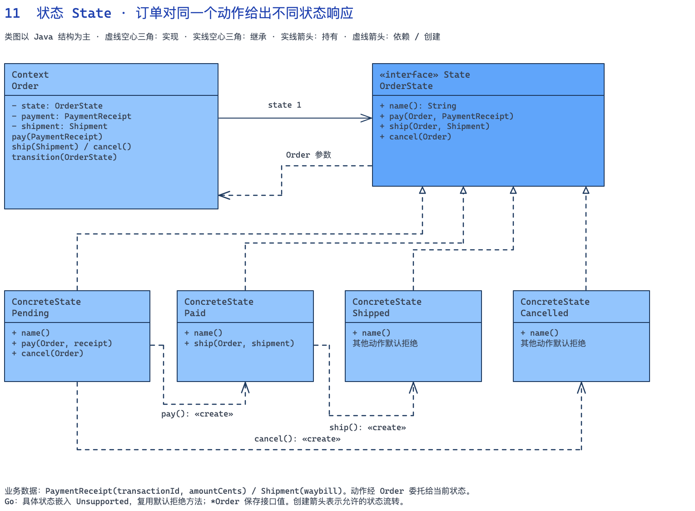

[下载可编辑的 Excalidraw 源文件](diagrams/11-state.zh.excalidraw)

#### 双语言完整示例



```java
record PaymentReceipt(String transactionId, int amountCents) {}
record Shipment(String waybill) {}
// State（状态接口）。
interface OrderState {
    String name();
    default void pay(Order o, PaymentReceipt r) { throw new IllegalStateException("当前状态不能付款"); }
    default void ship(Order o, Shipment s) { throw new IllegalStateException("当前状态不能发货"); }
    default void cancel(Order o) { throw new IllegalStateException("当前状态不能取消"); }
}
// ConcreteState（具体状态）。
class Pending implements OrderState {
    public String name() { return "待付款"; }
    public void pay(Order o, PaymentReceipt r) {
        if (r.amountCents() != o.amountCents() || r.transactionId().isBlank())
            throw new IllegalArgumentException("付款凭据不匹配");
        o.recordPayment(r); o.transition(new Paid());
    }
    public void cancel(Order o) { o.transition(new Cancelled()); }
}
// ConcreteState（具体状态）。
class Paid implements OrderState {
    public String name() { return "已付款"; }
    public void ship(Order o, Shipment s) {
        if (s.waybill().isBlank()) throw new IllegalArgumentException("缺少运单");
        o.recordShipment(s); o.transition(new Shipped());
    }
}
// ConcreteState（具体状态）。
class Shipped implements OrderState { public String name() { return "已发货"; } }
// ConcreteState（具体状态）。
class Cancelled implements OrderState { public String name() { return "已取消"; } }
// Context（上下文）。
class Order {
    private final int amountCents;
    private OrderState state = new Pending();
    private PaymentReceipt payment;
    private Shipment shipment;
    Order(int amountCents) {
        if (amountCents <= 0) throw new IllegalArgumentException("订单金额无效");
        this.amountCents = amountCents;
    }
    int amountCents() { return amountCents; }
    void transition(OrderState next) { state = next; }
    void recordPayment(PaymentReceipt receipt) { payment = receipt; }
    void recordShipment(Shipment value) { shipment = value; }
    void pay(PaymentReceipt receipt) { state.pay(this, receipt); }
    void ship(Shipment value) { state.ship(this, value); }
    void cancel() { state.cancel(this); }
    String summary() {
        return state.name() + " payment=" + (payment == null ? "-" : payment.transactionId())
            + " waybill=" + (shipment == null ? "-" : shipment.waybill());
    }
}
// Client（客户端）：组装参与者并发起调用。
public class Main {
    public static void main(String[] args) {
        Order order = new Order(12800);
        try { order.ship(new Shipment("WB-1")); }
        catch (IllegalStateException e) { System.out.println(e.getMessage()); }
        order.pay(new PaymentReceipt("TX-1", 12800));
        order.ship(new Shipment("WB-1"));
        System.out.println(order.summary());
        try { order.pay(new PaymentReceipt("TX-2", 12800)); }
        catch (IllegalStateException e) { System.out.println(e.getMessage()); }
        Order cancelled = new Order(5000); cancelled.cancel(); System.out.println(cancelled.summary());
    }
}
```



```go
package main

import "fmt"

type PaymentReceipt struct {
	TransactionID string
	AmountCents   int
}
type Shipment struct{ Waybill string }
// State（状态接口）。
type OrderState interface {
	Name() string
	Pay(*Order, PaymentReceipt) error
	Ship(*Order, Shipment) error
	Cancel(*Order) error
}
type Unsupported struct{}

func (Unsupported) Pay(*Order, PaymentReceipt) error { return fmt.Errorf("当前状态不能付款") }
func (Unsupported) Ship(*Order, Shipment) error      { return fmt.Errorf("当前状态不能发货") }
func (Unsupported) Cancel(*Order) error              { return fmt.Errorf("当前状态不能取消") }

// ConcreteState（具体状态）。
type Pending struct{ Unsupported }

func (Pending) Name() string { return "待付款" }
func (Pending) Pay(o *Order, r PaymentReceipt) error {
	if r.AmountCents != o.amountCents || r.TransactionID == "" {
		return fmt.Errorf("付款凭据不匹配")
	}
	o.payment = r
	o.state = Paid{}
	return nil
}
func (Pending) Cancel(o *Order) error { o.state = Cancelled{}; return nil }

// ConcreteState（具体状态）。
type Paid struct{ Unsupported }

func (Paid) Name() string { return "已付款" }
func (Paid) Ship(o *Order, s Shipment) error {
	if s.Waybill == "" {
		return fmt.Errorf("缺少运单")
	}
	o.shipment = s
	o.state = Shipped{}
	return nil
}

// ConcreteState（具体状态）。
type Shipped struct{ Unsupported }

func (Shipped) Name() string { return "已发货" }

// ConcreteState（具体状态）。
type Cancelled struct{ Unsupported }

func (Cancelled) Name() string { return "已取消" }

// Context（上下文）。
type Order struct {
	amountCents int
	state       OrderState
	payment     PaymentReceipt
	shipment    Shipment
}

func NewOrder(amount int) (*Order, error) {
	if amount <= 0 {
		return nil, fmt.Errorf("订单金额无效")
	}
	return &Order{amountCents: amount, state: Pending{}}, nil
}
func (o *Order) Pay(r PaymentReceipt) error { return o.state.Pay(o, r) }
func (o *Order) Ship(s Shipment) error      { return o.state.Ship(o, s) }
func (o *Order) Cancel() error              { return o.state.Cancel(o) }
func (o *Order) Summary() string {
	tx, wb := o.payment.TransactionID, o.shipment.Waybill
	if tx == "" {
		tx = "-"
	}
	if wb == "" {
		wb = "-"
	}
	return fmt.Sprintf("%s payment=%s waybill=%s", o.state.Name(), tx, wb)
}
// Client（客户端）：组装参与者并发起调用。
func main() {
	o, err := NewOrder(12800)
	if err != nil {
		panic(err)
	}
	fmt.Println(o.Ship(Shipment{"WB-1"}))
	if err = o.Pay(PaymentReceipt{"TX-1", 12800}); err != nil {
		panic(err)
	}
	if err = o.Ship(Shipment{"WB-1"}); err != nil {
		panic(err)
	}
	fmt.Println(o.Summary())
	fmt.Println(o.Pay(PaymentReceipt{"TX-2", 12800}))
	cancelled, err := NewOrder(5000)
	if err != nil {
		panic(err)
	}
	if err = cancelled.Cancel(); err != nil {
		panic(err)
	}
	fmt.Println(cancelled.Summary())
}
```



#### 运行结果与关键点

```text
当前状态不能发货
已发货 payment=TX-1 waybill=WB-1
当前状态不能付款
已取消 payment=- waybill=-
```

增加待审核状态时实现 `OrderState`，决定哪些动作可用以及通过后去哪一状态。Java 用接口默认方法拒绝未实现动作；Go 嵌入 `Unsupported` 复用拒绝方法，再由具体状态覆盖允许的动作，嵌入不等同于继承。

#### 什么时候不用，以及这个例子的边界

本例的付款凭据假定已由可信支付入口核验，金额校验不能替代真实到账验证。状态对象的内部写入方法只供同一实现模块协作，不能作为对外跳转接口。多实例并发操作同一订单时，还需要版本控制或事务保护；状态模式本身不解决并发。

### 12. 模板方法 Template-Method（行为型）

#### 业务场景：销售日报固定流程，变化部分只负责格式

运营每天按日期导出销售数据。CSV 和 HTML 都需要加载数据、拒绝空结果、格式化、保存产物，但文件后缀和内容结构不同。如果两种导出各写一套流程，后来加入统一校验时可能漏改其中一种。模板方法把这些固定步骤收进一个入口。

| 类 / 接口 | 模式角色 | 具体职责 |
|---|---|---|
| `ReportRequest / Sale / ExportResult` | 业务数据 | 分别描述查询条件、销售行和导出产物 |
| `SalesRepository / ArtifactStore` | 辅助服务 | 负责加载销售记录与保存内存产物 |
| `Java ReportExporter` | AbstractClass（抽象类） | final export() 是 TemplateMethod（模板方法），format() 和 extension() 是留给子类的 PrimitiveOperations（基本操作） |
| `Java CsvExporter / HtmlExporter` | ConcreteClass（具体类） | 实现格式转换和文件后缀；CSV 处理引号，HTML 处理文本转义 |
| `Go ReportExporter + ReportFormat` | 用组合表达固定流程与可变步骤 | Export() 固定流程，CSVFormat / HTMLFormat 提供可替换步骤；Go 没有照搬 Java 的抽象类继承 |

#### 一次请求怎样走

1. 两个导出器都查询 9 月 1 日，仅选中当天的一行销售数据。
2. 模板分别生成 daily.csv、daily.html，并返回行数和内容。
3. 查询没有销售记录的日期会在格式化和保存前失败，存储中仍然只有两个产物。

#### 类图：接口与关系

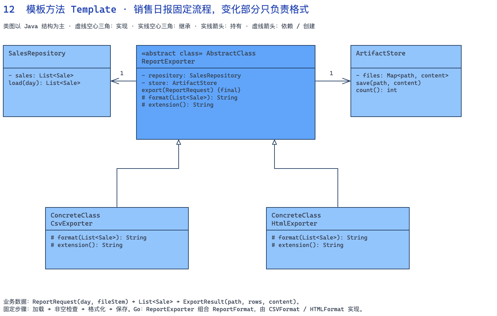

[下载可编辑的 Excalidraw 源文件](diagrams/12-template-method.zh.excalidraw)

#### 双语言完整示例



```java
import java.util.*;
import java.util.stream.Collectors;
record Sale(String day, String sku, int quantity, int amountCents) {}
record ReportRequest(String day, String fileStem) {}
record ExportResult(String path, int rows, String content) {}
class SalesRepository {
    private final List<Sale> sales = List.of(new Sale("2026-09-01", "BOOK", 2, 8000),
        new Sale("2026-09-02", "CUP", 1, 3000));
    List<Sale> load(String day) { return sales.stream().filter(s -> s.day().equals(day)).toList(); }
}
class ArtifactStore {
    private final Map<String, String> files = new HashMap<>();
    void save(String path, String content) { files.put(path, content); }
    int count() { return files.size(); }
}
// AbstractClass（抽象类）：export 是 TemplateMethod（模板方法）。
abstract class ReportExporter {
    private final SalesRepository repository;
    private final ArtifactStore store;
    ReportExporter(SalesRepository r, ArtifactStore s) { repository = r; store = s; }
    final ExportResult export(ReportRequest request) {
        List<Sale> rows = repository.load(request.day());
        if (rows.isEmpty()) throw new IllegalStateException("当天没有销售数据");
        String content = format(rows);
        String path = request.fileStem() + extension();
        store.save(path, content);
        return new ExportResult(path, rows.size(), content);
    }
    protected abstract String format(List<Sale> rows);
    protected abstract String extension();
}
// ConcreteClass（具体类）。
class CsvExporter extends ReportExporter {
    CsvExporter(SalesRepository r, ArtifactStore s) { super(r, s); }
    protected String extension() { return ".csv"; }
    protected String format(List<Sale> rows) {
        return "sku,quantity,amountCents\n" + rows.stream().map(s ->
            "\"" + s.sku().replace("\"", "\"\"") + "\"," + s.quantity() + "," + s.amountCents() + "\n")
            .collect(Collectors.joining());
    }
}
// ConcreteClass（具体类）。
class HtmlExporter extends ReportExporter {
    HtmlExporter(SalesRepository r, ArtifactStore s) { super(r, s); }
    protected String extension() { return ".html"; }
    private String escape(String s) { return s.replace("&", "&amp;").replace("<", "&lt;").replace(">", "&gt;"); }
    protected String format(List<Sale> rows) {
        return "<table>" + rows.stream().map(s -> "<tr><td>" + escape(s.sku())
            + "</td><td>" + s.quantity() + "</td><td>" + s.amountCents() + "</td></tr>")
            .collect(Collectors.joining()) + "</table>";
    }
}
// Client（客户端）：组装参与者并发起调用。
public class Main {
    public static void main(String[] args) {
        SalesRepository repo = new SalesRepository(); ArtifactStore store = new ArtifactStore();
        for (ReportExporter exporter : List.of(new CsvExporter(repo, store), new HtmlExporter(repo, store))) {
            ExportResult result = exporter.export(new ReportRequest("2026-09-01", "daily"));
            System.out.printf("%s rows=%d%n", result.path(), result.rows());
        }
        try { new CsvExporter(repo, store).export(new ReportRequest("2026-09-03", "empty")); }
        catch (IllegalStateException e) { System.out.println(e.getMessage()); }
        System.out.println("已保存文件数=" + store.count());
    }
}
```



```go
package main

import (
	"encoding/csv"
	"fmt"
	"html"
	"strconv"
	"strings"
)

type Sale struct {
	Day, SKU              string
	Quantity, AmountCents int
}
type ReportRequest struct{ Day, FileStem string }
type ExportResult struct {
	Path    string
	Rows    int
	Content string
}
type SalesRepository struct{ sales []Sale }

func (r SalesRepository) Load(day string) []Sale {
	var rows []Sale
	for _, s := range r.sales {
		if s.Day == day {
			rows = append(rows, s)
		}
	}
	return rows
}

type ArtifactStore struct{ files map[string]string }

func (s *ArtifactStore) Save(path, content string) { s.files[path] = content }

// 可变步骤接口：对应 Java 留给子类的基本操作。
type ReportFormat interface {
	Format([]Sale) (string, error)
	Extension() string
}
// 可变步骤的 CSV 实现（Go 组合）。
type CSVFormat struct{}

func (CSVFormat) Extension() string { return ".csv" }
func (CSVFormat) Format(rows []Sale) (string, error) {
	var buffer strings.Builder
	writer := csv.NewWriter(&buffer)
	records := [][]string{{"sku", "quantity", "amountCents"}}
	for _, s := range rows {
		records = append(records, []string{s.SKU, strconv.Itoa(s.Quantity), strconv.Itoa(s.AmountCents)})
	}
	if err := writer.WriteAll(records); err != nil {
		return "", err
	}
	return buffer.String(), nil
}

// 可变步骤的 HTML 实现（Go 组合）。
type HTMLFormat struct{}

func (HTMLFormat) Extension() string { return ".html" }
func (HTMLFormat) Format(rows []Sale) (string, error) {
	var b strings.Builder
	b.WriteString("<table>")
	for _, s := range rows {
		fmt.Fprintf(&b, "<tr><td>%s</td><td>%d</td><td>%d</td></tr>", html.EscapeString(s.SKU), s.Quantity, s.AmountCents)
	}
	b.WriteString("</table>")
	return b.String(), nil
}

// 固定步骤放在普通方法中，变化步骤委托给接口；Go 不需要模拟继承。
// 固定流程的承载者：Export 保留 TemplateMethod 的流程骨架，Go 使用组合。
type ReportExporter struct {
	repository SalesRepository
	store      *ArtifactStore
	format     ReportFormat
}

func (e ReportExporter) Export(r ReportRequest) (ExportResult, error) {
	rows := e.repository.Load(r.Day)
	if len(rows) == 0 {
		return ExportResult{}, fmt.Errorf("当天没有销售数据")
	}
	content, err := e.format.Format(rows)
	if err != nil {
		return ExportResult{}, err
	}
	path := r.FileStem + e.format.Extension()
	e.store.Save(path, content)
	return ExportResult{path, len(rows), content}, nil
}
// Client（客户端）：组装参与者并发起调用。
func main() {
	repo := SalesRepository{[]Sale{{"2026-09-01", "BOOK", 2, 8000}, {"2026-09-02", "CUP", 1, 3000}}}
	store := &ArtifactStore{map[string]string{}}
	for _, format := range []ReportFormat{CSVFormat{}, HTMLFormat{}} {
		result, err := (ReportExporter{repo, store, format}).Export(ReportRequest{"2026-09-01", "daily"})
		if err != nil {
			panic(err)
		}
		fmt.Printf("%s rows=%d\n", result.Path, result.Rows)
	}
	_, err := (ReportExporter{repo, store, CSVFormat{}}).Export(ReportRequest{"2026-09-03", "empty"})
	fmt.Println(err)
	fmt.Printf("已保存文件数=%d\n", len(store.files))
}
```



#### 运行结果与关键点

```text
daily.csv rows=1
daily.html rows=1
当天没有销售数据
已保存文件数=2
```

新增格式时扩展格式化和后缀步骤，不要复制加载、空结果检查和保存逻辑。Go 的 `ReportExporter.Export()` 通过 `ReportFormat` 委托变化步骤，用组合表达同样的流程约束；它是对应实现，不是 Java 继承语法的翻译。

#### 什么时候不用，以及这个例子的边界

这里只保存到内存，不涉及真实磁盘和对象存储。CSV 是实际 CSV，HTML 是实际表格片段，没有把普通字符串伪装成 PDF 或 Excel 文件。若导出流程本身经常需要重排步骤，模板方法会太僵硬；用于电子表格打开不可信 CSV 时，还要另行防止公式注入。

### 13. 备忘录模式 Memento（行为型）

#### 业务场景：报价单一次撤销多个字段的修改

销售编辑一份企业报价：修改标题、把两本书改成三本，并追加 2000 分优惠。用户点一次撤销，希望整份报价回到修改前，包括标题、数量和优惠，而不只是把某个提示文本改回去。历史管理器不应理解报价单每个字段如何存储。

| 类 / 接口 | 模式角色 | 具体职责 |
|---|---|---|
| `QuoteDraft` | Originator（原发器） | 保存并恢复标题、报价行和优惠 |
| `QuoteLine` | 业务数据 | 保存报价明细并计算小计 |
| `QuoteDraft.Snapshot（Go：snapshot）` | Memento（备忘录） | 私有保存所属草稿、标题、报价行列表和优惠金额 |
| `History` | Caretaker（管理者） | 只管理快照栈，通过 checkpoint() 保存，通过 undo() 交还快照 |

#### 一次请求怎样走

1. 初始报价为两本单价 5000 分的书，总价 10000 分，先保存检查点。
2. 数量改为 3、优惠设为 2000、标题也修改，总价变成 13000 分。
3. 撤销后标题、数量和金额一起恢复；再撤销返回 false，其他报价单不能接收这份快照。

#### 类图：接口与关系

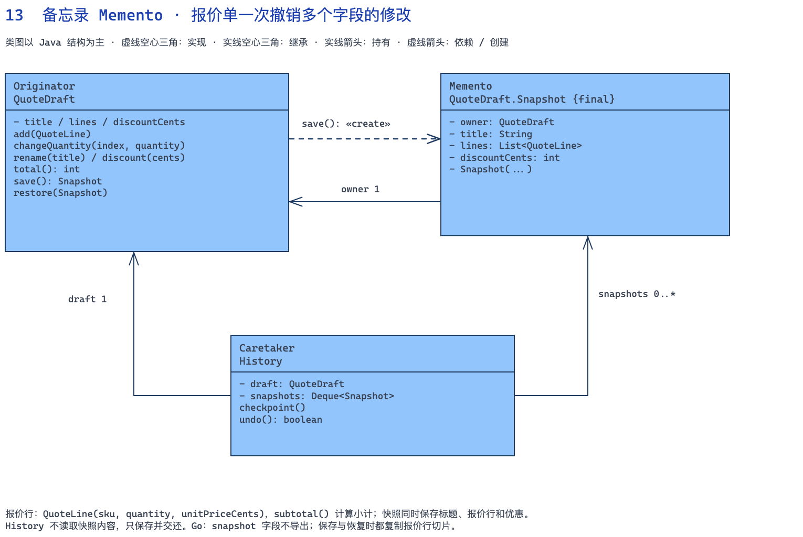

[下载可编辑的 Excalidraw 源文件](diagrams/13-memento.zh.excalidraw)

#### 双语言完整示例



```java
import java.util.*;
record QuoteLine(String sku, int quantity, int unitPriceCents) {
    QuoteLine {
        if (quantity <= 0 || unitPriceCents < 0) throw new IllegalArgumentException("报价行无效");
    }
    int subtotal() { return quantity * unitPriceCents; }
}
// Originator（原发器）。
class QuoteDraft {
    private String title;
    private List<QuoteLine> lines = new ArrayList<>();
    private int discountCents;
    QuoteDraft(String title) { this.title = title; }
    void add(QuoteLine line) { lines.add(line); }
    void rename(String title) { this.title = title; }
    void changeQuantity(int index, int quantity) {
        QuoteLine old = lines.get(index);
        lines.set(index, new QuoteLine(old.sku(), quantity, old.unitPriceCents()));
    }
    void discount(int cents) {
        if (cents < 0) throw new IllegalArgumentException("折扣不能为负");
        discountCents = cents;
    }
    int total() { return Math.max(0, lines.stream().mapToInt(QuoteLine::subtotal).sum() - discountCents); }
    String summary() { return title + " qty=" + lines.get(0).quantity() + " total=" + total(); }
    Snapshot save() { return new Snapshot(this, title, lines, discountCents); }
    void restore(Snapshot s) {
        if (s.owner != this) throw new IllegalArgumentException("快照属于另一份报价");
        title = s.title; lines = new ArrayList<>(s.lines); discountCents = s.discountCents;
    }
    // Memento（备忘录）。
    static final class Snapshot {
        private final QuoteDraft owner;
        private final String title;
        private final List<QuoteLine> lines;
        private final int discountCents;
        private Snapshot(QuoteDraft owner, String title, List<QuoteLine> lines, int discount) {
            this.owner = owner; this.title = title; this.lines = List.copyOf(lines); discountCents = discount;
        }
    }
}
// Caretaker（管理者）。
class History {
    private final QuoteDraft draft;
    private final Deque<QuoteDraft.Snapshot> snapshots = new ArrayDeque<>();
    History(QuoteDraft draft) { this.draft = draft; }
    void checkpoint() { snapshots.push(draft.save()); }
    boolean undo() {
        if (snapshots.isEmpty()) return false;
        draft.restore(snapshots.peek()); snapshots.pop(); return true;
    }
}
// Client（客户端）：组装参与者并发起调用。
public class Main {
    public static void main(String[] args) {
        QuoteDraft draft = new QuoteDraft("企业采购");
        draft.add(new QuoteLine("BOOK", 2, 5000));
        History history = new History(draft); history.checkpoint();
        draft.changeQuantity(0, 3); draft.discount(2000); draft.rename("企业采购修订版");
        System.out.println(draft.summary());
        history.undo(); System.out.println(draft.summary());
        System.out.println("再次撤销=" + history.undo());
        try { new QuoteDraft("别的报价").restore(draft.save()); }
        catch (IllegalArgumentException e) { System.out.println(e.getMessage()); }
    }
}
```



```go
package main

import "fmt"

type QuoteLine struct {
	SKU                      string
	Quantity, UnitPriceCents int
}

func (l QuoteLine) Subtotal() int { return l.Quantity * l.UnitPriceCents }

// Originator（原发器）。
type QuoteDraft struct {
	title         string
	lines         []QuoteLine
	discountCents int
}

func (d *QuoteDraft) Add(l QuoteLine) error {
	if l.Quantity <= 0 || l.UnitPriceCents < 0 {
		return fmt.Errorf("报价行无效")
	}
	d.lines = append(d.lines, l)
	return nil
}
func (d *QuoteDraft) Rename(title string) { d.title = title }
func (d *QuoteDraft) ChangeQuantity(index, q int) error {
	if index < 0 || index >= len(d.lines) || q <= 0 {
		return fmt.Errorf("报价行无效")
	}
	d.lines[index].Quantity = q
	return nil
}
func (d *QuoteDraft) Discount(cents int) error {
	if cents < 0 {
		return fmt.Errorf("折扣不能为负")
	}
	d.discountCents = cents
	return nil
}
func (d *QuoteDraft) Total() int {
	total := -d.discountCents
	for _, l := range d.lines {
		total += l.Subtotal()
	}
	if total < 0 {
		return 0
	}
	return total
}
func (d *QuoteDraft) Summary() string {
	return fmt.Sprintf("%s qty=%d total=%d", d.title, d.lines[0].Quantity, d.Total())
}

// Memento（备忘录）。
type snapshot struct {
	owner         *QuoteDraft
	title         string
	lines         []QuoteLine
	discountCents int
}

func (d *QuoteDraft) Save() snapshot {
	return snapshot{d, d.title, append([]QuoteLine(nil), d.lines...), d.discountCents}
}
func (d *QuoteDraft) Restore(s snapshot) error {
	if s.owner != d {
		return fmt.Errorf("快照属于另一份报价")
	}
	d.title = s.title
	d.lines = append([]QuoteLine(nil), s.lines...)
	d.discountCents = s.discountCents
	return nil
}

// Caretaker（管理者）。
type History struct {
	draft     *QuoteDraft
	snapshots []snapshot
}

func (h *History) Checkpoint() { h.snapshots = append(h.snapshots, h.draft.Save()) }
func (h *History) Undo() (bool, error) {
	n := len(h.snapshots)
	if n == 0 {
		return false, nil
	}
	if err := h.draft.Restore(h.snapshots[n-1]); err != nil {
		return false, err
	}
	h.snapshots = h.snapshots[:n-1]
	return true, nil
}
// Client（客户端）：组装参与者并发起调用。
func main() {
	d := &QuoteDraft{title: "企业采购"}
	if err := d.Add(QuoteLine{"BOOK", 2, 5000}); err != nil {
		panic(err)
	}
	h := History{draft: d}
	h.Checkpoint()
	if err := d.ChangeQuantity(0, 3); err != nil {
		panic(err)
	}
	if err := d.Discount(2000); err != nil {
		panic(err)
	}
	d.Rename("企业采购修订版")
	fmt.Println(d.Summary())
	if _, err := h.Undo(); err != nil {
		panic(err)
	}
	fmt.Println(d.Summary())
	ok, err := h.Undo()
	if err != nil {
		panic(err)
	}
	fmt.Printf("再次撤销=%t\n", ok)
	fmt.Println((&QuoteDraft{title: "别的报价"}).Restore(d.Save()))
}
```



#### 运行结果与关键点

```text
企业采购修订版 qty=3 total=13000
企业采购 qty=2 total=10000
再次撤销=false
快照属于另一份报价
```

以后增加收货地址或报价有效期，要把它纳入快照的保存和恢复，`History` 不需要读取或修改这些细节。Java 报价行用不可变 record，列表复制就能隔离；Go 报价行只包含值字段和字符串，复制切片后元素也与当前状态分开。若元素内部再加入 map、slice 或可变对象引用，就要继续复制相应层级。

#### 什么时候不用，以及这个例子的边界

这是本地草稿回退，不能撤销已经发送的报价邮件或真实支付。Go 的封装边界是包，真正项目应将快照放在草稿包内；单文件示例为了可运行放在 main 包。大量大对象快照会占用内存，可再考虑限制历史深度、增量快照或命令记录。

### 14. 迭代器模式 Iterator（行为型）

#### 业务场景：逐页读取已付款订单，调用方不管理游标

对账程序需要累计所有已付款订单的金额。数据源分页返回订单，过滤之后可能出现空页，但空页后仍然有数据。若每个对账调用者都处理分页、缓冲区、耗尽判断和失败，重复逻辑既多又容易提前结束。这里让调用者只取下一条订单。

| 类 / 接口 | 模式角色 | 具体职责 |
|---|---|---|
| `OrderSource / MemoryOrderSource` | 数据源接口与辅助实现 | 提供分页读取，内存实现记录请求次数 |
| `OrderRow / Page` | 业务数据 | 订单字段、当前页内容和下一页游标，-1 表示结束 |
| `Java Iterable<OrderRow>` | Aggregate（聚合接口） | 约定创建迭代器的入口 |
| `PaidOrders` | ConcreteAggregate（具体聚合） | 每次创建独立遍历状态；Java 实现 Iterable，Go 直接提供构造迭代器的方法 |
| `Java Iterator<OrderRow> / Go OrderIterator` | Iterator（迭代器接口） | 约定遍历操作；Go 通过返回值同时表达数据、结束与错误 |
| `PagedIterator` | ConcreteIterator（具体迭代器） | 持有数据源、缓冲区、索引和游标，按需请求下一页 |

Java 直接使用标准库的 Aggregate / Iterator 契约，因此代码没有重复声明自定义 Aggregate 接口。Go 的 OrderIterator 对应迭代器接口，PaidOrders 直接提供遍历入口，没有额外声明聚合接口。

#### 一次请求怎样走

1. 创建迭代器不请求数据。第一次取数据时先读到全是未付款订单的空页，再继续拉取。
2. 只累计 O-3、O-4、O-5 的金额，合计 12000 分，总共读取三页。
3. 新建另一个迭代器从 O-3 重新开始；耗尽的迭代器不会复活。Java 连续 hasNext() 不跳过订单，Go Next() 同时返回值、是否存在和错误。

#### 类图：接口与关系

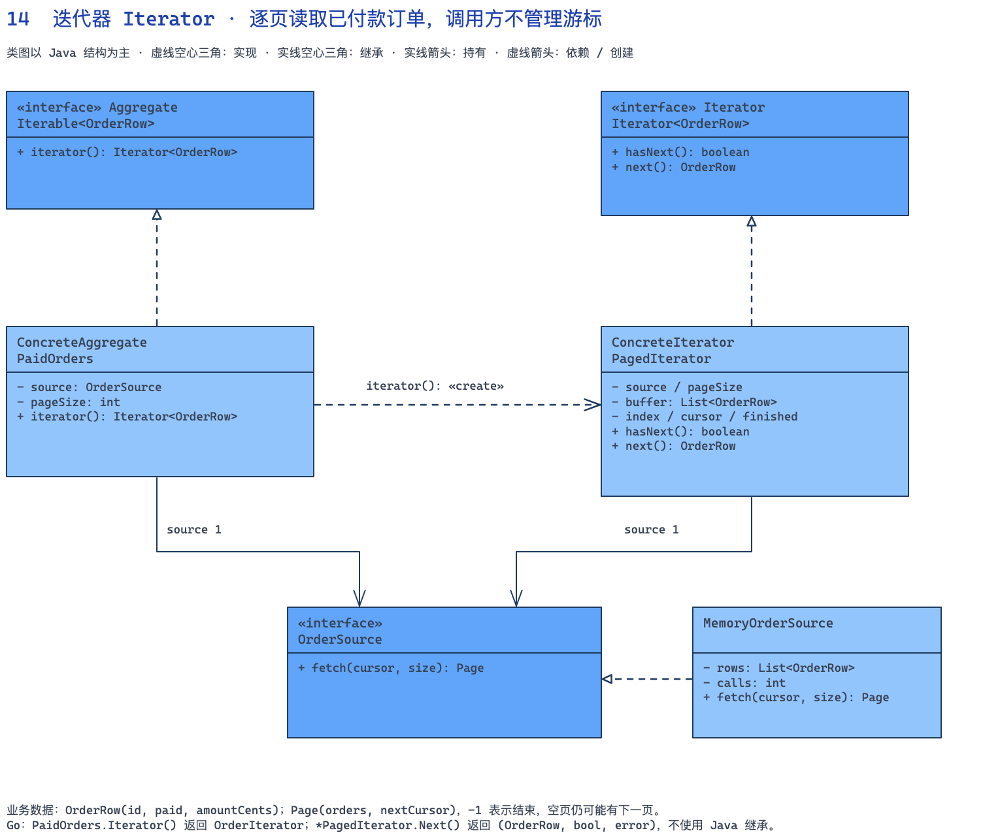

[下载可编辑的 Excalidraw 源文件](diagrams/14-iterator.zh.excalidraw)

#### 双语言完整示例



```java
import java.util.*;
record OrderRow(String id, boolean paid, int amountCents) {}
record Page(List<OrderRow> orders, int nextCursor) {
    Page { orders = List.copyOf(orders); }
}
interface OrderSource { Page fetch(int cursor, int size); }
class MemoryOrderSource implements OrderSource {
    private final List<OrderRow> rows;
    private int calls;
    MemoryOrderSource(List<OrderRow> rows) { this.rows = List.copyOf(rows); }
    public Page fetch(int cursor, int size) {
        if (size <= 0 || cursor < 0 || cursor > rows.size()) throw new IllegalArgumentException("分页参数无效");
        calls++;
        int end = Math.min(cursor + size, rows.size());
        // 模拟服务端分页后过滤：可能返回空页，但仍然存在下一页。
        List<OrderRow> paid = rows.subList(cursor, end).stream().filter(OrderRow::paid).toList();
        return new Page(paid, end == rows.size() ? -1 : end);
    }
    int calls() { return calls; }
}
// ConcreteAggregate（具体聚合）：负责创建独立的迭代器。
class PaidOrders implements Iterable<OrderRow> {
    private final OrderSource source;
    private final int pageSize;
    PaidOrders(OrderSource source, int size) {
        if (size <= 0) throw new IllegalArgumentException("分页大小必须为正");
        this.source = source; pageSize = size;
    }
    public Iterator<OrderRow> iterator() { return new PagedIterator(source, pageSize); }
}
// ConcreteIterator（具体迭代器）。
class PagedIterator implements Iterator<OrderRow> {
    private final OrderSource source;
    private final int pageSize;
    private List<OrderRow> buffer = List.of();
    private int index, cursor;
    private boolean finished;
    PagedIterator(OrderSource source, int size) { this.source = source; pageSize = size; }
    public boolean hasNext() {
        while (index == buffer.size() && !finished) {
            Page page = source.fetch(cursor, pageSize);
            if (page.nextCursor() != -1 && page.nextCursor() <= cursor)
                throw new IllegalStateException("分页游标没有前进");
            buffer = page.orders(); index = 0;
            finished = page.nextCursor() == -1; cursor = page.nextCursor();
        }
        return index < buffer.size();
    }
    public OrderRow next() {
        if (!hasNext()) throw new NoSuchElementException("没有更多订单");
        return buffer.get(index++);
    }
}
// Client（客户端）：组装参与者并发起调用。
public class Main {
    public static void main(String[] args) {
        MemoryOrderSource source = new MemoryOrderSource(List.of(
            new OrderRow("O-1", false, 1000), new OrderRow("O-2", false, 2000),
            new OrderRow("O-3", true, 3000), new OrderRow("O-4", true, 4000),
            new OrderRow("O-5", true, 5000)));
        PaidOrders orders = new PaidOrders(source, 2);
        Iterator<OrderRow> a = orders.iterator();
        System.out.println("创建时请求数=" + source.calls());
        System.out.println("连续探测=" + a.hasNext() + "," + a.hasNext());
        int total = 0;
        while (a.hasNext()) { OrderRow row = a.next(); total += row.amountCents(); }
        System.out.printf("总额=%d 请求数=%d%n", total, source.calls());
        System.out.println("独立游标首项=" + orders.iterator().next().id());
        try { a.next(); } catch (NoSuchElementException e) { System.out.println(e.getMessage()); }
    }
}
```



```go
package main

import "fmt"

type OrderRow struct {
	ID          string
	Paid        bool
	AmountCents int
}
type Page struct {
	Orders     []OrderRow
	NextCursor int
}
type OrderSource interface {
	Fetch(cursor, size int) (Page, error)
}
type MemoryOrderSource struct {
	rows  []OrderRow
	calls int
}

func (s *MemoryOrderSource) Fetch(cursor, size int) (Page, error) {
	if size <= 0 || cursor < 0 || cursor > len(s.rows) {
		return Page{}, fmt.Errorf("分页参数无效")
	}
	s.calls++
	end := cursor + size
	if end > len(s.rows) {
		end = len(s.rows)
	}
	var paid []OrderRow
	for _, r := range s.rows[cursor:end] {
		if r.Paid {
			paid = append(paid, r)
		}
	}
	next := end
	if end == len(s.rows) {
		next = -1
	}
	return Page{paid, next}, nil
}

// Iterator（迭代器接口）。
type OrderIterator interface {
	Next() (OrderRow, bool, error)
}
// ConcreteAggregate（具体聚合）：负责创建独立的迭代器。
type PaidOrders struct {
	source   OrderSource
	pageSize int
}

func (p PaidOrders) Iterator() (OrderIterator, error) {
	if p.pageSize <= 0 {
		return nil, fmt.Errorf("分页大小必须为正")
	}
	return &PagedIterator{source: p.source, pageSize: p.pageSize}, nil
}

// ConcreteIterator（具体迭代器）。
type PagedIterator struct {
	source        OrderSource
	pageSize      int
	buffer        []OrderRow
	index, cursor int
	finished      bool
}

func (i *PagedIterator) Next() (OrderRow, bool, error) {
	for i.index == len(i.buffer) && !i.finished {
		page, err := i.source.Fetch(i.cursor, i.pageSize)
		if err != nil {
			return OrderRow{}, false, err
		}
		if page.NextCursor != -1 && page.NextCursor <= i.cursor {
			return OrderRow{}, false, fmt.Errorf("分页游标没有前进")
		}
		i.buffer = page.Orders
		i.index = 0
		i.finished = page.NextCursor == -1
		i.cursor = page.NextCursor
	}
	if i.index == len(i.buffer) {
		return OrderRow{}, false, nil
	}
	row := i.buffer[i.index]
	i.index++
	return row, true, nil
}
// Client（客户端）：组装参与者并发起调用。
func main() {
	source := &MemoryOrderSource{rows: []OrderRow{{"O-1", false, 1000}, {"O-2", false, 2000},
		{"O-3", true, 3000}, {"O-4", true, 4000}, {"O-5", true, 5000}}}
	orders := PaidOrders{source, 2}
	a, err := orders.Iterator()
	if err != nil {
		panic(err)
	}
	fmt.Printf("创建时请求数=%d\n", source.calls)
	total := 0
	for {
		row, ok, err := a.Next()
		if err != nil {
			panic(err)
		}
		if !ok {
			break
		}
		total += row.AmountCents
	}
	fmt.Printf("总额=%d 请求数=%d\n", total, source.calls)
	b, err := orders.Iterator()
	if err != nil {
		panic(err)
	}
	first, ok, err := b.Next()
	if err != nil || !ok {
		panic("缺少首项")
	}
	fmt.Println("独立游标首项=" + first.ID)
	_, ok, err = a.Next()
	if err != nil {
		panic(err)
	}
	fmt.Printf("耗尽后 ok=%t\n", ok)
}
```



#### 运行结果与关键点

Java 输出：

```text
创建时请求数=0
连续探测=true,true
总额=12000 请求数=3
独立游标首项=O-3
没有更多订单
```

Go 输出：

```text
创建时请求数=0
总额=12000 请求数=3
独立游标首项=O-3
耗尽后 ok=false
```

Java 的耗尽契约可参见 [Iterator.next() 官方说明](https://docs.oracle.com/en/java/javase/17/docs/api/java.base/java/util/Iterator.html#next())。

数据源改成数据库或 HTTP 分页时，实现 `OrderSource` 即可，累计金额的循环不用修改。错误与耗尽必须分开表达：Go 用 error 与 ok，Java 让请求错误向外传播，耗尽后的 next() 抛 NoSuchElementException。额外检查游标递增，避免数据源异常时永远循环。

#### 什么时候不用，以及这个例子的边界

本例只处理单调递增的整数游标，不代表所有服务端游标都可比较。空页是否结束应依据契约中的结束标记。内存源在本次演示期间不变；换成不断变动的远端数据后，不自动获得快照一致性或 exactly-once 遍历。普通内存列表直接循环通常更简单。

### 15. 命令模式 Command（行为型）

#### 业务场景：购物车加商品与用券共用可撤销入口

购物车页面既有加购按钮，也有快捷操作和优惠券输入框。不同操作改变的状态不同，但都希望进入统一的历史列表，按最近一次操作撤销。按钮如果直接修改 map，撤销逻辑就会散落在各个组件里。命令对象把接收者、参数和恢复信息放在一起。

| 类 / 接口 | 模式角色 | 具体职责 |
|---|---|---|
| `Cart` | Receiver（接收者） | 校验 SKU、设置数量、应用优惠券并计算总价 |
| `Command` | Command（命令接口） | 统一 execute() / undo() 契约 |
| `AddItemCommand` | ConcreteCommand（具体命令） | 保存 SKU、增加数量及执行前的数量 |
| `ApplyCouponCommand` | ConcreteCommand（具体命令） | 保存新优惠金额及执行前的优惠 |
| `CommandBus` | Invoker（调用者） | 只管理命令执行与历史栈，成功后才入栈 |
| `main` | Client（客户端） | 创建接收者和命令，将命令交给调用者 |

#### 一次请求怎样走

1. 加两本书和一个杯子，商品合计 13000 分；应用 2000 分券后实付 11000 分。
2. 第一次撤销恢复之前的优惠，金额回到 13000 分；第二次撤销恢复杯子之前的数量，金额回到 10000 分。
3. UNKNOWN 商品执行失败，不进入历史，历史中只剩第一次加书操作。

#### 类图：接口与关系

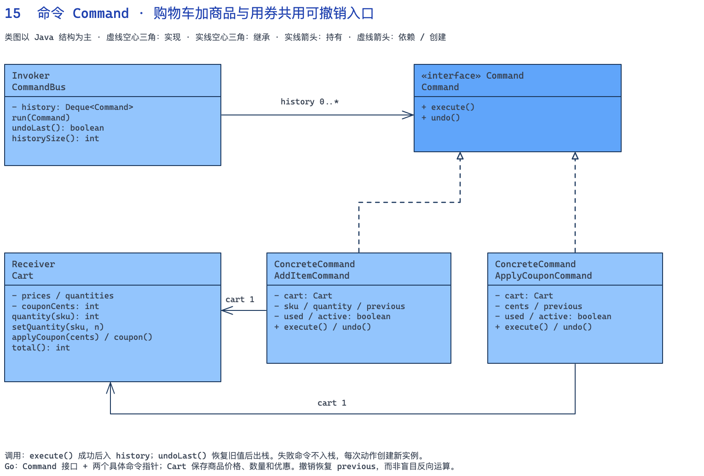

[下载可编辑的 Excalidraw 源文件](diagrams/15-command.zh.excalidraw)

#### 双语言完整示例



```java
import java.util.*;
// Receiver（接收者）。
class Cart {
    private final Map<String, Integer> prices = Map.of("BOOK", 5000, "CUP", 3000);
    private final Map<String, Integer> quantities = new HashMap<>();
    private int couponCents;
    int quantity(String sku) { return quantities.getOrDefault(sku, 0); }
    void setQuantity(String sku, int n) {
        if (!prices.containsKey(sku) || n < 0) throw new IllegalArgumentException("商品或数量无效");
        if (n == 0) quantities.remove(sku); else quantities.put(sku, n);
    }
    int coupon() { return couponCents; }
    void applyCoupon(int cents) {
        if (cents < 0) throw new IllegalArgumentException("优惠券金额无效");
        couponCents = cents;
    }
    int total() {
        int goods = quantities.entrySet().stream().mapToInt(e -> prices.get(e.getKey()) * e.getValue()).sum();
        return Math.max(0, goods - couponCents);
    }
}
// Command（命令接口）。
interface Command { void execute(); void undo(); }
// ConcreteCommand（具体命令）。
class AddItemCommand implements Command {
    private final Cart cart;
    private final String sku;
    private final int quantity;
    private int previous;
    private boolean used, active;
    AddItemCommand(Cart cart, String sku, int quantity) { this.cart = cart; this.sku = sku; this.quantity = quantity; }
    public void execute() {
        if (used || quantity <= 0) throw new IllegalStateException("命令已使用或数量无效");
        previous = cart.quantity(sku);
        cart.setQuantity(sku, previous + quantity); used = true; active = true;
    }
    public void undo() {
        if (!active) throw new IllegalStateException("命令未执行或已撤销");
        cart.setQuantity(sku, previous); active = false;
    }
}
// ConcreteCommand（具体命令）。
class ApplyCouponCommand implements Command {
    private final Cart cart;
    private final int cents;
    private int previous;
    private boolean used, active;
    ApplyCouponCommand(Cart cart, int cents) { this.cart = cart; this.cents = cents; }
    public void execute() {
        if (used) throw new IllegalStateException("命令已使用");
        previous = cart.coupon(); cart.applyCoupon(cents); used = true; active = true;
    }
    public void undo() {
        if (!active) throw new IllegalStateException("命令未执行或已撤销");
        cart.applyCoupon(previous); active = false;
    }
}
// Invoker（调用者）。
class CommandBus {
    private final Deque<Command> history = new ArrayDeque<>();
    void run(Command command) { command.execute(); history.push(command); }
    boolean undoLast() {
        if (history.isEmpty()) return false;
        history.peek().undo(); history.pop(); return true;
    }
    int historySize() { return history.size(); }
}
// Client（客户端）：组装参与者并发起调用。
public class Main {
    public static void main(String[] args) {
        Cart cart = new Cart(); CommandBus bus = new CommandBus();
        bus.run(new AddItemCommand(cart, "BOOK", 2));
        bus.run(new AddItemCommand(cart, "CUP", 1));
        bus.run(new ApplyCouponCommand(cart, 2000));
        System.out.println("应用优惠券=" + cart.total());
        bus.undoLast(); System.out.println("撤销优惠券=" + cart.total());
        bus.undoLast(); System.out.println("撤销加杯子=" + cart.total());
        try { bus.run(new AddItemCommand(cart, "UNKNOWN", 1)); }
        catch (IllegalArgumentException e) { System.out.println(e.getMessage()); }
        System.out.println("有效历史数=" + bus.historySize());
    }
}
```



```go
package main

import "fmt"

// Receiver（接收者）。
type Cart struct {
	prices, quantities map[string]int
	couponCents        int
}

func (c *Cart) Quantity(sku string) int { return c.quantities[sku] }
func (c *Cart) SetQuantity(sku string, n int) error {
	if _, ok := c.prices[sku]; !ok || n < 0 {
		return fmt.Errorf("商品或数量无效")
	}
	if n == 0 {
		delete(c.quantities, sku)
	} else {
		c.quantities[sku] = n
	}
	return nil
}
func (c *Cart) ApplyCoupon(cents int) error {
	if cents < 0 {
		return fmt.Errorf("优惠券金额无效")
	}
	c.couponCents = cents
	return nil
}
func (c *Cart) Total() int {
	goods := 0
	for sku, n := range c.quantities {
		goods += c.prices[sku] * n
	}
	total := goods - c.couponCents
	if total < 0 {
		return 0
	}
	return total
}

// Command（命令接口）。
type Command interface {
	Execute() error
	Undo() error
}
// ConcreteCommand（具体命令）。
type AddItemCommand struct {
	cart               *Cart
	sku                string
	quantity, previous int
	used, active       bool
}

func (c *AddItemCommand) Execute() error {
	if c.used || c.quantity <= 0 {
		return fmt.Errorf("命令已使用或数量无效")
	}
	c.previous = c.cart.Quantity(c.sku)
	if err := c.cart.SetQuantity(c.sku, c.previous+c.quantity); err != nil {
		return err
	}
	c.used = true
	c.active = true
	return nil
}
func (c *AddItemCommand) Undo() error {
	if !c.active {
		return fmt.Errorf("命令未执行或已撤销")
	}
	if err := c.cart.SetQuantity(c.sku, c.previous); err != nil {
		return err
	}
	c.active = false
	return nil
}

// ConcreteCommand（具体命令）。
type ApplyCouponCommand struct {
	cart            *Cart
	cents, previous int
	used, active    bool
}

func (c *ApplyCouponCommand) Execute() error {
	if c.used {
		return fmt.Errorf("命令已使用")
	}
	c.previous = c.cart.couponCents
	if err := c.cart.ApplyCoupon(c.cents); err != nil {
		return err
	}
	c.used = true
	c.active = true
	return nil
}
func (c *ApplyCouponCommand) Undo() error {
	if !c.active {
		return fmt.Errorf("命令未执行或已撤销")
	}
	if err := c.cart.ApplyCoupon(c.previous); err != nil {
		return err
	}
	c.active = false
	return nil
}

// Invoker（调用者）。
type CommandBus struct{ history []Command }

func (b *CommandBus) Run(c Command) error {
	if err := c.Execute(); err != nil {
		return err
	}
	b.history = append(b.history, c)
	return nil
}
func (b *CommandBus) UndoLast() (bool, error) {
	n := len(b.history)
	if n == 0 {
		return false, nil
	}
	if err := b.history[n-1].Undo(); err != nil {
		return false, err
	}
	b.history = b.history[:n-1]
	return true, nil
}
// Client（客户端）：组装参与者并发起调用。
func main() {
	cart := &Cart{prices: map[string]int{"BOOK": 5000, "CUP": 3000}, quantities: map[string]int{}}
	bus := &CommandBus{}
	for _, c := range []Command{&AddItemCommand{cart: cart, sku: "BOOK", quantity: 2},
		&AddItemCommand{cart: cart, sku: "CUP", quantity: 1}, &ApplyCouponCommand{cart: cart, cents: 2000}} {
		if err := bus.Run(c); err != nil {
			panic(err)
		}
	}
	fmt.Printf("应用优惠券=%d\n", cart.Total())
	if _, err := bus.UndoLast(); err != nil {
		panic(err)
	}
	fmt.Printf("撤销优惠券=%d\n", cart.Total())
	if _, err := bus.UndoLast(); err != nil {
		panic(err)
	}
	fmt.Printf("撤销加杯子=%d\n", cart.Total())
	fmt.Println(bus.Run(&AddItemCommand{cart: cart, sku: "UNKNOWN", quantity: 1}))
	fmt.Printf("有效历史数=%d\n", len(bus.history))
}
```



#### 运行结果与关键点

```text
应用优惠券=11000
撤销优惠券=13000
撤销加杯子=10000
商品或数量无效
有效历史数=1
```

新增改收货地址命令时，命令负责调用接收者方法与保存旧地址，`CommandBus` 无需了解地址字段。撤销恢复的是执行前的值，不能简单假设“减一次”总能反转。每次用户动作创建新的命令实例，已成功执行的实例不能再次执行。

#### 什么时候不用，以及这个例子的边界

本例只允许通过同一个 CommandBus 按后进先出顺序撤销，直接调用 undo() 或绕过它修改购物车都会破坏约定。没有实现 redo、持久化队列和并发编辑冲突。真实扣款、发短信等外部操作不能照搬字段恢复，需要单独的业务补偿；命令模式本身也不要求所有命令支持撤销。

### 16. 桥接模式 Bridge（结构型）

#### 业务场景：告警级别与发送渠道分别扩展

监控系统捕获 checkout 服务 errorRate=12、阈值为 5 的告警。普通通知发送摘要，紧急通知还必须包含处置手册，并要求更高优先级；邮件需要邮箱和主题正文，短信需要手机号且有长度限制。如果用 NormalEmail、UrgentEmail、NormalSms、UrgentSms 为每个组合建类，新增级别或渠道都会复制逻辑。

| 类 / 接口 | 模式角色 | 具体职责 |
|---|---|---|
| `Alert / Recipient` | 业务数据 | 输入包含服务、指标、实测值、阈值、处置手册和联系方式 |
| `Notification` | Abstraction（抽象部分） | Java 抽象类持有 Sender，代表通知业务维度 |
| `NormalNotification / UrgentNotification` | RefinedAbstraction（扩展抽象） | 决定内容、优先级和处置手册校验 |
| `Sender` | Implementor（实现部分接口） | 定义通知业务调用渠道的发送契约 |
| `EmailSender / SmsSender` | ConcreteImplementor（具体实现） | 检查地址、转换载荷并写入本地发送队列 |
| `Delivery / DeliveryReceipt` | 业务数据 | 连接两个维度的载荷契约与发送回执 |

Abstraction / Implementor 指两个协作的变化维度。Java 的 Notification 持有 Sender，通过组合调用它，并不实现 Sender 接口；Go 用 Notification 接口及其具体结构体表达通知维度，由具体结构体持有 Sender。

#### 一次请求怎样走

1. 相同告警通过普通通知生成优先级 1 的摘要邮件。
2. 紧急通知把处置手册加入正文，设置优先级 9，既能组合邮件也能组合短信。
3. 邮件渠道接收两条，短信接收一条；通知子类没有判断渠道类型，渠道类也没有判断普通或紧急业务规则。

#### 类图：接口与关系

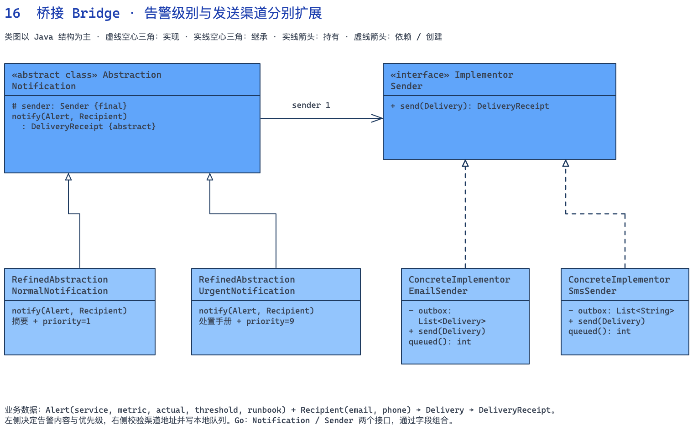

[下载可编辑的 Excalidraw 源文件](diagrams/16-bridge.zh.excalidraw)

#### 双语言完整示例



```java
import java.util.*;
record Alert(String service, String metric, int actual, int threshold, String runbook) {
    String detail() { return service + " " + metric + "=" + actual + " threshold=" + threshold; }
}
record Recipient(String email, String phone) {}
record Delivery(Recipient recipient, String subject, String body, int priority) {}
record DeliveryReceipt(String channel, String address, int priority) {}
// Implementor（实现部分接口）。
interface Sender { DeliveryReceipt send(Delivery delivery); }
// ConcreteImplementor（具体实现）。
class EmailSender implements Sender {
    private final List<Delivery> outbox = new ArrayList<>();
    public DeliveryReceipt send(Delivery d) {
        if (d.recipient().email().isBlank()) throw new IllegalArgumentException("缺少邮箱");
        outbox.add(d); // 真实项目在此转换为邮件服务请求
        return new DeliveryReceipt("email", d.recipient().email(), d.priority());
    }
    int queued() { return outbox.size(); }
}
// ConcreteImplementor（具体实现）。
class SmsSender implements Sender {
    private final List<String> outbox = new ArrayList<>();
    public DeliveryReceipt send(Delivery d) {
        if (d.recipient().phone().isBlank()) throw new IllegalArgumentException("缺少手机号");
        String text = d.subject() + " " + d.body();
        if (text.codePointCount(0, text.length()) > 140)
            throw new IllegalArgumentException("短信超过 140 字符，需要拆分");
        outbox.add(text);
        return new DeliveryReceipt("sms", d.recipient().phone(), d.priority());
    }
    int queued() { return outbox.size(); }
}
// Abstraction（抽象部分）。
abstract class Notification {
    protected final Sender sender;
    Notification(Sender sender) { this.sender = Objects.requireNonNull(sender); }
    abstract DeliveryReceipt notify(Alert alert, Recipient recipient);
}
// RefinedAbstraction（扩展抽象）。
class NormalNotification extends Notification {
    NormalNotification(Sender sender) { super(sender); }
    DeliveryReceipt notify(Alert a, Recipient r) {
        return sender.send(new Delivery(r, "告警摘要", a.detail(), 1));
    }
}
// RefinedAbstraction（扩展抽象）。
class UrgentNotification extends Notification {
    UrgentNotification(Sender sender) { super(sender); }
    DeliveryReceipt notify(Alert a, Recipient r) {
        if (a.runbook().isBlank()) throw new IllegalArgumentException("紧急告警必须附处置手册");
        return sender.send(new Delivery(r, "立即处理", a.detail() + " runbook=" + a.runbook(), 9));
    }
}
// Client（客户端）：组装参与者并发起调用。
public class Main {
    public static void main(String[] args) {
        Alert alert = new Alert("checkout", "errorRate", 12, 5, "ops/errors");
        Recipient recipient = new Recipient("ops@example.com", "+8613800000000");
        EmailSender email = new EmailSender(); SmsSender sms = new SmsSender();
        for (Notification n : List.of(new NormalNotification(email), new UrgentNotification(email), new UrgentNotification(sms))) {
            DeliveryReceipt receipt = n.notify(alert, recipient);
            System.out.printf("%s %s priority=%d%n", receipt.channel(), receipt.address(), receipt.priority());
        }
        System.out.printf("邮件队列=%d 短信队列=%d%n", email.queued(), sms.queued());
    }
}
```



```go
package main

import (
	"fmt"
	"unicode/utf8"
)

type Alert struct {
	Service, Metric   string
	Actual, Threshold int
	Runbook           string
}

func (a Alert) Detail() string {
	return fmt.Sprintf("%s %s=%d threshold=%d", a.Service, a.Metric, a.Actual, a.Threshold)
}

type Recipient struct{ Email, Phone string }
type Delivery struct {
	Recipient     Recipient
	Subject, Body string
	Priority      int
}
type DeliveryReceipt struct {
	Channel, Address string
	Priority         int
}
// Implementor（实现部分接口）。
type Sender interface {
	Send(Delivery) (DeliveryReceipt, error)
}
// ConcreteImplementor（具体实现）。
type EmailSender struct{ outbox []Delivery }

func (s *EmailSender) Send(d Delivery) (DeliveryReceipt, error) {
	if d.Recipient.Email == "" {
		return DeliveryReceipt{}, fmt.Errorf("缺少邮箱")
	}
	s.outbox = append(s.outbox, d)
	return DeliveryReceipt{"email", d.Recipient.Email, d.Priority}, nil
}

// ConcreteImplementor（具体实现）。
type SmsSender struct{ outbox []string }

func (s *SmsSender) Send(d Delivery) (DeliveryReceipt, error) {
	if d.Recipient.Phone == "" {
		return DeliveryReceipt{}, fmt.Errorf("缺少手机号")
	}
	text := d.Subject + " " + d.Body
	if utf8.RuneCountInString(text) > 140 {
		return DeliveryReceipt{}, fmt.Errorf("短信超过 140 字符，需要拆分")
	}
	s.outbox = append(s.outbox, text)
	return DeliveryReceipt{"sms", d.Recipient.Phone, d.Priority}, nil
}

// Abstraction（抽象部分）。
type Notification interface {
	Notify(Alert, Recipient) (DeliveryReceipt, error)
}
// RefinedAbstraction（扩展抽象）。
type NormalNotification struct{ sender Sender }

func (n NormalNotification) Notify(a Alert, r Recipient) (DeliveryReceipt, error) {
	return n.sender.Send(Delivery{r, "告警摘要", a.Detail(), 1})
}

// RefinedAbstraction（扩展抽象）。
type UrgentNotification struct{ sender Sender }

func (n UrgentNotification) Notify(a Alert, r Recipient) (DeliveryReceipt, error) {
	if a.Runbook == "" {
		return DeliveryReceipt{}, fmt.Errorf("紧急告警必须附处置手册")
	}
	return n.sender.Send(Delivery{r, "立即处理", a.Detail() + " runbook=" + a.Runbook, 9})
}
// Client（客户端）：组装参与者并发起调用。
func main() {
	alert := Alert{"checkout", "errorRate", 12, 5, "ops/errors"}
	recipient := Recipient{"ops@example.com", "+8613800000000"}
	email, sms := &EmailSender{}, &SmsSender{}
	notifications := []Notification{NormalNotification{email}, UrgentNotification{email}, UrgentNotification{sms}}
	for _, n := range notifications {
		r, err := n.Notify(alert, recipient)
		if err != nil {
			panic(err)
		}
		fmt.Printf("%s %s priority=%d\n", r.Channel, r.Address, r.Priority)
	}
	fmt.Printf("邮件队列=%d 短信队列=%d\n", len(email.outbox), len(sms.outbox))
}
```



#### 运行结果与关键点

```text
email ops@example.com priority=1
email ops@example.com priority=9
sms +8613800000000 priority=9
邮件队列=2 短信队列=1
```

新增“汇总通知”时增加通知类型，继续组合现有 Sender；新增企业聊天渠道时实现 Sender，已有普通和紧急通知都能复用。这两套独立的扩展方向才是桥接的核心。Go 通过 Notification 与 Sender 两个接口表达契约，用结构体字段组合渠道。

#### 什么时候不用，以及这个例子的边界

这里写入内存 outbox，不代表邮件或短信已经投递，优先级也只是载荷字段，没有实现优先队列调度。140 字符是演示规则，真实短信限制与编码、供应商分段策略有关。若某类通知根本无法通过某渠道表达，就不应强行追求任意组合，而要收紧能力契约。

## 四、把例子迁移到实际代码前

这组代码刻意把复杂度放在业务对象和协作关系上。Java 的 record、集合复制，以及 Go 的值类型与切片复制，都服务于明确的数据边界；例如 [List.copyOf()](https://docs.oracle.com/en/java/javase/17/docs/api/java.base/java/util/List.html#copyOf(java.util.Collection)) 产生不可修改的列表，但不会递归冻结元素对象。

简单工厂不属于 GoF 23 个经典模式，这里作为常用创建技巧单列。其余模式的归类见开篇表格；同一段实际代码也可能同时体现多个模式，例如责任链基类固定处理步骤时就带有模板方法的结构。

判断是否值得引入一个模式，可以直接落到本节代码里：新增规则时要改哪个类，失败发生后哪些对象已经变化，下一位维护者能否从接口看出调用约定。如果一个接口没有隔离任何会变化的职责，或者一个包装层没有承担任何业务工作，继续增加类并不会让设计更好。
