### Step by step installation
1. Navigate to the AWS services link top left corner beside the AWS logo

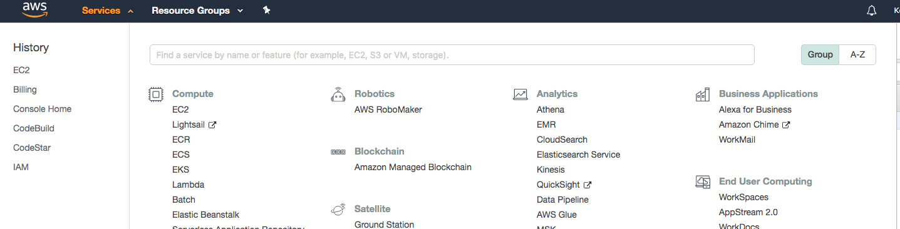
2. Search/Select EC2 under the compute category
3. Launch a new instance, search 'bitnami jenkins' on the marketplace 
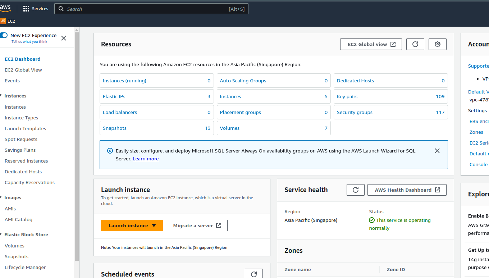

4. Search 'bitnami jenkins' on AWS marketplace click on Select to create the instance
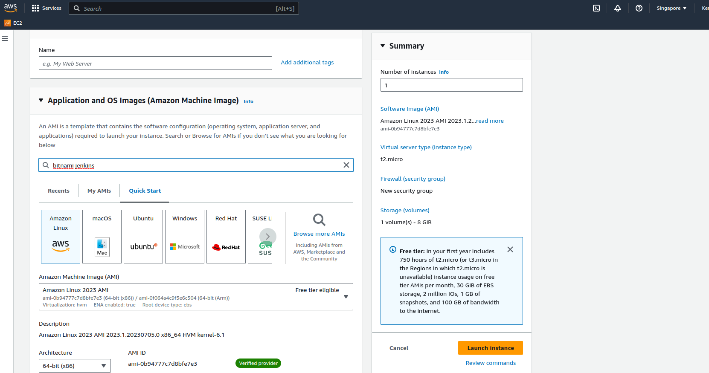
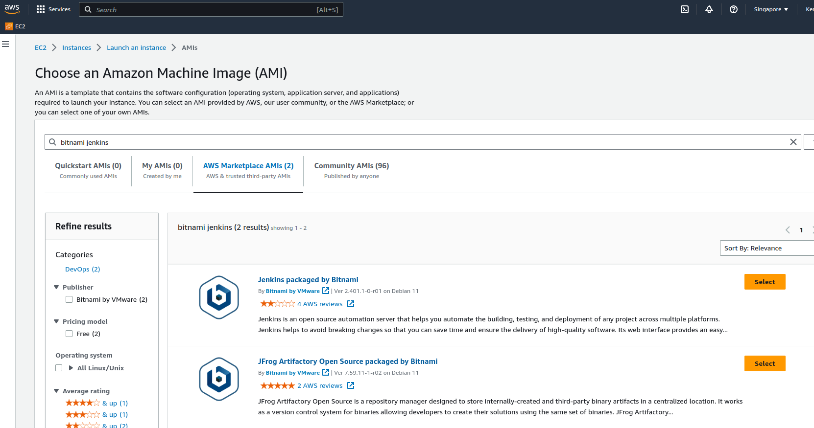
5. On the next page a pricing details page will be shown. Click continue
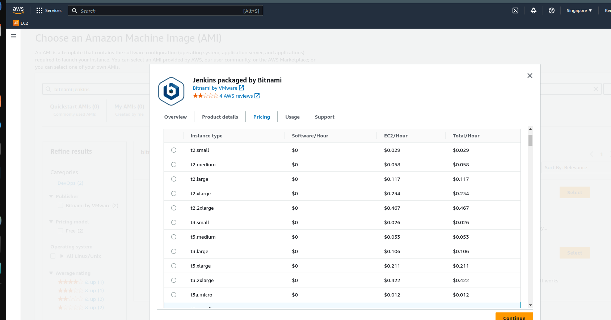

6. Choose an instance type which is  t2 micro/small (free tier). Click Next Configure Instance details
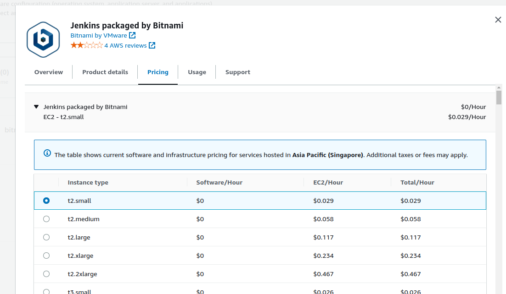

7. Landed on a configure instance details page and by default nothing is require to be configure on this page. Click Add Storage


8. On the configure storage page change 10GB to 15GB. Try not add more mount point overall AWS only give 30GB per instance on free tier.
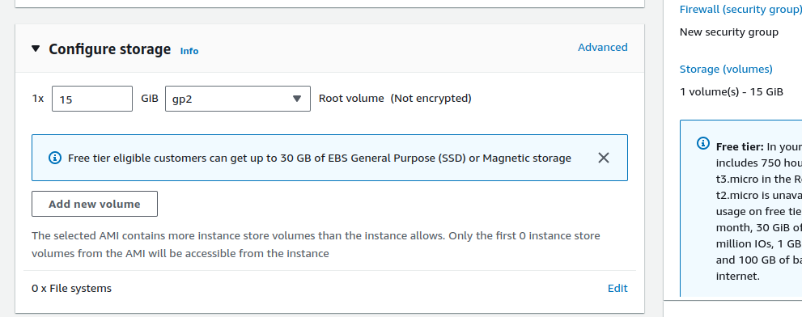
9. Define a tag for your jenkins server click add tag on the key field specify 'name' and value as 'project_name_ubuntu_jenkins'. Click Next
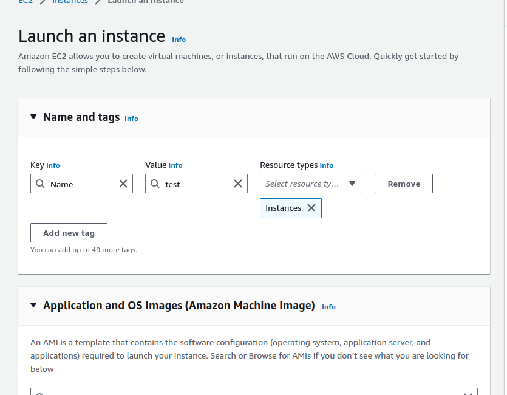

10.  Configure security group as default no addition configuration is needed on this page
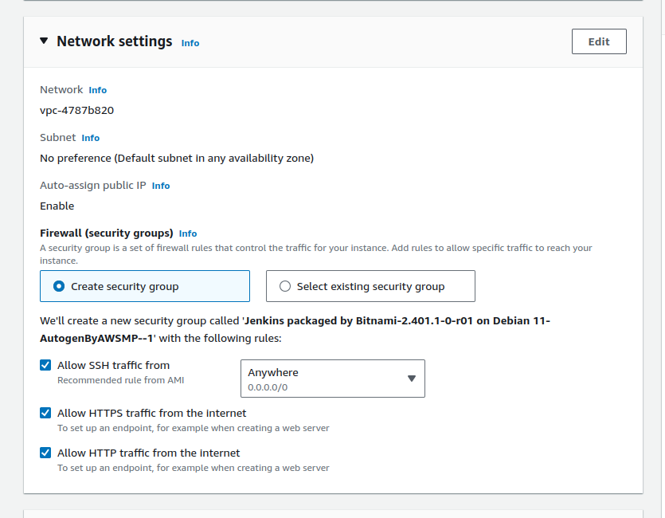

11. Upon launching the instance AWS require us to create a new pair of private key to be use to access the instance.
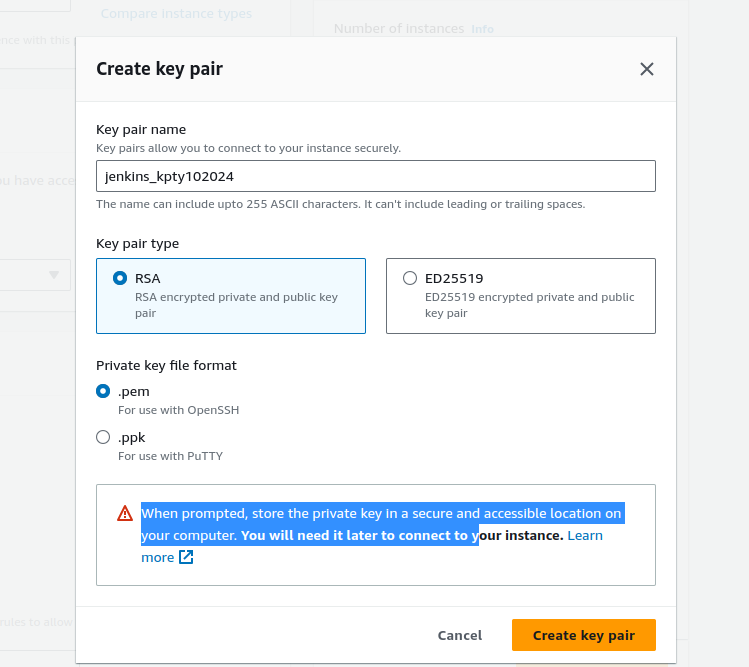


12. Review all the configuration and click on Launch


13. After creating the private key, a new instance will be launch. Kindly wait for a few minutes. Upon successful creation of the instance your instance is now ready to be use


14. Click on the instance id, the look out for instance status where it is running.
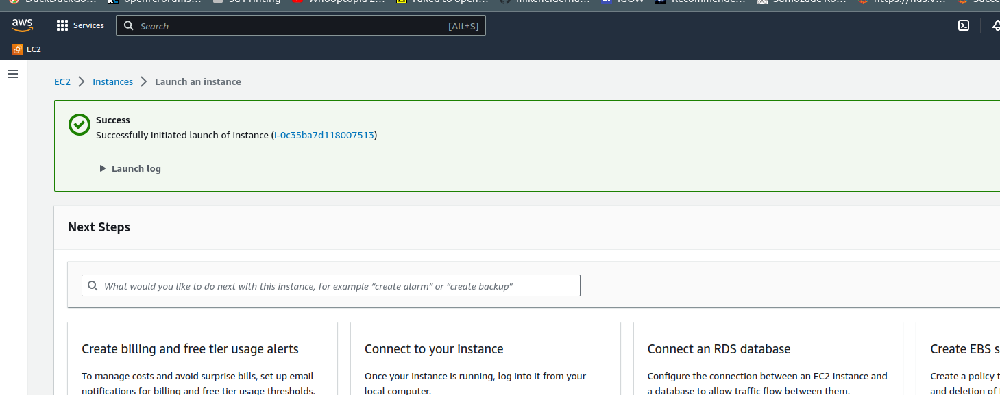

15. Use Git Bash on your local environment to log into the newly created server. Ensure to replace the placeholder with the corresponding values enclosed in <>
```
$ ls -lrt <location of your pem filename>
作用：列出你指定路径下的文件，并用 -lrt 参数按修改时间倒序显示详细信息。
目的：确认你的 .pem 密钥文件存在于这个路径，避免后续命令因文件找不到而失败。

$ chmod 400 <location of your pem filename>
作用：修改 .pem 文件的权限，让只有文件所有者能读取，其他人没有任何权限。
目的：SSH 协议要求密钥文件的权限必须是 400（否则会拒绝连接），这是为了保证私钥的安全性。

$ ssh -i <location of your pem filename> bitnami@<AWS jenkins server Public IP>
作用：通过 SSH 协议连接到你的 AWS 服务器。
-i：指定要使用的私钥文件（就是你的 .pem 文件）
bitnami：这是 Bitnami 镜像默认的用户名
<AWS jenkins server Public IP>：你的 Jenkins 服务器的公网 IP
目的：登录到远程服务器，以便进行后续的配置或管理操作。


```

16. Upon logging into the EC2 instance, change directory to /home/bitnami
```
$ cd /home/bitnami 
```


17. Look for the username and password under the bitnami_credentials file. View the bitnami_credentials file with the following command

```
more bitnami_credentials
```
As result the more command will show the default username and password on your terminal screen

```
Welcome to the Bitnami Jenkins Stack

******************************************************************************
The default username and password is 'user' and 'Dh9b6mi4AQOF'.
******************************************************************************

You can also use this password to access the databases and any other component the stack in
cludes.

Please refer to https://docs.bitnami.com/ for more details.
```

18. Retrieve ip4 public IP address or the DNS name from the AWS jenkins instance console panel
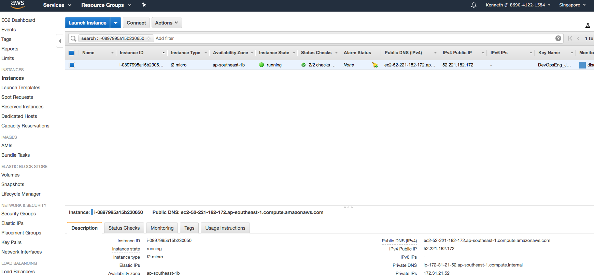

19. Launch the web browser then access the jenkins web admin app.
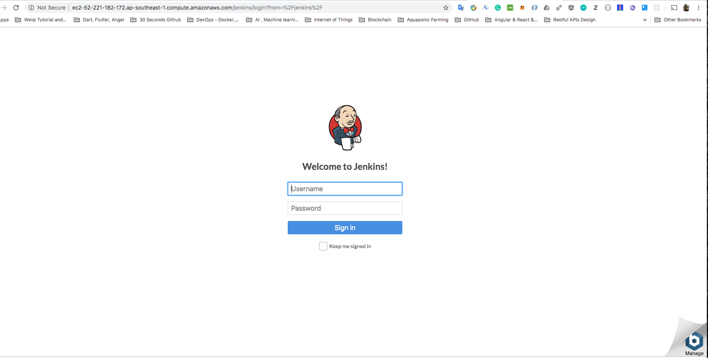

20. Login to Jenkins with the username and password retrieve from the bitnami credentials flat file
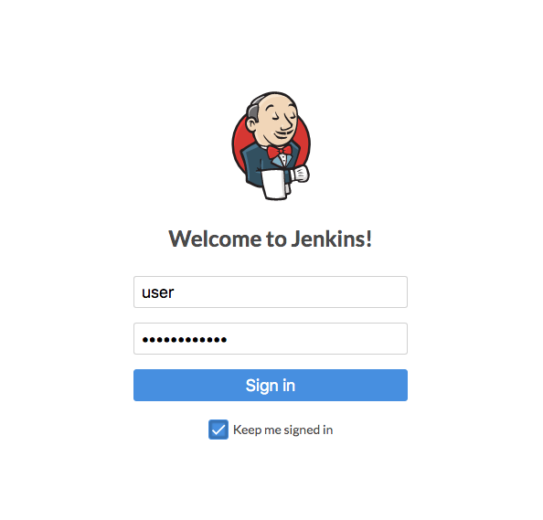

21. Screenshot the jenkins dashboard page with the URL shown on the address bar. Save the screenshot to Luminus submission folder.

# 从零搭建 Spring Boot 单机版 Jenkins CI/CD 自动化部署系统

## 第一部分：宏观流程（The Big Picture）
在动手之前，先看懂这张“自动化部署地图”：

1. **提交 (Push)**：本地完成代码开发后，推送到 GitHub/Gitee 等 Git 仓库。
2. **触发 (Trigger)**：Git 仓库主动通知 Jenkins 有新代码（Webhook 方式），或 Jenkins 定时检查仓库（轮询方式）。
3. **拉取 (Checkout)**：Jenkins 从 Git 仓库下载最新代码到服务器临时目录。
4. **构建 (Build)**：Jenkins 调用 Maven 将代码打包为 .jar 文件。
5. **部署 (Deploy)**：Jenkins 执行 Shell 脚本完成两件事：
   - 杀掉服务器上运行的旧 Spring Boot 进程
   - 启动刚打包好的新 .jar 包
6. **完成**：网站自动更新，无需手动操作。

## 第二部分：准备工作（在服务器上）
配置 Jenkins 前，必须确保服务器具备“手动部署”能力（手动运行正常，Jenkins 才能正常工作）。通过 SSH 登录服务器，执行以下操作：

### 1. 安装 JDK 17
```bash
# 示例（Ubuntu 系统）：
sudo apt update
sudo apt install openjdk-17-jdk
# 验证安装是否成功（需显示 JDK 17 版本）
java -version
```

### 2. 安装 Maven（或确认项目有 mvnw）
推荐全局安装 Maven，方便 Jenkins 调用：
```bash
sudo apt install maven
# 验证安装是否成功
mvn -v
```

### 3. 配置 AWS EC2 安全组
1. 在 AWS 控制台，点击那个 名字很长的 Bitnami 安全组 ID (sg-0ed11b...)。

2. 点击右侧的 "Edit inbound rules" (编辑入站规则) 按钮。

3. 点击左下角的 "Add rule" (添加规则)。

4. 按照下图填写：

5. Type (类型): Custom TCP

6. Port range (端口范围): 8090

7. Source (来源): 点击下拉菜单，选择 Anywhere-IPv4 (或者手动填 0.0.0.0/0)。

8. 点击 Save rules (保存规则)。


## 第三部分：Jenkins 实战步骤
### 步骤 1：安装必要插件
1. 登录 Jenkins 后台
2. 进入 **Manage Jenkins → Plugins → Available Plugins**
3. 搜索并安装以下插件（部分默认已安装）：
   - Git Plugin（代码拉取核心）
   - Pipeline（流水线核心插件）
   - Pipeline: Maven Integration（Maven 集成增强，推荐安装）
   - Pipeline: Declarative
   - Git
   - Pipeline: GitHub
4. 安装完成后重启 Jenkins（可选，部分插件需重启生效）


### 步骤 2：创建 Pipeline 任务
1. Jenkins 首页点击 **New Item**
2. 输入任务名称（如 `my-springboot-project`）
3. 选择 **Pipeline** 类型，点击 **OK**

### 步骤 3：编写流水线脚本（Jenkinsfile）
这是核心配置步骤，将以下代码复制到任务配置页的 **Pipeline Script** 区域，需根据实际项目修改关键参数：

```groovy
pipeline {
    agent any

    // 定义环境变量，方便后续修改
    environment {
        // 你的 Git 仓库地址（替换为实际地址）
        GIT_URL = 'https://github.com/your-username/your-repo.git' 
        // 代码分支（默认 main，根据实际分支修改）
        BRANCH_NAME = 'main'
        // 打包后的 jar 包名称（需与 pom.xml 中 <finalName> 一致）
        JAR_NAME = 'your-app-0.0.1-SNAPSHOT.jar'
    }

    stages {
        // 第一步：拉取代码
        stage('Checkout Code') {
            steps {
                echo '正在拉取最新代码...'
                // 私有仓库需先在 Jenkins 凭据中配置账号密码，添加 credentialsId 参数
                git branch: "${BRANCH_NAME}", url: "${GIT_URL}"
            }
        }

        // 第二步：编译打包
        stage('Build with Maven') {
            steps {
                echo '正在编译打包...'
                // 跳过测试加快构建速度（学习阶段推荐，生产环境需按需开启测试）
                sh 'mvn clean package -DskipTests'
            }
        }

        // 第三步：部署运行
        stage('Deploy') {
            steps {
                echo '正在部署...'
                script {
                    // 关键配置：防止 Jenkins 结束后杀死 Java 进程
                    withEnv(['JENKINS_NODE_COOKIE=dontKillMe']) {
                        sh '''
                            echo "1. 停止旧进程..."
                            # 查找并强制杀死包含目标 jar 包的进程（无进程时不报错）
                            ps -ef | grep ${JAR_NAME} | grep -v grep | awk '{print $2}' | xargs -r kill -9 || true
                            
                            echo "2. 启动新进程..."
                            # nohup 后台运行，日志输出到 app.log（2>&1 表示错误日志也输出到同一文件）
                            nohup java -jar target/${JAR_NAME} > app.log 2>&1 &
                            
                            echo "3. 等待应用启动..."
                            sleep 10
                        '''
                    }
                }
            }
        }
    }
}
```

⚠️ **关键修改说明**：
- `GIT_URL`：替换为你的 Git 仓库地址（公开/私有均可，私有仓库需配置 Jenkins 凭据）
- `BRANCH_NAME`：替换为实际代码分支（如 `master`、`dev`）
- `JAR_NAME`：必须与 `pom.xml` 中 `<finalName>` 标签定义的名称一致（可在本地执行 `mvn package` 后查看 `target` 目录下的 jar 包名称）


**简单测试版**
推荐使用的仓库：
你可以使用这个非常经典的入门仓库（或者 GitHub 搜 spring-boot-hello-world 随便找一个）：

仓库地址： https://github.com/spring-projects/spring-petclinic (官方经典，略大)

更简单的推荐（适合新手）： https://github.com/BuntyRaghani/spring-boot-hello-world

操作步骤：

登录你的 GitHub 账号。

打开上面的链接。

点击右上角的 Fork 按钮。

这会把代码完整复制一份到你自己的账号下，变成 https://github.com/你的用户名/spring-boot-hello-world。

以后 Jenkins 的配置里，Git URL 填你自己的这个地址。
```groovy
pipeline {
    agent any
    
    // 替换成你 FORK 后的地址
    environment {
        GIT_URL = 'https://github.com/你的用户名/spring-boot-hello-world.git'
    }

    stages {
        stage('拉取代码') {
            steps {
                // 如果是公开仓库，不需要 credentialsId
                git branch: 'master', url: "${GIT_URL}" 
            }
        }
        
        stage('编译构建') {
            steps {
                // 编译并跳过单元测试（加快速度）
                sh 'mvn clean package -DskipTests' 
            }
        }
        
        stage('部署运行') {
            steps {
                script {
                    // 防止 Jenkins 杀掉衍生进程
                    withEnv(['JENKINS_NODE_COOKIE=dontKillMe']) {
                        sh '''
                            echo "--- 正在部署 ---"
                            # 杀掉占用 8080 端口的旧进程 (如果 Jenkins 也是 8080，这里要小心！建议把 SpringBoot 换个端口)
                            # 假设应用运行在 8090 端口
                            fuser -k 8090/tcp || true
                            
                            # 启动新应用，并指定端口为 8090
                            nohup java -jar target/*.jar --server.port=8090 > app.log 2>&1 &
                            
                            echo "--- 部署完成，请访问 EC2-IP:8090 ---"
                        '''
                    }
                }
            }
        }
    }
}

```


### 步骤 4：配置触发器（实现自动构建）
#### 方法 A：轮询 SCM（适合新手/无公网 IP）
1. 在任务配置页找到 **Build Triggers** 选项
2. 勾选 **Poll SCM**，输入触发表达式：`H/2 * * * *`
3. 含义：每 2 分钟检查一次 Git 仓库，有新代码则自动执行流水线

#### 方法 B：Webhook（高级方案，需公网 IP）
1. 进入 Git 仓库后台（GitHub/Gitee）
2. 找到 **Settings → Webhooks**，点击 **Add webhook**
3. **Payload URL** 填写：`http://你的服务器IP:8080/github-webhook/`（GitHub 专用，GitLab 需调整路径）
4. **Content type** 选择 `application/json`
5. 保存后，Git 仓库有新代码推送时会自动触发 Jenkins 构建

## 第四部分：验证部署是否成功
CICD 的核心优势是“即时反馈”，可通过以下三层验证确认结果：

### 1. Jenkins 视觉反馈（第一道防线）
- 点击任务的 **Build Now**，右侧会显示构建进度
- 若所有 Stage（Checkout Code/Build/Deploy）均显示绿色方块，说明流程执行成功
- 若出现红色方块，点击该 Stage → 查看 **Console Output**，日志会明确提示错误原因（如 Maven 编译失败、端口占用、Git 拉取失败等）

### 2. 服务器进程检查（第二道防线）
登录服务器终端，执行以下命令查看 Java 进程：
```bash
ps -ef | grep java
```
- 应能看到一个新的 Java 进程，启动命令包含 `java -jar target/你的 jar 包名称`
- 进程启动时间应为 Jenkins 构建完成的时间

### 3. 实际功能验证（最终确认）
- 打开浏览器访问：`http://你的服务器IP:应用端口/接口路径`（如 `http://192.168.1.100:8080/api/hello`）
- 若能正常返回结果，说明应用部署成功

### 终极测试（验证自动化流程）
1. 本地修改代码（如修改接口返回文案、页面文字）
2. 执行 `git add . → git commit -m "测试自动化部署" → git push`
3. 等待触发器触发（轮询需等 2 分钟，Webhook 即时触发）
4. 刷新浏览器，若看到修改后的效果，说明整套 CI/CD 系统搭建成功！


**bitnami@ip-172-31-11-113:~$ sudo docker exec -it mongodb mongosh admin -u admin -p 123456**
Current Mongosh Log ID:	69735e81b67314886d8ce5af
Connecting to:		mongodb://<credentials>@127.0.0.1:27017/admin?directConnection=true&serverSelectionTimeoutMS=2000&appName=mongosh+2.6.0
Using MongoDB:		8.2.3
Using Mongosh:		2.6.0

For mongosh info see: https://www.mongodb.com/docs/mongodb-shell/


To help improve our products, anonymous usage data is collected and sent to MongoDB periodically (https://www.mongodb.com/legal/privacy-policy).
You can opt-out by running the disableTelemetry() command.

------
   The server generated these startup warnings when booting
   2026-01-23T11:39:12.212+00:00: Using the XFS filesystem is strongly recommended with the WiredTiger storage engine. See http://dochub.mongodb.org/core/prodnotes-filesystem
   2026-01-23T11:39:12.693+00:00: Soft rlimits for open file descriptors too low
   2026-01-23T11:39:12.694+00:00: For customers running the current memory allocator, we suggest changing the contents of the following sysfsFile
   2026-01-23T11:39:12.694+00:00: We suggest setting the contents of sysfsFile to 0.
------

admin> 
(To exit, press Ctrl+C again or Ctrl+D or type .exit)
admin> exit
^C^C^C


bitnami@ip-172-31-11-113:~$


ssh -i EcoGo.pem bitnami@13.214.215.241


bitnami@ip-172-31-11-113:~$ docker run -d \
  --name mongodb \          # 容器名（自定义，比如叫 mongodb）
  -p 27017:27017 \          # 端口映射（主机27017 → 容器27017，默认端口）
  -v mongodb-data:/data/db \# 数据持久化（把Mongo数据存到Docker卷，删除容器数据不丢）
  --restart=always \        # 开机自启（可选，推荐）
  mongo:latest              # MongoDB镜像（latest是最新版，也可以指定版本如 mongo:6.0）
permission denied while trying to connect to the docker API at unix:///var/run/docker.sock
-bash: -p: command not found
-bash: -v: command not found
-bash: --restart=always: command not found
-bash: mongo:latest: command not found
bitnami@ip-172-31-11-113:~$ 


sudo docker run -d \
  --name mongodb \
  -p 0.0.0.0:27017:27017 \
  -v mongodb-data:/data/db \
  --restart=always \
  mongo:latest


sudo docker stop mongodb


sudo docker rm mongodb

sudo docker run -d --name mongodb -p 27017:27017 -v mongodb-data:/data/db --restart=always mongo:latest


这个问题的核心是 **SSH隧道做了“端口转发”——把远程服务器的MongoDB端口，“映射”到了你本地电脑的端口上**，相当于在本地和远程数据库之间搭了一条“隐形通道”，所以你感觉像是连本地数据库，实际连的是远程Docker里的MongoDB。

用一个通俗的比喻就能看懂：
- 远程服务器的Docker里的MongoDB，就像“在外地的商店”（地址：远程服务器IP:27017）；
- 你本地电脑的127.0.0.1:27017，就像“你家门口的代收点”；
- SSH隧道（你本地终端开的那个命令），就是“快递员”：它会把你发给“家门口代收点”的所有请求，全部转发到“外地的商店”；
- 你用连接工具连“家门口代收点”（127.0.0.1:27017），其实是通过“快递员”（SSH隧道）和“外地商店”（远程Docker的MongoDB）沟通，只是你看不到中间的转发过程，感觉像是直接连本地。


### 具体技术逻辑拆解（一步步看）
1. **远程服务器的状态**：
   - Docker里的MongoDB容器绑定了 `0.0.0.0:27017`，相当于“外地商店”对外营业，允许接收外部请求；
   - 你通过 `ssh -i 密钥 -L ...` 命令，在本地和远程之间建立了隧道。

2. **隧道的转发逻辑**：
   - 隧道规则是 `本地127.0.0.1:27017 → 远程127.0.0.1:27017`；
   - 当你本地连接工具发起 `127.0.0.1:27017` 的请求时，这个请求会被SSH隧道“截获”，通过加密通道发送到远程服务器；
   - 远程服务器收到后，会把请求转发给本地的27017端口（也就是Docker里的MongoDB）。

3. **数据的往返流程**：
   - 你的查询/操作请求 → 本地127.0.0.1:27017 → SSH隧道 → 远程服务器27017 → Docker里的MongoDB；
   - MongoDB处理后的数据 → 远程服务器27017 → SSH隧道 → 本地127.0.0.1:27017 → 你的连接工具；
   - 整个过程中，你和连接工具都只和“本地端口”交互，看不到远程的存在，但数据实际是在本地和远程Docker之间传输的。


### 关键结论
- 你连接的 `127.0.0.1:27017` 只是“隧道的本地入口”，不是真的有一个MongoDB在你本地；
- 数据仍然存在远程服务器的 `mongodb-data` 数据卷里（不会存在你本地）；
- 隧道的作用就是“伪装”：让远程服务看起来像本地服务，同时解决远程访问的认证和安全问题。

现在你成功连接后，操作的数据都会实时同步到远程服务器的MongoDB里，关闭本地终端的隧道（或断开SSH），连接就会中断——这也能证明你连的是远程服务～


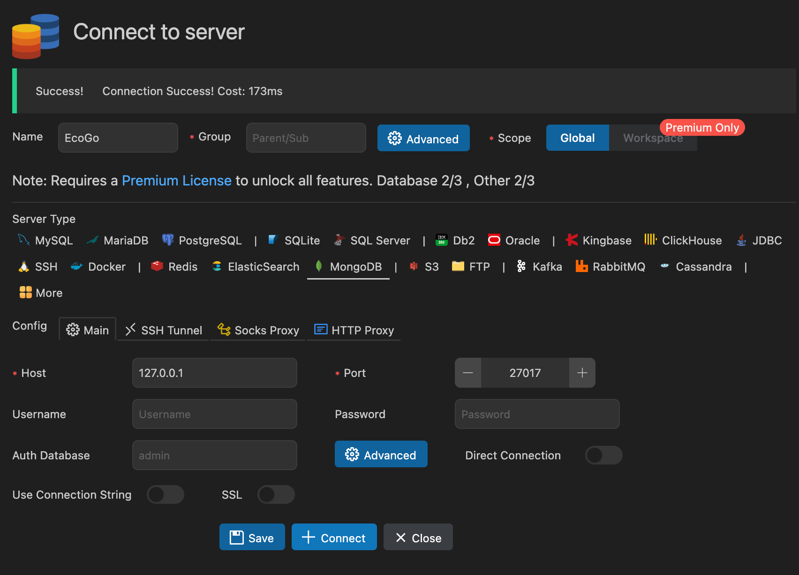

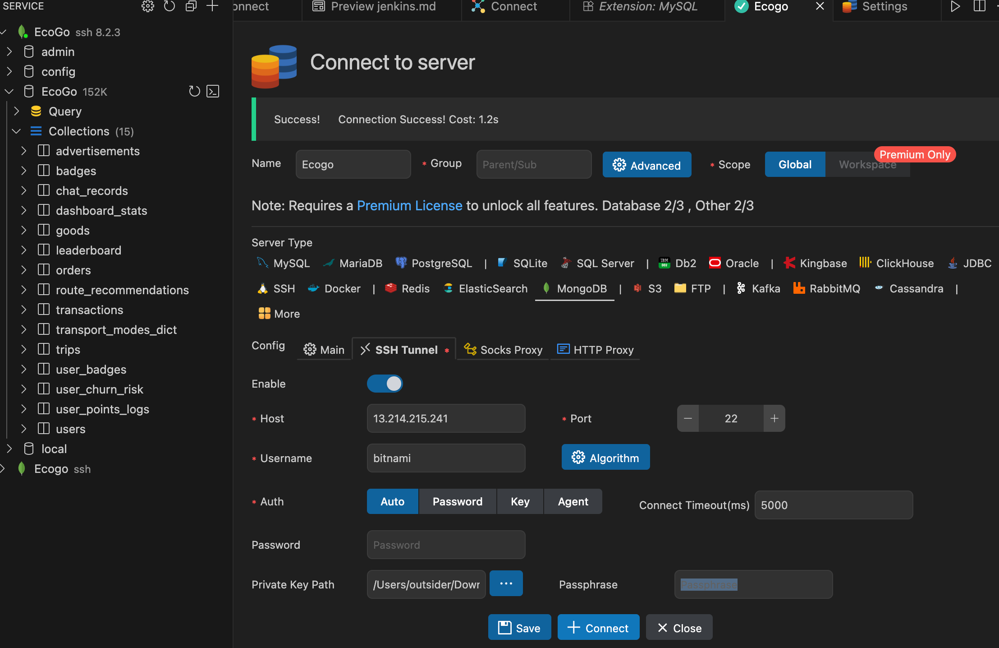


明白了！报错 `Permission denied (publickey)` 是因为你的远程服务器（AWS EC2？）启用了 **密钥认证**，不支持密码登录，必须用你提到的 `EcoGo.pem` 密钥文件才能通过 SSH 登录（包括建立隧道）。

### 解决方案：用密钥文件建立 SSH 隧道（修正后的命令）
在你本地 Mac 的终端里，执行以下命令（核心是添加 `-i 密钥文件路径` 参数，指定 `EcoGo.pem` 的位置）：

```bash
# 格式：ssh -i 你的EcoGo.pem路径 -L 127.0.0.1:27017:127.0.0.1:27017 bitnami@13.214.215.241 -p 22
ssh -i ~/Downloads/EcoGo.pem -L 127.0.0.1:27017:127.0.0.1:27017 bitnami@13.214.215.241 -p 22
```

#### 关键说明：
1. **`-i ~/Downloads/EcoGo.pem`**：`-i` 指定密钥文件路径，你需要把 `~/Downloads/EcoGo.pem` 改成你电脑上 `EcoGo.pem` 的实际路径（比如存放在桌面就改成 `~/Desktop/EcoGo.pem`）；
2. 执行后如果提示 `Permissions 0644 for 'EcoGo.pem' are too open`（密钥文件权限太开放），先执行以下命令修改权限（Mac/Linux 要求密钥文件不能被其他用户读取）：
   ```bash
   chmod 400 ~/Downloads/EcoGo.pem  # 同样替换成你的密钥文件路径
   ```
3. 再重新执行上面的隧道命令，会自动用密钥认证，不需要输入密码，成功后保持终端窗口打开（隧道不能关）。


### 后续步骤（隧道成功建立后）
1. 按之前的方法，在本地电脑终端验证隧道是否生效：
   ```bash
   netstat -tulpn | grep 27017 或 lsof -i :27017
   ```
   能看到 `ssh` 进程占用 `127.0.0.1:27017` 就说明隧道通了；
2. 本地连接工具（Compass/Navicat）按之前的正确配置填：
   - Host：127.0.0.1，Port：27017
   - 认证：无，SSL：禁用
   - 直接连接即可成功。


### 常见问题排查：
- 若提示 `No such file or directory`：说明 `EcoGo.pem` 路径写错了，找到文件后右键 → 「显示简介」→ 复制「位置」，拼接成完整路径；
- 若还是提示 `Permission denied (publickey)`：可能是密钥文件不对（比如不是服务器对应的密钥），或 `bitnami` 用户名错误（部分 EC2 实例用户是 `ubuntu`，可尝试替换用户名）。

按这个命令执行，就能成功建立隧道，之后连接 MongoDB 就没问题了～